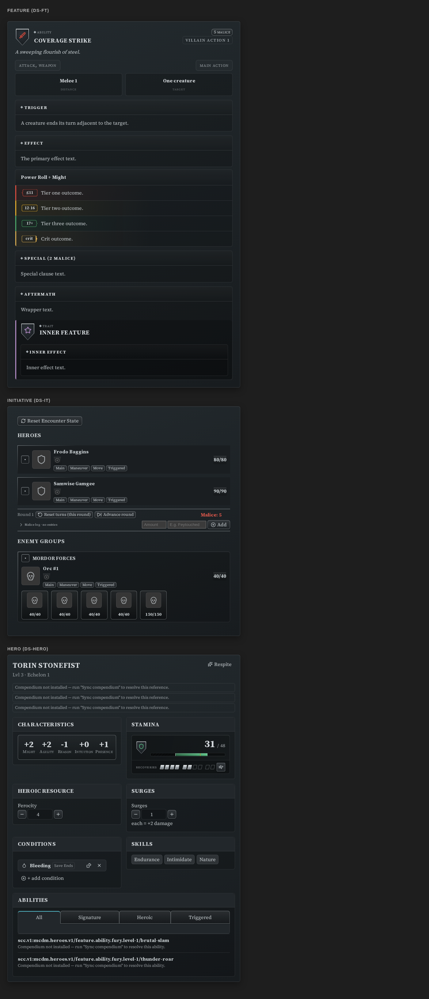

# Draw Steel Elements Plugin for Obsidian

Statblocks, ability cards, initiative and negotiation trackers, hero sheets and a synced
copy of the Draw Steel Compendium — all inside your Obsidian vault.

_The Draw Steel Elements Obsidian Plugin is an independent product published under the
DRAW STEEL Creator License and is not affiliated with MCDM Productions, LLC. DRAW STEEL ©
2024 MCDM Productions, LLC._

**Reading mode only.** The plugin renders in Obsidian's Reading view; blocks show as plain
code in Live Preview. Switch a note to Reading view (`Ctrl/Cmd + E`) to see your elements.

Please use this [form to report bugs](https://docs.google.com/forms/d/e/1FAIpQLSc6m-pZ0NLt2EArE-Tcxr-XbAPMyhu40ANHJKtyRvvwBd2LSw/viewform?usp=sharing&ouid=105036387964900154878)
if you find them!



## Install

**Requires Obsidian 1.13.0 or newer.** Obsidian updates itself by default, so most installs
already qualify (**Settings → General → Current version** if you want to check). On an older
Obsidian you keep the last compatible build, 6.0.1, until you update the app.

1. **Settings → Community plugins → Browse**
2. Search for **Draw Steel Elements**
3. **Install**, then **Enable**

**Upgrading from a 5.x or 6.0.1 install?** Read the
[5.x → 7.0.0 migration guide](./docs/migrating-to-7.md) first — everyone should re-sync
their compendium, and the first sync offers to move your old compendium files so your
links keep working.

## Quick start

Everything the plugin renders is a fenced code block whose language is a `ds-` name — for
example:

````markdown
```ds-hr
```
````

You don't have to memorise any of them. In the editor, type **`/ds`** and pick an element
from the list: the plugin writes a filled-in example block for you, ready to edit. Every
element also has an **Insert Draw Steel: …** command in the command palette. See
[Writing and editing blocks](./docs/writing-blocks.md).

Then either:

- **Write your own content** — a creature in a [statblock](./docs/statblock.md), an ability
  in a [feature](./docs/Features.md) block; or
- **Use the official content** — [sync the compendium](./docs/compendium-sync.md) and
  reference any entry by its code, no copying required.

## What's included

### Content you write or reference

| Element | Block | What it does |
|---|---|---|
| [Statblock](./docs/statblock.md) | `ds-statblock`, `ds-sb` | A full creature statblock. |
| [Feature / ability card](./docs/Features.md) | `ds-feature`, `ds-ft`, `ds-feat` | Abilities, traits, tests and other power rolls. |
| [Featureblock](./docs/featureblock.md) | `ds-featureblock`, `ds-fb` | A group of features (Malice, Dynamic Terrain, …). |
| [Compendium reference](./docs/compendium-sync.md#referencing-a-compendium-entry-in-your-notes) | `ds-scc` | Renders any entry from your synced compendium by its code. |
| [Roll](./docs/Roll.md) | `ds-roll`, `ds-r`, `ds-power-roll` | A standalone power roll / test / flat dice roller. |
| [Horizontal rule](./docs/horizontal-rule.md) | `ds-hr` | A Draw Steel styled section divider. |

### Running the game

| Element | Block | What it does |
|---|---|---|
| [Initiative tracker](./docs/initiative-tracker.md) | `ds-initiative`, `ds-it` | Run an encounter: turns, Stamina, conditions, Malice. |
| [Negotiation tracker](./docs/negotiation-tracker.md) | `ds-negotiation`, `ds-nt` | Run a negotiation: interest, patience, motivations, pitfalls. |
| [Encounter builder](./docs/gm-trackers.md#encounter-builder-ds-encounter) | `ds-encounter` | Build an encounter from compendium monsters with a live EV budget. |
| [Montage Test tracker](./docs/gm-trackers.md#montage-test-tracker-ds-montage) | `ds-montage` | Track successes, failures and rounds in a montage test. |
| [Project tracker](./docs/gm-trackers.md#project-tracker-ds-project) | `ds-project` | Track a downtime project's goal and accumulated points. |
| [Party tracker](./docs/gm-trackers.md#party-tracker-ds-party) | `ds-party` | Victories, XP, renown, wealth and hero tokens for the whole party. |

Any tracker can be pinned to a **persistent sidebar panel** so it stays visible while you
navigate between notes — see [Pinning to the sidebar](./docs/writing-blocks.md#pinning-a-block-to-the-sidebar).

### Hero sheets

| Element | Block | What it does |
|---|---|---|
| [Hero sheet](./docs/hero-suite.md#hero-sheet-ds-hero) | `ds-hero` | A whole hero in one block: Stamina, heroic resource, surges, conditions and clickable abilities. |
| [Stamina bar](./docs/stamina-bar.md) | `ds-stamina-bar`, `ds-stam` | Stamina, temporary Stamina, Recoveries, Winded/Dying. |
| [Conditions](./docs/hero-suite.md#conditions-ds-conditions) | `ds-conditions`, `ds-cond` | A conditions strip for one hero or creature. |
| [Heroic resource](./docs/hero-suite.md#heroic-resource-ds-resource) | `ds-resource` | Ferocity, Focus, Piety, … tracked by class. |
| [Surges](./docs/hero-suite.md#surges-ds-surges) | `ds-surges` | A surge counter. |
| [Hero tokens](./docs/hero-suite.md#hero-tokens-ds-tokens) | `ds-tokens` | The party's shared hero token pool. |

### Character sheet pieces (great in [Canvas](./docs/canvas-character-sheet.md))

[Characteristics](./docs/characteristics-element.md) (`ds-characteristics`),
[Skills](./docs/skills-element.md) (`ds-skills`),
[Values row](./docs/values-row-element.md) (`ds-values-row`) and
[Counter](./docs/counter.md) (`ds-counter`).

## The compendium in your vault

[Compendium Sync](./docs/compendium-sync.md) downloads the
[Draw Steel Compendium](https://steelcompendium.io/compendium) into a folder in your vault
and keeps it up to date, without touching your own notes. Once it's synced, a `ds-scc`
block renders any entry in it — the body is just the entry's code:

````markdown
```ds-scc
mcdm.heroes.v1/kit/panther
```
````

Use **Insert Draw Steel: compendium reference** in the command palette to search for an
entry and drop the block in. The card always shows the currently synced version — nothing
is copied into your note.

## Settings

**Settings → Draw Steel Elements** is a short index of pages: Appearance, Typography,
Statblock display, Featureblock display, Element defaults, Rolling, Authoring, Compendium,
Links and Initiative tracker. Statblocks ship with three one-click presets, and Obsidian's
own settings search finds every individual setting by name. See the
[settings guide](./docs/settings.md).

## Docs

Full documentation: **[docs/index.md](./docs/index.md)** (also published at
[steelcompendium.io](https://steelcompendium.io)).

## Known limitations

- **Reading mode only** — no Live Preview rendering.
- The compendium's file layout is still developing; a future sync may rename or move a
  compendium file you linked to. [Reference entries by code](./docs/compendium-sync.md#referencing-a-compendium-entry-in-your-notes)
  if you want links that survive that.

## Development

See the [changelog](CHANGELOG.md) for changes.

### Build

- `npm i` to install deps
- `npm run dev` to build and watch

<!-- ~/Documents/demo/DS Elements demo has symlink to this repo -->

### Screenshots

Every image in this README and in `docs/` is generated:

```bash
npm run docs-shots          # regenerate all of them (~4 min)
npm run docs-shots -- --only=statblock.png
npm run docs-shots -- --browser-only     # skip the Obsidian half
```

The run starts its own virtual display, so it is fully headless — your own Obsidian can
stay open, and nothing appears on screen. What each image is and where it comes from lives
in `visual-harness/docs-manifest.mjs`; add an entry there to add an image. The two animated
GIFs are the only images a human still has to record by hand, and the run says so.

### Release

- **Refresh the screenshots**: `npm run docs-shots`, then commit whatever changed
- Make sure the `manifest.json` has the right release version
  - This should be semver without the `v` prefix
- Update `CHANGELOG.md`
- Create release in github
  - Tag should match `manifest.json`
  - Tag and release name should match
  - Upload the files `manifest.json`, `main.js`, `styles.css` as binary attachments
