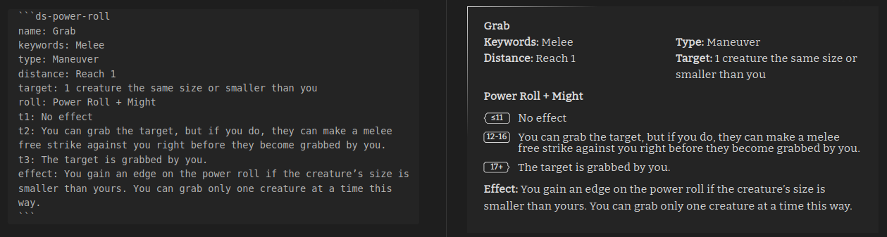

# Draw Steel Elements Plugin for Obsidian

Some helper elements for the MCDM Draw Steel TTRPG

**IMPORTANT: This plugin does NOT (yet) work in "Live Preview" mode.**

## Elements

### Power Roll Element

The [Power Roll Element](./docs/power-roll.md) is used to quickly format Tests, Abilities, Resistance Rolls, and other Power Rolls.

### Initiative Tracker Element

The [Initiative Tracker Element](./docs/initiative-tracker.md) is used to manage and run encounters.

### Horizontal Rule Element

The [Horizontal Rule Element](./docs/horizontal-rule.md) is used as an alternative `
` mimicking the Draw Steel design 

## Future work

- Optionally add hidden header for a Power Roll Element for linking
- Support Live Preview mode
- Add ability to roll Power Rolls from Power Roll Element
- Integrate with the dice plugin
- Something with statblocks...
- Something with encounter building...
- Negotiation tracker
- Party tracker (XP, Victories)
- Text parser for generating power-roll admonitions from raw copied text

### Known Issues

- No support for Live Preview
- This repo is in a very primitive state

## Development

See the [changelog](CHANGELOG.md) for changes 

### Build

- `npm i` to install deps
- `npm run dev` to build and watch

### Release

- Make sure the `manifest.json` has the right release version
  - This should be semver without the `v` prefix
- Update `CHANGELOG.md`
- Create release in github
  - Tag should match `manifest.json`
  - Tag and release name should match
  - Upload the files `manifest.json`, `main.js`, `styles.css` as binary attachments
