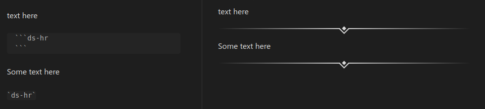

# Draw Steel Elements Plugin for Obsidian

Some helper elements for the MCDM Draw Steel TTRPG

## Power Roll Codeblock

Power Roll element for Tests, Resistance Rolls, Abilities, and other Power Rolls. Triggered with a codeblock leading 
with `ds-power-roll` or `ds-pr`


	```ds-power-roll
	name: Draconian Pride
	flavor: You let loose a mighty roar to repel your foes and shake their spirits
	keywords: Area, Magic
	type: Action
	distance: 2 burst
	target: All enemies
	roll: Power Roll + Might or Presence
	t1: "2 damage; push 1"
	t2: "4 damage; push 3"
	t3: 7 damage; push 5; frightened (EoT)
	effect: You have a bane on the power roll for this ability when you use it in consecutive rounds of the same encounter.
	```

The generated html is simple, but should be highly customizable with css:

```html
<div class="pr-container indent-2">
    <div class="pr-name-line"><span class="pr-name-value">Might Test</span></div>
    <div class="pr-detail-line pr-tier-line pr-tier-1-line">
        <div class="tier-key-container t1-key-container">
            <div class="t1-key-left-side">
                <div class="t1-key-brace-part t1-key-brace-p1"></div>
                <div class="t1-key-brace-part t1-key-brace-p2"></div>
                <div class="t1-key-brace-part t1-key-brace-p3"></div>
                <div class="t1-key-brace-part t1-key-brace-p4"></div>
            </div>
            <div class="t1-key-body">≤11</div>
        </div>
        <span class="pr-tier-value pr-tier-1-value">1 damage</span></div>
    <div class="pr-detail-line pr-tier-line pr-tier-2-line">
        <div class="tier-key-container t2-key-container">
            <div class="t2-key-body">12-16</div>
        </div>
        <span class="pr-tier-value pr-tier-2-value">2 damage</span></div>
    <div class="pr-detail-line pr-tier-line pr-tier-3-line">
        <div class="tier-key-container t3-key-container">
            <div class="t3-key-body">17+</div>
            <div class="t3-key-right-side">
                <div class="t3-key-brace-part t3-key-brace-p1"></div>
                <div class="t3-key-brace-part t3-key-brace-p2"></div>
                <div class="t3-key-brace-part t3-key-brace-p3"></div>
                <div class="t3-key-brace-part t3-key-brace-p4"></div>
            </div>
        </div>
        <span class="pr-tier-value pr-tier-3-value">3 damage; push 2</span></div>
    <div class="pr-detail-line pr-note-line"><span class="pr-note">You have an Edge on this attack if its raining</span>
    </div>
</div>
```

### Fields

| Property                      | Description                                              | Example                                   |
| ----------------------------- | -------------------------------------------------------- | ----------------------------------------- |
| `name`                        | The "Title" or "Description" of the Power Roll.          | `name: Might Resistance Roll`             |
| `keywords`                    | Keywords of the ability                                  | `keywords: Area, Magic`                   |
| `type`                        | Type of the ability                                      | `type: Action`                            |
| `distance`                    | Distance of the ability                                  | `distance: 2 burst`                       |
| `Target`                      | Target of the ability                                    | `target: All enemies`                     |
| `roll`                        | Power Roll                                               | `roll: Power Roll + Might or Presence`    |
| `tier 1`, `t1`, `11 or lower` | The tier-1 (11 or lower) result of the Power Roll        | `t1: 2 damage`                            |
| `tier 2`, `t2`, `12-16`       | The tier-2 (12-16) result of the Power Roll              | `t2: 3 damage`                            |
| `tier 3`, `t3`, `17+`         | The tier-3 (17+) result of the Power Roll                | `t3: 4 damage`                            |
| `crit`, `nat 19-20`           | The critical result of the Power Roll                    | `crit: 4 damage, Extra Action`            |
| `effect`                      | Effect of the ability                                    | `effect: Gain an Edge if you didn't move` |
| `custom_fields`, `fields`     | Custom fields and values                                 | See below                                 |
| `note`, `notes`               | Notes and reminders about the Power Roll                 | `note: Grant Edge if creature is bracing` |
| `indent`                      | Left-margin indentation for the block (for nested lists) | `indent: 2`                               |

**`custom_fields` and `fields`**

These are for arbitrary fields under the power roll and effects:
```
fields:
  - name: "Spend 1 Piety"
    value: "The attack has a double edge and deals holy damage equal to twice your Intuition score."
  - name: "Eat a Sandwich"
    value: "Immune to everything"
```

Yaml is incredibly sensitive, be sure to format exactly.
## Horizontal Rule 

Horizontal line to separate sections. Triggered with a codeblock leading with `ds-horizontal-rule` or `ds-hr`




## Future work

- Optionally add hidden header for a Power Roll Element for linking 
- Customize the Power Roll Element's output (ex: display `Tier 1:` instead of `11 or lower:`)
- Support Live Preview mode
- Add ability to roll Power Rolls from Power Roll Element
- Integrate with the dice plugin
- Something with statblocks...
- Something with encounter building...
- Maybe an inline Power Roll (`pr Might RR|5 damage;fall Prone|3 damage|No effect`)
- Negotiation tracker
- Tracker for turn and who has gone in a round
- Party tracker (XP, Victories)

### Known Issues

- No support for Live Preview
- Links dont render
- This repo is in a very primitive state
- Integrate into the community plugins (pending: https://github.com/obsidianmd/obsidian-releases/pull/4083)

## Development

See the [changelog](CHANGELOG.md) for changes 

### Build

- `npm i` to install deps
- `npm run dev` to build and watch

### Release

- Make sure the `manifest.json` has the right release version
  - This should be semver without the `v` prefix
- Update `CHANGELOG.md`
- Create release in github
  - Tag should match `manifest.json`
  - Tag and release name should match
  - Upload the files `manifest.json`, `main.js`, `styles.css` as binary attachments
