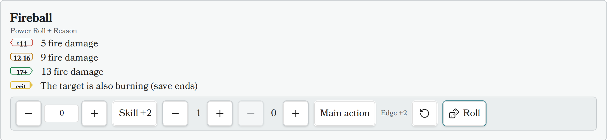

# Roll Element

The Roll Element renders a standalone Draw Steel dice roller: a Power Roll (2d10 +
characteristic, resolved to tier 1/2/3), a test, an opposed power roll, or a flat dice
roll (damage, saving throws, etc.). It shows a modifier bar (characteristic, skill,
edges, banes), rolls with one click, highlights the matching tier row, and shows a
result card with the full breakdown plus Reroll/Clear actions.

Unlike the roller on ability cards (which is off until you turn on **Enable rolling**
in the plugin settings), the Roll Element always rolls — writing the block into your
note is the opt-in.



## Usage

Insert a code block with the language identifier `ds-roll` (aliases: `ds-r`,
`ds-power-roll`) and define the roll using YAML syntax. An empty block is valid and
renders a bare 2d10 power roll.

### Example: an ability-style roll with tiers

```
~~~ds-roll
name: Fireball
roll: "Power Roll + Reason"
edges: 1
tiers:
  t1: "5 fire damage"
  t2: "9 fire damage"
  t3: "13 fire damage"
crit: "The target is also burning (save ends)"
~~~
```

### Example: a test

```
~~~ds-roll
name: Climb the cliff
roll: "Might test"
difficulty: hard
~~~
```

### Example: a flat dice roll

```
~~~ds-roll
name: Falling damage
mode: flat
dice: "3d6+2"
~~~
```

## Field Definitions

All fields are optional.

| Field            | Type                | Description                                                                                                                                        | Default Value |
|------------------|---------------------|----------------------------------------------------------------------------------------------------------------------------------------------------|---------------|
| `name`           | `string`            | Card title.                                                                                                                                          | none          |
| `roll`           | `string`            | Free-text expression (`"Power Roll + Reason"`, `"Might test"`, `"2d10 + 5"`). Parsed leniently and shown as the caption. A characteristic keyword here beats the `characteristic:` field; an explicit `mode:` field beats the expression. | none          |
| `mode`           | `string`            | `power-roll`, `test`, `opposed`, or `flat`.                                                                                                          | `power-roll`  |
| `characteristic` | `number` or `string`| A number is used directly (shown read-only); a keyword (`"Reason"`) labels a manual −5..+5 stepper in the bar.                                        | none          |
| `skill`          | `boolean` or `string`| `true` — or a skill name — starts the bar with the skill (+2) toggle on.                                                                             | `false`       |
| `edges`          | `integer`           | Starting edge count in the bar (adjustable before rolling).                                                                                          | `0`           |
| `banes`          | `integer`           | Starting bane count in the bar (adjustable before rolling).                                                                                          | `0`           |
| `bonus`          | `number`            | A flat modifier applied to every roll (shown in the breakdown, not in the bar).                                                                      | `0`           |
| `difficulty`     | `string`            | `easy`, `medium`, or `hard`. Display only — shown in the caption; the plugin does not judge success.                                                | none          |
| `main_action`    | `boolean`           | Starts the "Main action" (crit-eligible) toggle on. Only main-action power rolls can crit on a natural 19–20.                                        | `false`       |
| `dice`           | `string`            | Flat mode only: the dice expression (`"1d6+2"`).                                                                                                     | `1d10`        |
| `tiers`          | `object`            | Optional tier rows: `t1`/`t2`/`t3` strings (markdown). Rendered like an ability's power-roll table; the rolled tier is highlighted.                  | none          |
| `crit`           | `string`            | Optional critical row (markdown), highlighted on a natural 19–20 main-action power roll.                                                             | none          |
| `auto_roll`      | `boolean`           | Roll once automatically when the block renders.                                                                                                      | `false`       |

## Rolling rules applied

- Tiered rolls are always 2d10 + modifiers; tier 1 is a total of 11 or lower, tier 2
  is 12–16, tier 3 is 17+.
- Edges and banes are capped at two per side first, then cancel. A single net
  edge/bane is ±2; a double edge/bane shifts the tier by ±1 instead (in `opposed`
  mode a double is ±4). The bar shows the live net effect before you roll.
- A natural 19–20 (the two faces before modifiers) is always tier 3, and is a
  critical when the roll is a main-action power roll.

## Results are session-only

Roll results and your last bar settings are kept in memory for the current Obsidian
session only (the last 10 results per block). Rolling never writes to your note, and
everything resets when Obsidian restarts or the plugin reloads.

## Related plugin settings

Under **Settings → Draw Steel Elements → Rolling**:

- **Enable rolling** (default off) — adds a dice roller to rendered ability cards
  (feature, featureblock, statblock). The Roll Element ignores this switch and always
  rolls.
- **Roller** (default "Draw Steel native") — optionally delegates the raw dice to the
  community [Dice Roller](https://github.com/javalent/dice-roller) plugin when it is
  installed and enabled. Draw Steel tier/edge/bane math always stays native, and the
  plugin falls back to the built-in roller automatically if Dice Roller is missing or
  fails. The result card notes "rolled with Dice Roller" when the bridge rolled the
  faces.
- **Click ability to roll** (default on) — when rolling is enabled, clicking a
  power-roll tier row on an ability card rolls it. This setting does not affect the
  Roll Element.

## Known limitations

- Dice notation inside the `roll:` string does not drive the dice — `roll:` sets the
  caption (and mode/characteristic/trailing bonus), but the dice themselves come from
  `mode: flat` + `dice:`. For example, `roll: "3d6"` alone still rolls a 2d10 power
  roll; write `mode: flat` and `dice: "3d6"` to roll 3d6.
- Reading mode only (like the rest of the plugin — no Live Preview support).
