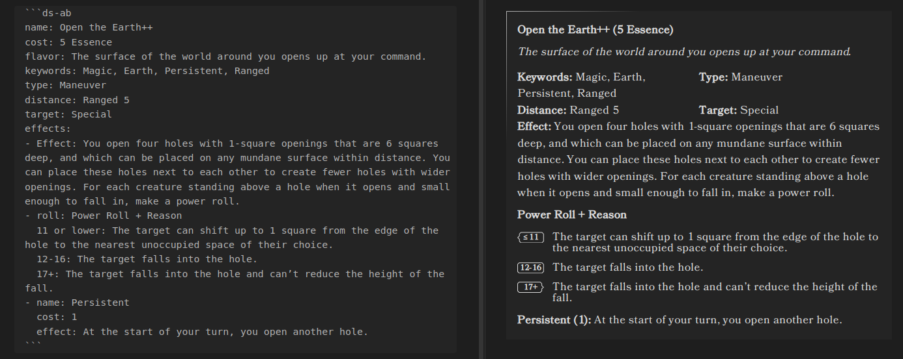
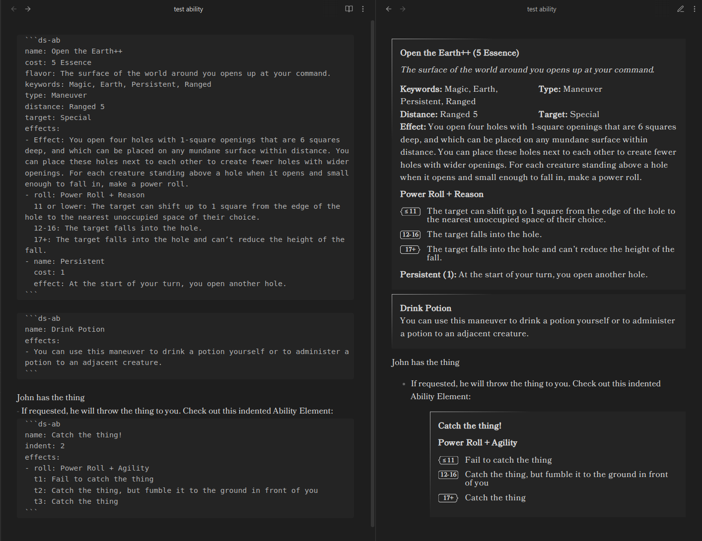

# Ability Element




Note: this was previously a "Power Roll Element", but that was too limiting and has been replaced by this Ability Element

## Codeblock

Ability element for Tests, Resistance Rolls, Abilities, and other Power Rolls. Triggered with a codeblock leading
with `ds-ability` or `ds-ab`



	```ds-ab
    name: Open the Earth++
    cost: 5 Essence
    flavor: The surface of the world around you opens up at your command.
    keywords: Magic, Earth, Persistent, Ranged
    type: Maneuver
    distance: Ranged 5
    target: Special
    effects:
    - Effect: You open four holes with 1-square openings that are 6 squares deep, and which can be placed on any mundane surface within distance. You can place these holes next to each other to create fewer holes with wider openings. For each creature standing above a hole when it opens and small enough to fall in, make a power roll.
    - roll: Power Roll + Reason
      11 or lower: The target can shift up to 1 square from the edge of the hole to the nearest unoccupied space of their choice.
      12-16: The target falls into the hole.
      17+: The target falls into the hole and can’t reduce the height of the fall.
    - name: Persistent
      cost: 1
      effect: At the start of your turn, you open another hole.
	```

- The values should support standard markdown rendering for bold, italics, links, etc.

## Fields

See the [abilities](./Abilities.md) documentation for field definitions
