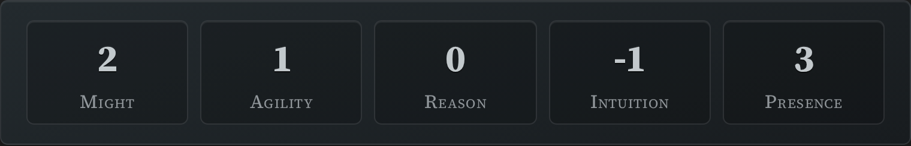
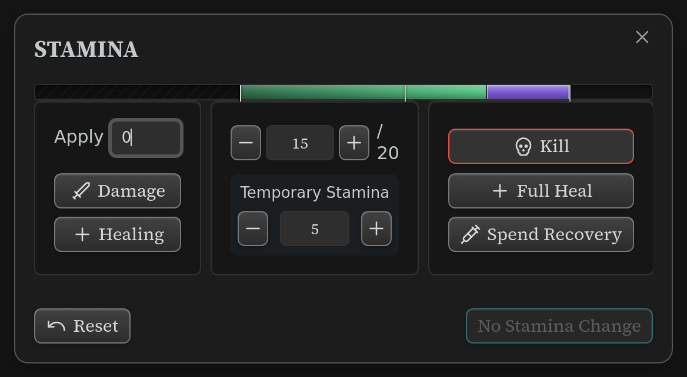
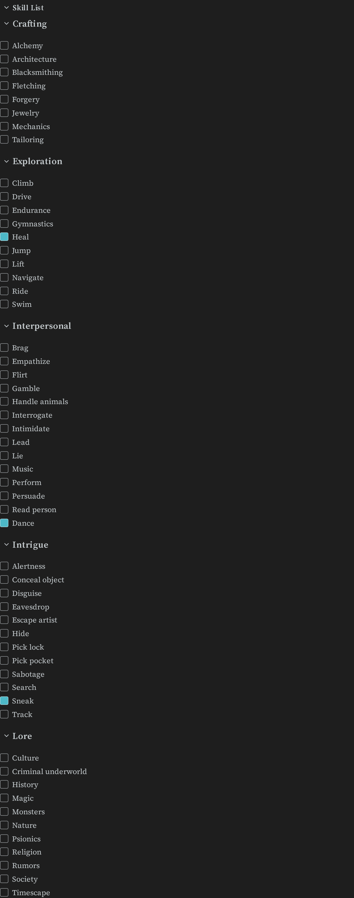

# Build a Character Sheet in Canvas

With [Obsidian Canvas](https://obsidian.md/canvas) you can lay out a flexible character
sheet from the elements below.

**Elements on a canvas are read-only.** A canvas text node gives the plugin no file to write
back to, so anything interactive — spending a Recovery, stepping a resource — is disabled
rather than silently discarded, and each card carries a small "Read-only" badge. Use a canvas
for a sheet you **look at**; keep the blocks you actually click in ordinary notes, or pin
them to the [sidebar](writing-blocks.md#pinning-a-block-to-the-sidebar).

## Elements for Character Sheets

**[Characteristic Element](characteristics-element.md)**

Displays your Might, Agility, Reason, Intuition, and Presence Scores.

**[Counter Element](counter.md)**

Displays numerical (integer) values for tracking resources, etc.

**[Stamina Bar](stamina-bar.md)**

Displays a Stamina bar for tracking and editing.

**[Values Row](values-row-element.md)**

Displays arbitrary key-value pairs.

**[Skills](skills-element.md)**

Displays skills

**[Hero suite blocks](hero-suite.md)**

Since 7.0.0 there are purpose-built trackers you can drop on a canvas too: a
[heroic resource](hero-suite.md#heroic-resource-ds-resource) counter, a
[surge](hero-suite.md#surges-ds-surges) counter, a
[conditions](hero-suite.md#conditions-ds-conditions) strip, and the party's
[hero token](hero-suite.md#hero-tokens-ds-tokens) pool — or the whole
[hero sheet](hero-suite.md#hero-sheet-ds-hero) in a single card.
