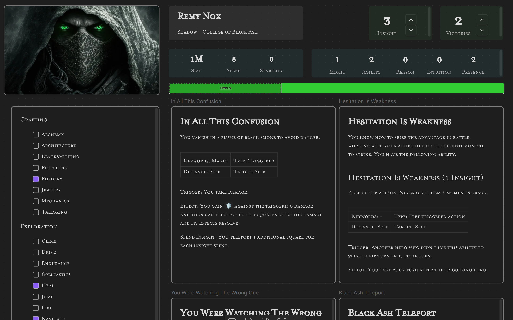

# Build a Character Sheet in Canvas

With [Obsidian Canvas](https://obsidian.md/canvas) you can create a flexible and robust character sheet.

## Elements for Character Sheets

**[Characteristic Element](characteristics-element.md)**

Displays your Might, Agility, Reason, Intuition, and Presence Scores.

**[Counter Element](counter.md)**

Displays numerical (integer) values for tracking resources, etc.

**[Stamina Bar](stamina-bar.md)**

Displays a Stamina bar for tracking and editing.

**[Values Row](values-row-element.md)**

Displays arbitrary key-value pairs.

**[Skills](skills-element.md)**

Displays skills

