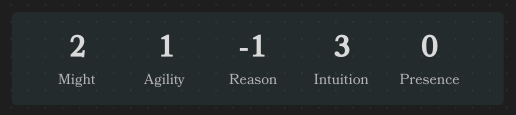

# Characteristics Element

The Characteristics Element is a tool designed to parse and display character characteristics within Obsidian. 
It allows you to define a character's Might, Agility, Reason, Intuition, and Presence using YAML syntax, 
and then renders this information in an organized layout for easy reference during gameplay or writing.

## Usage

To use the Characteristics Element, insert a code block with the language identifier ds-characteristics in your Obsidian note, and then define your characteristics using YAML syntax inside the code block.

### Example characteristics:

```
~~~ds-characteristics
might: +2
agility: +1
reason: -1
intuition: +3
presence: +0
~~~
```



This code block will render the character's characteristics in a formatted display.


## Field Definitions

Below is a detailed description of each field used in the characteristics, including their types, default values, and whether they are required.

| Field          | Type      | Description                                                                        | Required | Default Value |
|----------------|-----------|------------------------------------------------------------------------------------|----------|---------------|
| `might`        | `integer` | The character's Might characteristic. Represents physical strength and power.           | No       | `0`           |
| `agility`      | `integer` | The character's Agility characteristic. Represents dexterity and coordination.          | No       | `0`           |
| `reason`       | `integer` | The character's Reason characteristic. Represents logical thinking and intelligence.    | No       | `0`           |
| `intuition`    | `integer` | The character's Intuition characteristic. Represents instinct and awareness.            | No       | `0`           |
| `presence`     | `integer` | The character's Presence characteristic. Represents charisma and influence over others. | No       | `0`           |
| `value_height` | `integer` | Adjusts the size of the characteristic values in the rendered output.                   | No       | `3`           |
| `name_height`  | `integer` | Adjusts the size of the characteristic names in the rendered output.                    | No       | `1`           |

### Notes:

- Characteristic values can be positive or negative integers. You can include a `+` sign for positive values (e.g., `+2`), but it's optional.
- `value_height` and `name_height` are optional parameters to adjust the visual presentation of the characteristics in the rendered output. They are useful for customizing the display according to your preferences.

## Example

Here's an example of a full characteristics block with custom heights:

~~~ds-characteristics
might: +3
agility: +2
reason: 0
intuition: -1
presence: +1
value_height: 4
name_height: 2
~~~

This will display the characteristics with adjusted sizes for the values and labels.
