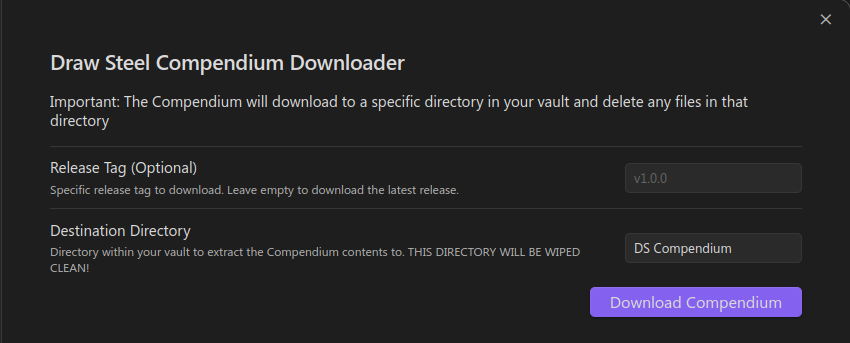

# Compendium Downloader

The Compendium Downloader feature will download the Markdown of the 
[Draw Steel Compendium](https://steelcompendium.io/compendium) into your local vault.

**IMPORTANT: The directory will get wiped clean every time the compendium is downloaded.  Any files in the 
specified directory will be erased.  Do not edit these files and don't put any notes in the compendium directory.**

## Quick Start

1. Open the Draw Steel Elements settings
2. (Optional) Edit the [configuration](#configuration)
3. Click the "Download Compendium" button

The Compendium will download into Destination Directory (`DC Compendium` in this case).

## Configuration

In the Draw Steel Elements settings you can configure the downloader

- **Release Tag**
  - Set to the name of a [Release](https://github.com/SteelCompendium/data-md-dse/releases) to "lock in" a specific version of the compendium. 
  - Optional: Leave empty to download the [latest release](https://github.com/SteelCompendium/data-md-dse/releases/latest)
- **Destination Directory**
  - Set to the path in your vault to store the Compendium
  - Do not edit these files and don't put any notes in the compendium directory - they will get deleted!
  - Default value: `DS Compendium`

## Command Palette

Downloading the compendium can also be triggered from the command palette:

1. Open the [Command Palette](https://help.obsidian.md/Plugins/Command+palette)
2. Search and execute `Draw Steel Elements: Download Compendium`
