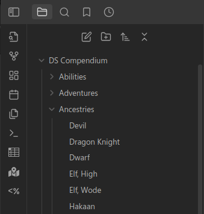
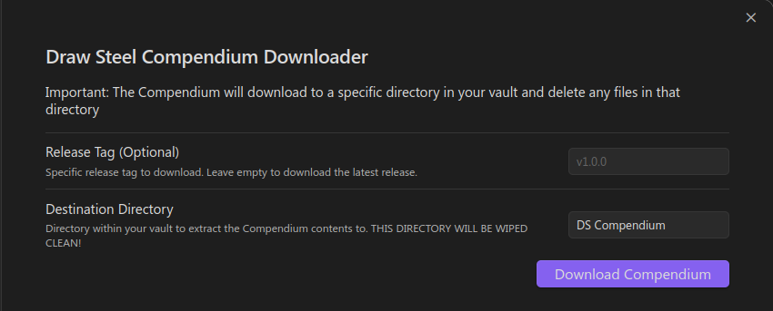

# Compendium Sync

Compendium Sync downloads the Markdown of the
[Draw Steel Compendium](https://steelcompendium.io/compendium) — published from the
[`data-unified`](https://github.com/SteelCompendium/data-unified) repo — into a folder in
your vault, and keeps it up to date.

**Non-destructive by design:** only files the plugin itself installed are ever created,
updated, or removed. Your own notes in the destination folder — and any file that happens
to collide with a compendium path — are never touched; a collision is skipped and reported
instead of overwritten. Removals (a file deleted upstream) go through Obsidian's trash, so
they're always recoverable, never a hard delete.

**The rules are still actively in development and are subject to change.** If you link to
files in the compendium, a future sync may rename or remove the file at that path. To lock
in a specific version, set the Release field to a specific
[release tag](https://github.com/SteelCompendium/data-unified/releases).

## Quick Start

1. Open the Draw Steel Elements settings and scroll to the **Compendium** section.
2. (Optional) Edit the [configuration](#configuration).
3. Click the **Sync** button.

The compendium downloads into the Destination folder (`DS Compendium` by default).

## Configuration

In the Draw Steel Elements settings, under **Compendium**:

- **Destination folder**
  - Vault folder the compendium is synced into.
  - Default value: `DS Compendium`
- **Release**
  - Set to a specific [release tag](https://github.com/SteelCompendium/data-unified/releases)
    to lock in a specific version of the compendium.
  - Leave empty to sync the latest release.
- **Locale**
  - The compendium's language. Only English (`en`) is published today.

Below these fields, the settings tab shows the currently synced release tag, file count, and
sync date (or "No compendium synced yet.").

## Syncing

- **Sync** downloads the selected release and updates only the files the plugin manages —
  new files are created, changed files are updated, and files removed upstream (that you
  haven't edited) are trashed. Files you added yourself, or upstream files you've edited,
  are left alone; anything skipped is listed in a Notice and the developer console.
- **Check for updates** makes a single metadata request to see whether a newer release is
  available, without downloading or changing anything.

### First sync into an existing folder

If the destination folder already contains files but has never been synced by this plugin
(for example, a compendium copy from a pre-6.0.0 install of this plugin, or your own
homebrew at that path), the first sync asks you to either move that folder to the trash
first or keep everything in place. Nothing is touched automatically either way; files you
keep are still never overwritten if they don't collide with a compendium path, and any that
do are skipped and reported.

## Command Palette

Syncing can also be triggered from the command palette:

1. Open the [Command Palette](https://help.obsidian.md/Plugins/Command+palette)
2. Search and execute `Draw Steel Elements: Sync compendium`
