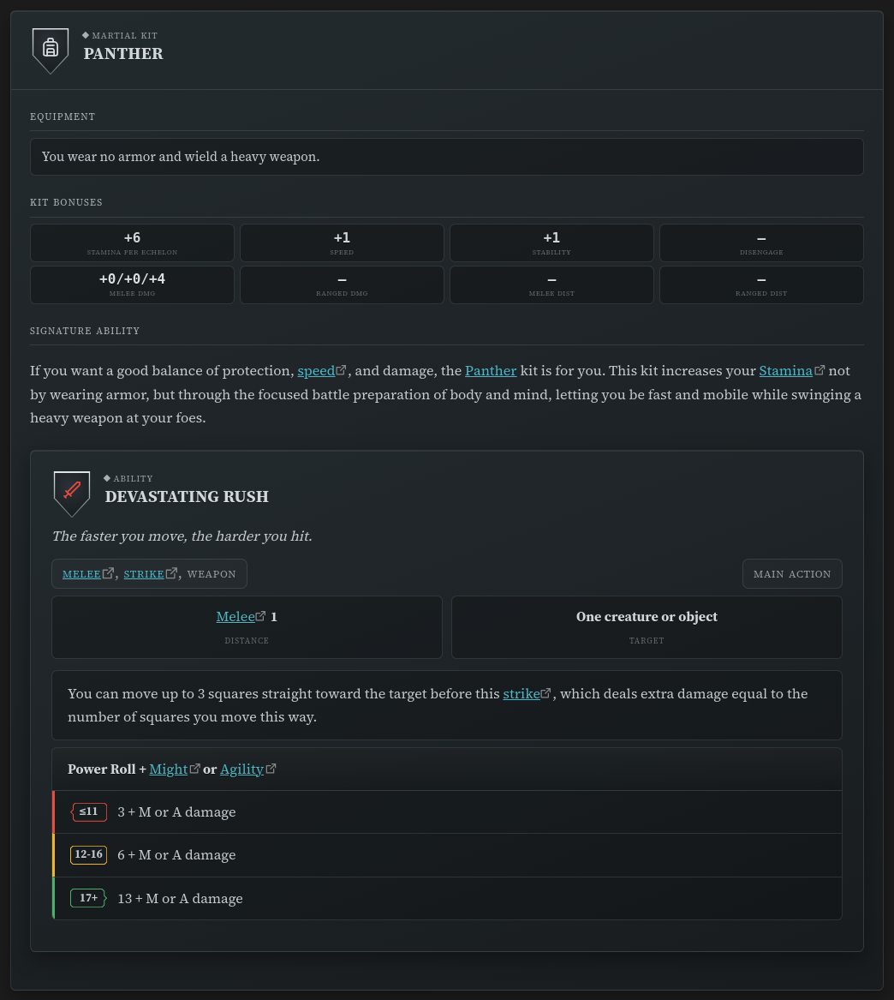

# Compendium Sync

Compendium Sync downloads the Markdown of the
[Draw Steel Compendium](https://steelcompendium.io/compendium) — published from the
[`data-unified`](https://github.com/SteelCompendium/data-unified) repo — into a folder in
your vault, and keeps it up to date.

**Non-destructive by design:** only files the plugin itself installed are ever created,
updated, or removed. Your own notes in the destination folder — and any file that happens
to collide with a compendium path — are never touched; a collision is skipped and reported
instead of overwritten. Removals (a file deleted upstream) go through Obsidian's trash, so
they're always recoverable, never a hard delete.

**The rules are still actively in development and are subject to change.** If you link to
files in the compendium, a future sync may rename or remove the file at that path. To lock
in a specific version, set the Release field to a specific
[release tag](https://github.com/SteelCompendium/data-unified/releases).

First time? [Getting started](getting-started.md) walks through the sync in context.

## Quick Start

1. Open **Settings → Draw Steel Elements → Compendium**.
2. (Optional) Edit the [configuration](#configuration).
3. Click the **Sync** button.


The compendium downloads into the Destination folder (`DS Compendium` by default).

## Configuration

On the **Settings → Draw Steel Elements → Compendium** page:

- **Destination folder**
  - Vault folder the compendium is synced into.
  - Default value: `DS Compendium`
- **Release**
  - Set to a specific [release tag](https://github.com/SteelCompendium/data-unified/releases)
    to lock in a specific version of the compendium.
  - Leave empty to sync the latest release.
- **Locale**
  - The compendium's language. Only English (`en`) is published today.

Below these fields, the settings tab shows the currently synced release tag, file count, and
sync date (or "No compendium synced yet.").

## Syncing

- **Sync** downloads the selected release and updates only the files the plugin manages —
  new files are created, changed files are updated, and files removed upstream (that you
  haven't edited) are trashed. Files you added yourself, or upstream files you've edited,
  are left alone; anything skipped is listed in a Notice and the developer console.
- **Check for updates** makes a single metadata request to see whether a newer release is
  available, without downloading or changing anything.

### First sync into an existing folder

If the destination folder already contains files but has never been synced by this plugin,
the first sync stops and asks before touching anything. Which question it asks depends on
what's in there:

- **A pre-7.0.0 compendium** (at least twenty files sitting at exact pre-7.0.0 compendium
  paths) — you're offered the **layout migration**: the old files are *moved* to their
  7.0.0 paths so Obsidian rewrites the links in your notes for you. Declining leaves the
  compendium alone and **does not sync** — syncing creates the new files and makes the
  move impossible, so that is a separate, explicitly labelled button. You are asked again
  the next time you sync. See
  [Migrating from 5.x to 7.0.0 → Your links to compendium notes keep working](migrating-to-7.md#your-links-to-compendium-notes-keep-working)
  for what the dialog shows and what it will and won't do. The command
  **Migrate compendium from the pre-7.0.0 layout** runs the same thing at any time.
- **Anything else** (your own homebrew at that path, a partial copy) — you're asked to
  either move that folder to the trash first or keep everything in place.

Nothing is touched automatically either way; files you keep are still never overwritten if
they don't collide with a compendium path, and any that do are skipped and reported. A
**fresh install never sees either prompt** — there is no folder yet, and nothing to ask
about.

## Referencing a compendium entry in your notes

Once the compendium is synced, a `ds-scc` block renders any entry in it. The body is the
entry's SCC code — nothing else:

````markdown
```ds-scc
mcdm.heroes.v1/kit/panther
```
````

That's the whole format. The `scc.v1:` prefixed form works too
(`scc.v1:mcdm.heroes.v1/kit/panther`); anything that isn't a code renders a short message
telling you so.



The easiest way to write one is the command palette: **Insert Draw Steel: compendium
reference** searches the compendium and drops the block in for you. (Hold Shift when you
pick an entry to insert an inline link instead, or Ctrl/Cmd to copy just the code.)

The block re-resolves every time the note renders, so it always shows the currently synced
version of the entry — nothing is copied into your note but the code. If the code isn't in
your vault, the block offers a link to the entry on steelcompendium.io and a nudge to sync.

**What it looks like is not a promise.** `ds-scc` renders whatever the entry is — a kit, a
condition, a rule, a statblock — using whichever layout suits it, and those layouts change
as the plugin develops. The code you write is stable; the card it produces is not
specified.

Statblocks, features and featureblocks accept the same reference in their own blocks — see
[Use a creature from the compendium](statblock.md#use-a-creature-from-the-compendium).

## Compendium links

Inline links to a compendium entry — the ones this plugin writes when you hold Shift on an
insert (above), and the ones already inside compendium notes themselves — look like this:

```markdown
[Vasloria](scc.v1:mcdm.heroes.v1/rule.world/vasloria)
```

**Clicking one works everywhere** — Reading view, Live Preview, Source mode, and in a
popout window — and does the same thing every time: opens the synced note if you have it,
opens the entry's page on steelcompendium.io if you don't, or tells you plainly that the
code isn't recognized. Ctrl/Cmd-click, Ctrl/Cmd+Alt-click and middle-click open it in a new
tab, split, or window the same way a normal link would.

**What doesn't work yet:**

- **Backlinks, the graph view, and "unlinked mentions"** don't know about these links. As
  far as Obsidian's own link index is concerned, they're not links to anything in your
  vault — so a compendium note won't show up in another note's backlinks just because it's
  referenced this way, and you won't see it in the graph. Clicking still works regardless;
  this only affects Obsidian's own link-tracking features.
- **There's no option yet to have the compendium sync in wikilink or plain vault-path
  form** instead of this `scc.v1:` form. That form is what makes a link survive the
  compendium's layout changing under it — some sync in the future may keep breaking links
  from happening if the compendium's structure changes again — so it isn't going away, but
  an alternative is planned.

Both are on the list; this note exists so "why doesn't this show up in backlinks?" has an
answer today instead of feeling like a bug.

**One more thing worth remembering:** clicking always works, but only **Reading view**
actually draws the cards (`ds-scc` and every other element). A link will take you to the
right note in any view; what you see when you get there depends on which view that note is
in.

## Copying an entry to homebrew from

**Insert Draw Steel: compendium block (snapshot)** does something different: it pastes the
entry's full YAML into your note as an editable copy. That's the starting point for
homebrew — take a goblin, raise its Stamina, give it a new ability, rename it, and it's
yours.

A snapshot is deliberately a **copy, not a link**: it does not follow the compendium
afterwards, because your edits are the whole point. If you want content that keeps updating
with the compendium, use **Insert Draw Steel: compendium reference** instead. Snapshots are
offered for statblocks, features and featureblocks.

## Command Palette

Syncing can also be triggered from the command palette:

1. Open the [Command Palette](https://help.obsidian.md/Plugins/Command+palette)
2. Search and execute `Draw Steel Elements: Sync compendium`

The pre-7.0.0 layout migration has its own entry:
`Draw Steel Elements: Migrate compendium from the pre-7.0.0 layout`.
