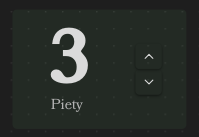

# Counter Element

The Counter Element is a tool designed to parse and display a numerical counter within Obsidian. It allows you to
define a counter with customizable maximum and minimum values using YAML syntax, and then renders this information in
an interactive format for easy tracking during gameplay or writing.

## Usage

To use the Counter Element, insert a code block with the language identifier `ds-counter` in your Obsidian note, and
then define your counter using YAML syntax inside the code block.

### Example counter:

Default (Vertical) Style

```
~~~ds-counter
name_top: Stamina
name_bottom: Current Stamina
current_value: 10
max_value: 20
min_value: 0
name_bottom_height: 0.75
~~~
```

Horizontal Style

```
~~~ds-counter
name_top: Health
name_bottom: Current health
current_value: 10
max_value: 20
min_value: 0
name_bottom_height: 0.75
style: horizontal
~~~
```

These code blocks will render the following counters with interactive buttons to increment or decrement the value
<span style="display:flex; flex-direction:row; column-gap:20px">
<span style="display:flex; flex-direction:column">
Default (Vertical) Style
<span style="height:126px">

</span>
</span>
<span style="display:flex; flex-direction:column">
Horizontal Style
<span style="height:126px">

</span>
</span>
</span>

## Field Definitions

Below is a detailed description of each field used in the counter element, including their types, default values, and whether they are required.

| Field                | Type      | Description                                                                                                                                                                  | Required | Default Value                    |
| -------------------- | --------- | ---------------------------------------------------------------------------------------------------------------------------------------------------------------------------- | -------- | -------------------------------- |
| `name_top`           | `string`  | The name shown above the counter (e.g., "Stamina", "Heroic Resource").                                                                                                       | No       | ""                               |
| `name_bottom`        | `string`  | The name shown below the counter (e.g., "Focus", "Drama).                                                                                                                    | No       | ""                               |
| `name`               | `string`  | Alias for `name_bottom` for backwards compatibility. If `name_bottom` exists name will be ignored.                                                                           | No       | ""                               |
| `current_value`      | `integer` | The current value of the counter.                                                                                                                                            | No       | `0`                              |
| `max_value`          | `integer` | The maximum value the counter can reach.                                                                                                                                     | No       | `undefined`                      |
| `min_value`          | `integer` | The minimum value the counter can reach.                                                                                                                                     | No       | `undefined`                      |
| `value_height`       | `float`   | Adjusts the size of the counter value text in the rendered output as a multiplier.                                                                                           | No       | `3`                              |
| `max_value_height`   | `float`   | Adjusts the size of the counter max_value text in the rendered output as a multiplier.                                                                                       | No       | The same value as `value_height` |
| `name_top_height`    | `float`   | Adjusts the size of the counter name_top text in the rendered output as a multiplier.                                                                                        | No       | `1`                              |
| `name_bottom_height` | `float`   | Adjusts the size of the counter name_bottom text in the rendered output as a multiplier.                                                                                     | No       | `1`                              |
| `name_height`        | `float`   | Alias for `name_top_height` and `name_bottom_height` for backwards compatibility. `name_bottom_height` and `name_bottom_height` will override their associated value if set. | No       | ""                               |
| `hide_buttons`       | `string`  | Hides 0, 1 or both buttons depending on the value. "both" will hide both buttons, "neither" will hide neither, "plus" and "minus" will hide the corresponding button.        | No       | `"neither"`                      |
| `style`              | `string`  | Selects the style of Counter. "default", "horizontal" and "vertical" are accepted values.                                                                                    | No       | `"default"`                      |

### Notes:

- The `current_value` is the starting point of the counter when it's rendered.
- If `max_value` is defined, the counter cannot increment beyond this value.
- If `min_value` is defined, the counter cannot decrement below this value.
- `value_height`, `name_top_height` and `name_bottom_height` are optional parameters to adjust the visual presentation of the counter in the rendered output. They are useful for customizing the display according to your preferences.
- You can click on the counter value to edit it directly.
