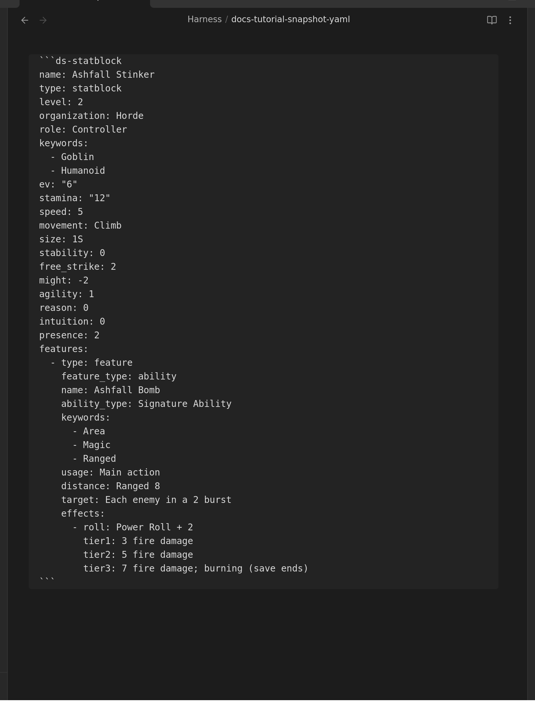

# Customize a Monster

Take a goblin, raise its Stamina, give it a new ability, rename it — and it's yours. This is
the homebrew loop, and it starts with one command.

New to the plugin? Start with [Getting started](getting-started.md).

## Reference or copy? Pick on purpose

The plugin can put a compendium creature in your note two ways, and the difference matters:

|  | **Insert compendium reference** | **Insert compendium block (snapshot)** |
|---|---|---|
| What lands in your note | a code — three short lines | the creature's full text, editable |
| When the compendium updates | your card updates too | your copy stays as you left it |
| Can you edit it? | no — it isn't in your note | yes; that's the point |
| Use it for | official content you just want to read | homebrew, reskins, "the same but nastier" |

Neither is better. Reference the monsters you're running as written; snapshot the ones you
intend to change.

## 1. Take a copy

1. Put your cursor where you want the creature, in **Editing view**.
2. Open the command palette (**`Ctrl/Cmd + P`**) and run
   **Insert Draw Steel: compendium block (snapshot)**.
3. Search for the creature and press `Enter`.

The whole creature lands in your note as text you can edit:

(Snapshots are offered for creatures, abilities and feature blocks — the things you'd
actually homebrew from.)

## 2. Make it yours

Switch to **Reading view** to see it, back to **Editing view** to change it. The lines read
exactly as they look: `name:` is the name, `stamina:` is the Stamina.

Some edits worth knowing:

- **Rename it** — change `name:`.
- **Make it tougher** — raise `stamina:`, or `level:` and `ev:` to match.
- **Change what it does** — every ability lives under `features:`. Copy an existing one,
  change its `name:` and its tier lines.
- **Change its damage** — the `tier1:` / `tier2:` / `tier3:` lines are just text; write
  whatever the ability does.

Two rules keep you out of trouble:

- **Indentation is meaningful.** Lines that line up belong together. Copy an existing block
  and edit it rather than typing a new one from scratch, and you'll rarely go wrong.
- **If a card disappears**, you have almost certainly mis-indented a line. Undo
  (`Ctrl/Cmd + Z`) back to the last version that rendered and redo the change more
  carefully.

Prefer not to edit text at all? Turn on
**[Settings → Authoring → "Show edit button on rendered blocks"](settings.md#authoring)**
and every card gains a pencil that opens a form, with a live preview and a Save button that
refuses to save something broken.

## 3. Keep it somewhere sensible

Your homebrew is an ordinary note — put it wherever you like, **except inside the
`DS Compendium` folder**. That folder belongs to the sync: files the plugin manages are
replaced with the official text when you next sync. Anywhere else in your vault is yours
forever and is never touched.

(If you did edit a compendium file in place before 7.0.0, the migration keeps a backup —
see [Migrating from 5.x to 7.0.0](migrating-to-7.md#your-edited-files-are-backed-up-first).)

## Building one from scratch

Same loop without the copy: type `/ds` in Editing view, pick **Statblock**, and edit the
worked example it writes. The full field list — what every line means, which are required —
is in [Statblock Element](statblock.md).

For a single ability rather than a whole creature, `/ds` → **Feature**; see
[Feature Element](Features.md).

## See also

- [Statblock Element](statblock.md) — every statblock field
- [Feature Element](Features.md) — abilities, traits, power rolls
- [Featureblock](featureblock.md) — groups of features (Malice, Dynamic Terrain)
- [Writing and editing blocks](writing-blocks.md) — `/ds`, autocomplete, the form editor
