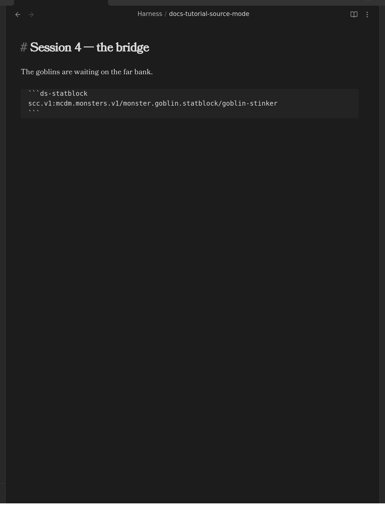
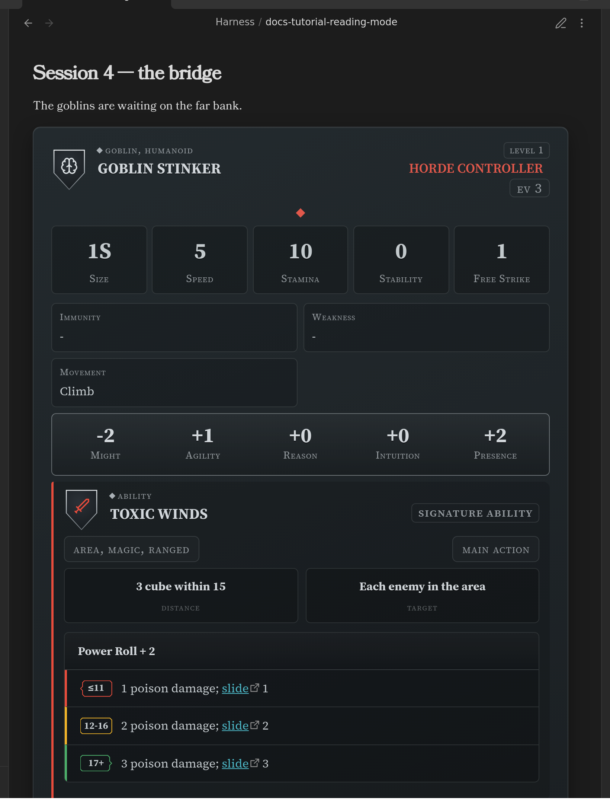
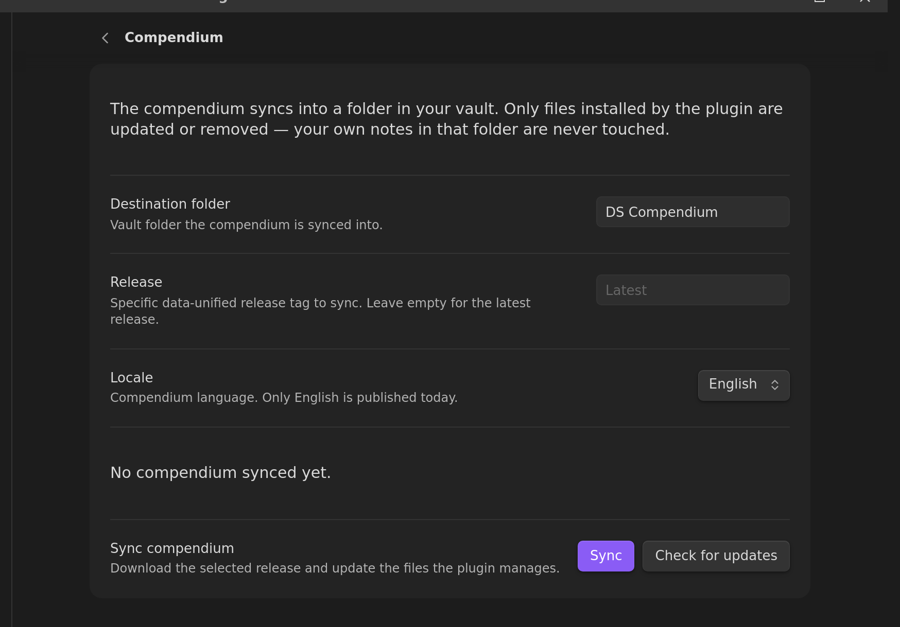
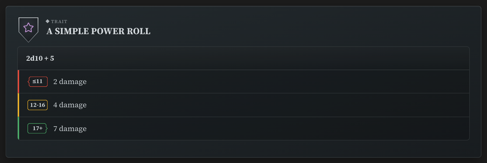
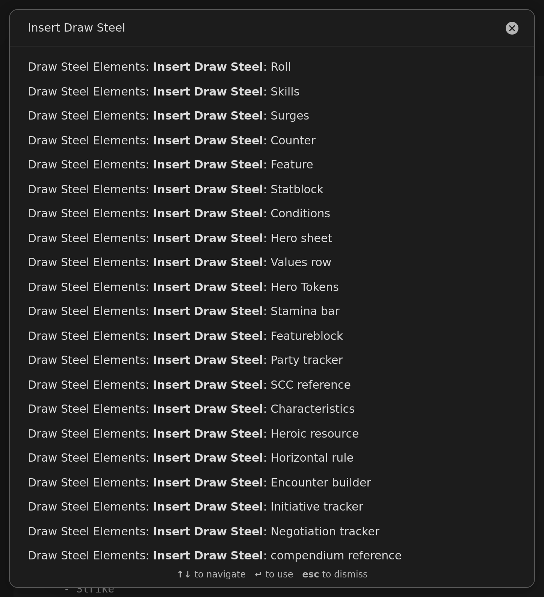
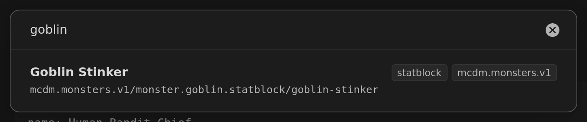

# Getting Started

This walks you from an empty vault to running a fight, in about fifteen minutes. It assumes
you have never written YAML or markdown — you won't have to type any here. Every step ends
with something you can see.

If you already used the plugin before 7.0.0, read
[Migrating from 5.x to 7.0.0](migrating-to-7.md) first: your first sync offers to move your
old compendium files, and taking that offer is what keeps your existing links working.

## 1. Install the plugin

You need **Obsidian 1.13.0 or newer**. Obsidian updates itself, so you almost certainly
have it — **Settings → General → Current version** if you want to be sure.

1. Open **Settings → Community plugins**.
2. If Obsidian says *Restricted mode is on*, click **Turn on community plugins**.
3. Click **Browse**, search for **Draw Steel Elements**, and click **Install**.
4. Click **Enable**.

That's it — there is nothing to configure yet.

## 2. Learn the one keyboard shortcut that matters

Everything the plugin draws — statblocks, ability cards, trackers — only appears in
Obsidian's **Reading view**. In **Editing view** you see the text you wrote instead.

**`Ctrl + E`** (**`Cmd + E`** on a Mac) switches between them. You will use it constantly.

Here is the same note in both. Editing view — the text:



Reading view — what that text draws:



If you ever see a block of grey text where you expected a card, you are in Editing view.
Press `Ctrl/Cmd + E`.

## 3. Download the compendium

The plugin can keep a copy of the official
[Draw Steel Compendium](https://steelcompendium.io/compendium) inside your vault — every
monster, kit, ability and rule — so you can drop any of it into your notes.

1. Open **Settings → Draw Steel Elements → Compendium**.
2. Click **Sync**.



It downloads into a folder called **DS Compendium**. Your own notes are never touched: the
plugin only ever updates files it installed itself.

**If you used the plugin before 7.0.0**, this first sync stops and offers to move your old
compendium files to their new locations first. **Say yes.** Obsidian rewrites the links in
your notes as it moves them, so everything you wrote keeps working — and it makes a backup
of anything you edited before it starts. The full story, including what the dialog shows
you before anything happens, is in
[Migrating from 5.x to 7.0.0](migrating-to-7.md#your-links-to-compendium-notes-keep-working).

## 4. Make your first element

Open any note, make sure you are in **Editing view** (`Ctrl/Cmd + E`), and type:

```
/ds
```

A list of everything the plugin can draw appears. Keep typing to narrow it — `/dsstat` for
a statblock, `/dsroll` for a dice roller. Pick one with the arrow keys and `Enter`.

The plugin writes a complete, working example into your note. Switch to Reading view
(`Ctrl/Cmd + E`) and there it is:



Now go back to Editing view and change something — a name, a number. Return to Reading
view. That is the whole authoring loop: **edit the text, look at the card**.

> **Everything is a "code block".** The lines with ``` around them are how Obsidian marks
> off a chunk of special text. The plugin reads what is inside and draws something in its
> place. You never have to write those lines yourself — `/ds` does it for you.

## 5. Drop a monster into a note

You don't have to type a monster out. With the compendium synced:

1. Put your cursor where you want the monster, in **Editing view**.
2. Open the command palette — **`Ctrl/Cmd + P`**.
3. Type **`Insert Draw Steel`** and pick **Insert Draw Steel: compendium reference**.



4. Search for the creature you want and press `Enter`.



The plugin writes three short lines into your note. In Reading view they become the whole
statblock — the one you saw in step 2.

**Nothing was copied into your note but a code.** That is deliberate: the card always shows
the currently synced version of that monster, so when the compendium is updated, your notes
are too. If you would rather have your *own* copy to change, that is the
[Customize a monster](customizing-a-monster.md) guide.

## 6. Run a fight

The initiative tracker runs an encounter: turn order, Stamina, conditions, Malice.

1. In Editing view, type `/ds` and pick **Initiative tracker**. You get a worked example
   with two heroes and a group of enemies.
2. Switch to Reading view.


Now play with it — it is all clickable:

- **Click the circle** next to a name to mark that someone has taken their turn.
- **Click a Stamina number** to open the damage/healing editor.
- **Click the `+`** in a conditions row to apply a condition.
- **Malice** has its own panel, with arrows to spend and gain, and a log.
- **"Advance round"** clears the turn markers and moves to the next round.

Everything you click is written back into the note, so closing Obsidian and coming back
later picks up exactly where you left off.

To replace the example heroes with your party, go back to Editing view and edit the names
and numbers — they read exactly as they look. The full field list is in
[Initiative Tracker](initiative-tracker.md).

## Where to go next

- **[Run an encounter](running-an-encounter.md)** — build the fight from compendium
  monsters, with a difficulty budget, then hand it to the tracker.
- **[Track your hero](hero-suite.md)** — Stamina, heroic resource, surges and conditions.
- **[Customize a monster](customizing-a-monster.md)** — the homebrew loop.
- **[Style your statblocks](styling-statblocks.md)** — make cards look the way you like.
- **[Settings](settings.md)** — a tour of every page.
- **[All elements](index.md#elements)** — the full catalog.

Something not rendering? It is nearly always Reading view (`Ctrl/Cmd + E`) or an un-synced
compendium (**Settings → Draw Steel Elements → Compendium → Sync**).
