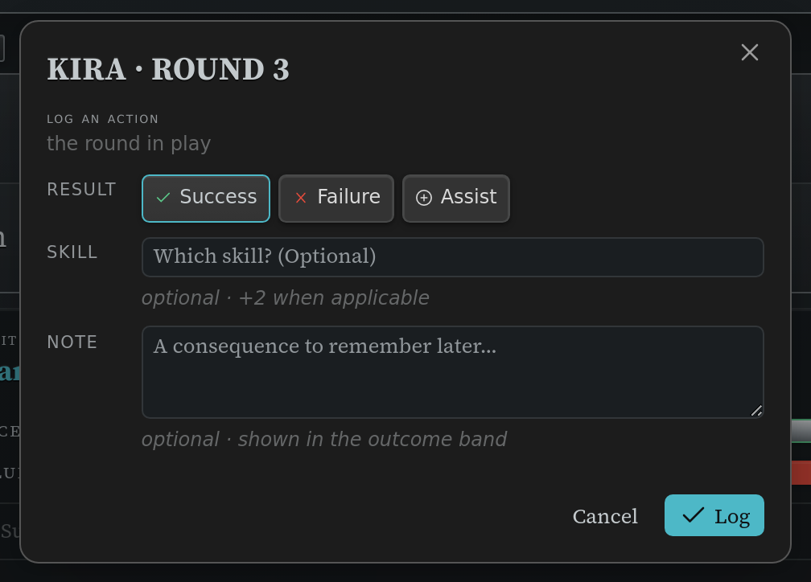

# Director's Trackers

Four blocks for the things a Director tracks outside a fight: building an encounter,
running a montage test, following a downtime project, and keeping the party's totals.

Like the other trackers, each of these **writes its state back into the note** as you use
it, and each can be pinned to the
[sidebar](writing-blocks.md#pinning-a-block-to-the-sidebar) so it stays available while you
move between notes. These blocks also carry a `_dse_anchor:` key once pinned — that's the
plugin's bookmark; leave it alone. (A `ds-scc` reference block never gets one — see
[Pinning a block to the sidebar](writing-blocks.md#pinning-a-block-to-the-sidebar).)

## Encounter builder (`ds-encounter`)

List the monsters you're thinking of using and the builder totals their Encounter Value
against your party's budget.

```markdown
~~~ds-encounter
label: Ambush at the ford
party:
  hero_count: 4
  hero_level: 3
monsters:
  - code: scc.v1:mcdm.monsters.v1/monster.goblin.statblock/goblin-stinker
    count: 6
    squad: minion
  - code: scc.v1:mcdm.monsters.v1/monster.dragon.statblock/crucible-dragon
    count: 1
~~~
```


| Field | What it is |
|---|---|
| `party.hero_count`, `party.hero_level` | How many heroes, and what level — this sets the budget. |
| `party.victories` | The party's Victories, which raise the budget. |
| `monsters[].code` | A compendium code for the creature. One row per creature type. |
| `monsters[].count` | How many of them. |
| `monsters[].squad` | `minion` or `captain`, when the row is part of a minion squad. |
| `label` | A name for the encounter. |

Each row is looked up in your [synced compendium](compendium-sync.md); a code that can't
be found is listed with the reason and left out of the totals rather than silently
dropped. **Nothing works here until the compendium is synced** — the builder reads the
creatures' stats from it.

The summary line shows spent EV, the party's budget, the ratio between them, a difficulty
band (trivial / easy / standard / hard / extreme) and the Victories the party earns for
winning. Budgets are worked out for parties of **1–6 heroes at levels 1–10**; outside that
range the budget shows as unset and only the spent EV is shown.

Two buttons finish the job:

- **Create tracker block** writes a matching
  [initiative tracker](initiative-tracker.md) block at the end of the note, with the
  monsters grouped (minions as squads) and ready to run.
- **Open in sidebar** does the same and pins the new tracker to the sidebar.

The block also keeps a `_computed:` key with the last totals. It's a display cache — the
builder recalculates every time it renders, so don't bother editing it.

## Montage Test tracker (`ds-montage`)

```markdown
~~~ds-montage
title: Cross the Ashfall Wastes
description: |
  Forty miles of volcanic waste, and the ashfall is three days behind them. The heroes
  have to find the pass, keep the mules alive, and reach the Cinder Gate before the sky
  closes over it.
rounds: 3
success_limit: 6
failure_limit: 3
successes: 0
failures: 0
participants:
  - name: Kira
    skills_used: []
  - name: Bram
    skills_used: []
entries: []
current_round: 1
~~~
```


A working board for a Draw Steel montage test: one row per hero, one column per round, and
a running tally beside each row. `description` is an optional brief — a few lines of prose
about the montage — shown above the board.

**Logging an action.** Click the **Log an action…** button at the bottom of the card, or
click directly on a hero's cell for the round in play, and a small form opens: pick the
hero and the round (both are pre-filled for you), pick success, failure or assist, and
optionally name the skill used and add a note. Nothing is written until you press **Log**.
The form also shows, as a reminder, which power roll result starts a success at each
difficulty — and if you have [rolling turned on](settings.md#rolling), a **Roll** button
right there resolves the test and picks the result for you.



**Correcting a mistake.** Click an already-logged cell (it shows a small pencil mark) to
open the same form pre-filled with what's recorded, so you can change the result, the
skill, or the note — or remove it outright with the **Remove** button. This is also how you
fix a hero's typo'd result if you ever hand-edit the note directly.

**Notes.** Anything you type in a test's Note field — a consequence, a complication, a
reward — shows up listed under the outcome banner below the board, tagged with the hero and
round it happened in.

**The skill-reuse rule.** A hero can't use the same skill twice in one montage (the book's
own rule). The tracker warns you right in the form when you try — it never blocks you,
since the Director always has the final call.

**Test tiers and running the montage.** Above the board, **Test tiers** is a collapsed
strip you can open for a quick-reference table of what each power roll result means at
each difficulty (with any reward or consequence noted). Below the board, **Running a
montage test** is a collapsed panel covering the same tiers plus how to set limits and how
a montage ends — leave both closed for a quick glance, or open either when you need the
detail.

**Ending a round.** Below the board, next to **Log an action…**, the **End round N**
button moves everyone on to the next round — it's the only way to advance the round short
of hand-editing the block. If ending a round uses up the last one and no limit has been
hit, the montage finishes there (the outcome banner updates on its own).

**Undoing the last thing you logged.** The **Undo** button beside it removes whatever was
logged most recently — handy right after a slip of the finger. It only undoes the single
most recent entry; for anything further back, click that cell directly to correct or
remove it.

**When a montage finishes.** The board stands down to two buttons: **Reopen**, if the
montage simply ran out of rounds with no limit reached (it adds one more round and picks
up where you left off), and **Clear all**, which wipes the running successes, failures,
the round, and everyone's logged actions and used skills so the same block can run the
montage again from the top. Once a success or failure *limit* has actually been hit, that
result is final — **Reopen** isn't offered, and **Clear all** is the only way back.

**The card's menu (⋯).** Hover the card for its menu panel: **Add a round** extends the
montage by one round; **Add a hero** adds a new participant by name; **Set limits…** opens
a small form to change the success/failure limits; **Reset progress** clears the running
successes, failures, the round, everyone's logged actions and used skills — your setup
(title, description, limits, roster) survives it, so the same block can run the montage
again. (This is the same reset **Clear all** performs once the montage is finished — just
reachable at any time, not only once the board is done.)

## Project tracker (`ds-project`)

```markdown
~~~ds-project
goal_name: Craft Teleportation Platform
goal_code: scc.v1:mcdm.heroes.v1/project/craft-teleportation-platform
goal_points: 1500
accrued: 340
prerequisites:
  item: planar lodestone
  source: Aetheric Cartography (Old Vaslorian)
current_respite: 2
rolls:
  - { respite: 1, roll: 14, points: 14 }
  - { respite: 2, roll: 20, points: 34, breakthrough: true }
~~~
```


Tracks one downtime project: the goal, its prerequisites, the points accrued so far, and
every respite roll that got you there.

- `goal_name` and `goal_points` are yours to set. If you give a `goal_code` instead and
  have the compendium synced, the tracker fills the name and goal from the compendium
  entry for display. Where a project's goal is conditional or given per tier, it leaves the
  number blank rather than guessing.
- Log a roll manually, or let the built-in roller do it if you have
  [rolling turned on](settings.md#rolling). A natural 19–20 is a **breakthrough**: it adds
  a +20 bonus and prompts you for the extra roll.
- `rolls[]` and `accrued` are maintained for you as you log.

## Party tracker (`ds-party`)

```markdown
~~~ds-party
members:
  - name: Kira
    level: 3
    class: Shadow
    ancestry: Wode Elf
    victories: 1
    xp: 24
    renown: 3
    wealth: 1
    hero_ref: "[[Kira]]"
party:
  hero_tokens: 2
~~~
```


One row per hero with level, class, ancestry, victories, XP, renown and wealth, plus the
party's shared hero token pool. `hero_ref` is an ordinary link to that hero's note.

Each value has a stepper, and the action bar can award Victories to everyone at once. The
tracker also surfaces what the rules key off those numbers — a member's echelon, and how
many followers their renown supports. **Convert victories to XP (respite)** clears
everyone's Victories and reminds you to award XP; it doesn't invent an exchange rate, so
XP stays a number you enter.
