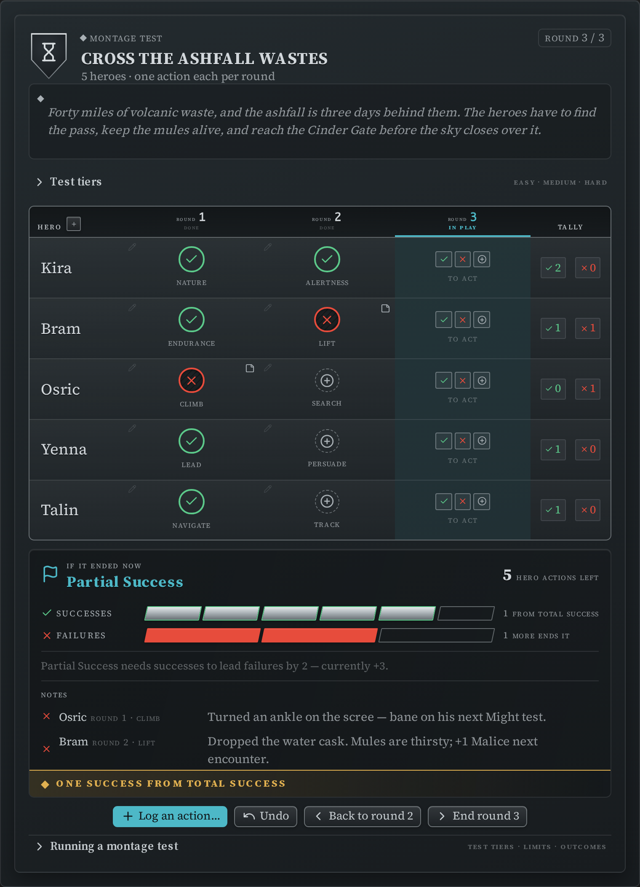
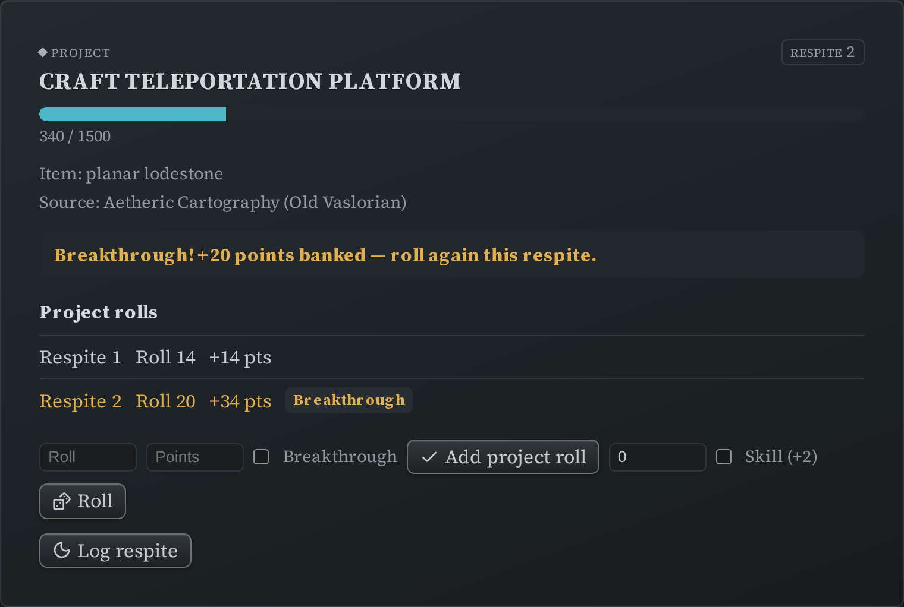
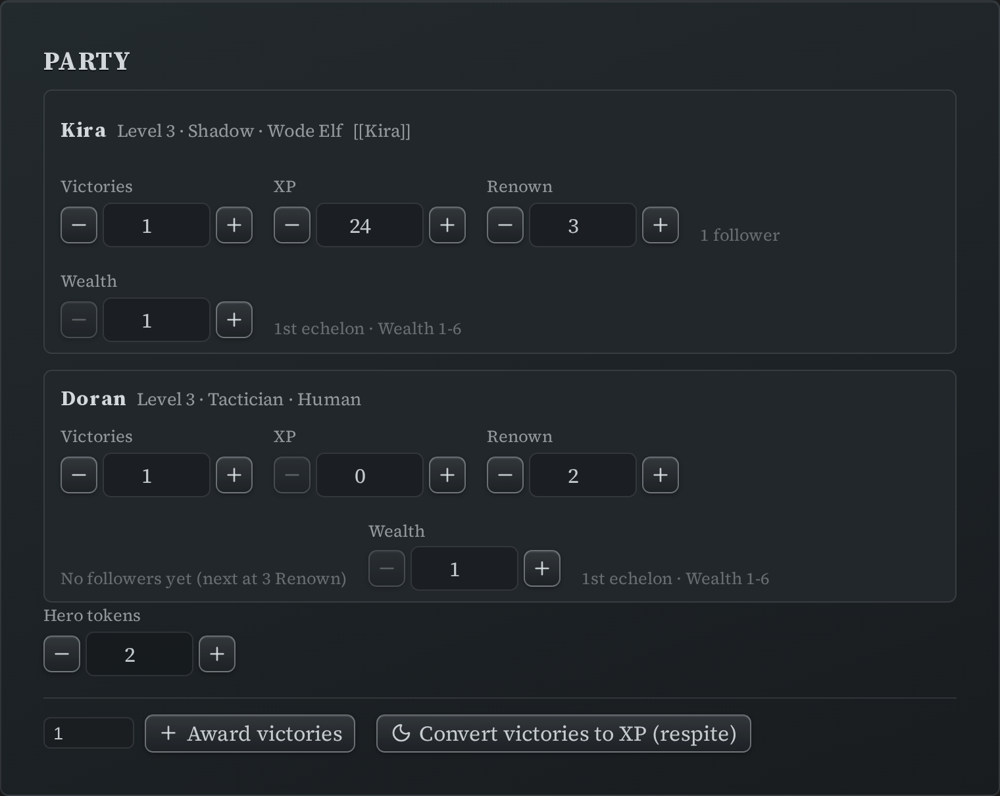

# Director's Trackers

Four blocks for the things a Director tracks outside a fight: building an encounter,
running a montage test, following a downtime project, and keeping the party's totals.

Like the other trackers, each of these **writes its state back into the note** as you use
it, and each can be pinned to the
[sidebar](writing-blocks.md#pinning-a-block-to-the-sidebar) so it stays available while you
move between notes. These blocks also carry a `_dse_anchor:` key once pinned — that's the
plugin's bookmark; leave it alone. (A `ds-scc` reference block never gets one — see
[Pinning a block to the sidebar](writing-blocks.md#pinning-a-block-to-the-sidebar).)

## Encounter builder (`ds-encounter`)

List the monsters you're thinking of using and the builder totals their Encounter Value
against your party's budget.

```markdown
~~~ds-encounter
label: Ambush at the ford
party:
  hero_count: 4
  hero_level: 3
monsters:
  - code: scc.v1:mcdm.monsters.v1/monster.goblin.statblock/goblin-stinker
    count: 6
    squad: minion
  - code: scc.v1:mcdm.monsters.v1/monster.dragon.statblock/crucible-dragon
    count: 1
~~~
```


| Field | What it is |
|---|---|
| `party.hero_count`, `party.hero_level` | How many heroes, and what level — this sets the budget. |
| `party.victories` | The party's Victories, which raise the budget. |
| `monsters[].code` | A compendium code for the creature. One row per creature type. |
| `monsters[].count` | How many of them. |
| `monsters[].squad` | `minion` or `captain`, when the row is part of a minion squad. |
| `label` | A name for the encounter. |

Each row is looked up in your [synced compendium](compendium-sync.md); a code that can't
be found is listed with the reason and left out of the totals rather than silently
dropped. **Nothing works here until the compendium is synced** — the builder reads the
creatures' stats from it.

The summary line shows spent EV, the party's budget, the ratio between them, a difficulty
band (trivial / easy / standard / hard / extreme) and the Victories the party earns for
winning. Budgets are worked out for parties of **1–6 heroes at levels 1–10**; outside that
range the budget shows as unset and only the spent EV is shown.

Two buttons finish the job:

- **Create tracker block** writes a matching
  [initiative tracker](initiative-tracker.md) block at the end of the note, with the
  monsters grouped (minions as squads) and ready to run.
- **Open in sidebar** does the same and pins the new tracker to the sidebar.

The block also keeps a `_computed:` key with the last totals. It's a display cache — the
builder recalculates every time it renders, so don't bother editing it.

## Montage Test tracker (`ds-montage`)

```markdown
~~~ds-montage
title: Cross the Ashfall Wastes
rounds: 2
success_limit: 5
failure_limit: 3
successes: 0
failures: 0
current_round: 1
participants:
  - name: Kira
    skills_used:
      - Nature
      - Endurance
~~~
```



Tracks the round, the running successes and failures against their limits, and which
skills each participant has already used (the tracker warns you when someone reuses one).
Record a test's outcome from the participant's row; the tally and round track update
together.

The menu (**⋮**) has a **Reset** that clears progress only — successes, failures, the
round, and everyone's used skills. Your setup (title, limits, roster) survives it, so the
same block can run the montage again.

## Project tracker (`ds-project`)

```markdown
~~~ds-project
goal_name: Craft Teleportation Platform
goal_code: scc.v1:mcdm.heroes.v1/project/craft-teleportation-platform
goal_points: 1500
accrued: 340
prerequisites:
  item: planar lodestone
  source: Aetheric Cartography (Old Vaslorian)
current_respite: 2
rolls:
  - { respite: 1, roll: 14, points: 14 }
  - { respite: 2, roll: 20, points: 34, breakthrough: true }
~~~
```



Tracks one downtime project: the goal, its prerequisites, the points accrued so far, and
every respite roll that got you there.

- `goal_name` and `goal_points` are yours to set. If you give a `goal_code` instead and
  have the compendium synced, the tracker fills the name and goal from the compendium
  entry for display. Where a project's goal is conditional or given per tier, it leaves the
  number blank rather than guessing.
- Log a roll manually, or let the built-in roller do it if you have
  [rolling turned on](settings.md#rolling). A natural 19–20 is a **breakthrough**: it adds
  a +20 bonus and prompts you for the extra roll.
- `rolls[]` and `accrued` are maintained for you as you log.

## Party tracker (`ds-party`)

```markdown
~~~ds-party
members:
  - name: Kira
    level: 3
    class: Shadow
    ancestry: Wode Elf
    victories: 1
    xp: 24
    renown: 3
    wealth: 1
    hero_ref: "[[Kira]]"
party:
  hero_tokens: 2
~~~
```



One row per hero with level, class, ancestry, victories, XP, renown and wealth, plus the
party's shared hero token pool. `hero_ref` is an ordinary link to that hero's note.

Each value has a stepper, and the action bar can award Victories to everyone at once. The
tracker also surfaces what the rules key off those numbers — a member's echelon, and how
many followers their renown supports. **Convert victories to XP (respite)** clears
everyone's Victories and reminds you to award XP; it doesn't invent an exchange rate, so
XP stays a number you enter.
