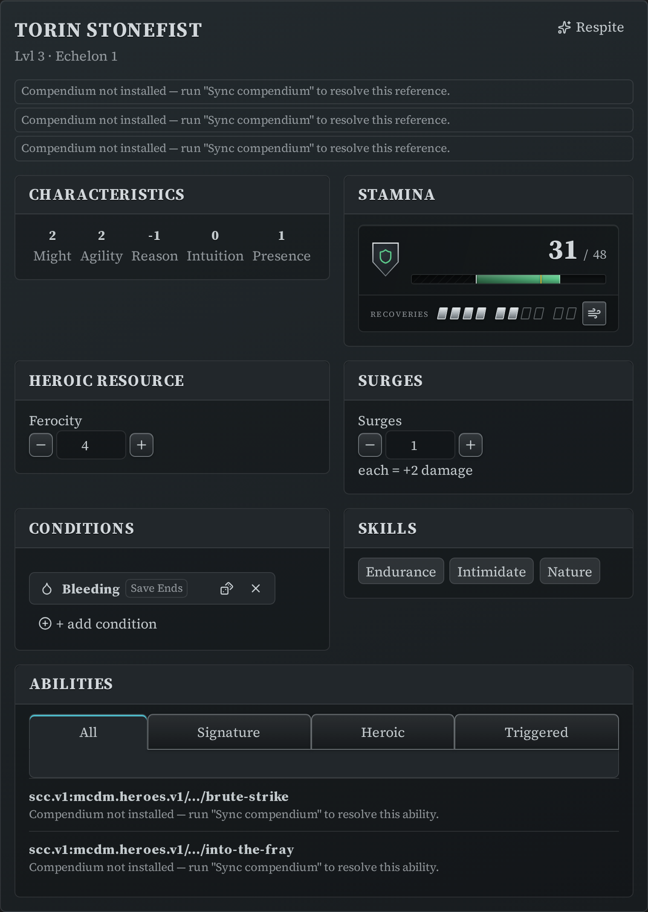
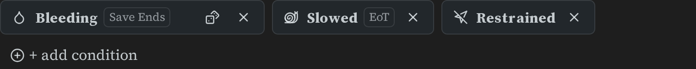
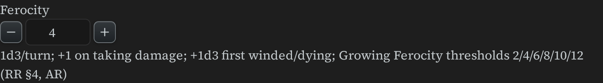
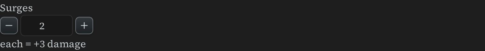
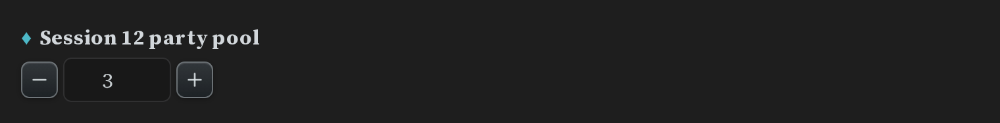

# Hero Sheets and Trackers

The hero sheet puts a whole character in one block. The four smaller blocks below it track
one thing each — useful on a [Canvas character sheet](canvas-character-sheet.md), in a
session note, or pinned to the
[sidebar](writing-blocks.md#pinning-a-block-to-the-sidebar).

All of these blocks **write their state back into the note** as you play: spend a Recovery
or a surge and the YAML in the block updates itself. You never have to edit those numbers
by hand.

## Hero sheet (`ds-hero`)

```markdown
~~~ds-hero
name: Torin Stonefist
level: 3
ancestry: scc.v1:mcdm.heroes.v1/ancestry/dwarf
class: scc.v1:mcdm.heroes.v1/class/fury
subclass: berserker
kits: [scc.v1:mcdm.heroes.v1/kit/mountain]
characteristics: { might: 2, agility: 2, reason: -1, intuition: 0, presence: 1 }
skills: [Endurance, Intimidate, Nature]
abilities:
  - scc.v1:mcdm.heroes.v1/feature.ability.fury.level-1/brutal-slam
~~~
```



The sheet renders characteristics, a Stamina bar with Recoveries, the heroic resource,
surges, conditions, and the hero's abilities as compact rows that expand into full ability
cards (rollable, if you have turned rolling on in [Settings](settings.md#rolling)).

### Fields

| Field | Required | What it is |
|---|---|---|
| `name` | Yes | The hero's name. |
| `level` | Yes | 1–10. |
| `characteristics` | Yes | `might`, `agility`, `reason`, `intuition`, `presence`. |
| `ancestry`, `class`, `kits` | No | Compendium codes (`scc.v1:…`), `[[wikilinks]]`, or inline data. |
| `subclass`, `skills` | No | Plain text and a list of skill names. |
| `abilities` | No | Compendium codes, or ability YAML written inline (same shape as a [feature block](Features.md)). |
| `max_stamina`, `recoveries_max`, `resource` | No | Overrides, for when you aren't resolving a class from the compendium. |
| `titles`, `perks`, `treasures`, `complication` | No | Shown as-is. |
| `state` | No | Written by the plugin — see below. Leave it out when you write a new sheet. |

### The compendium does the maths

If `class`, `ancestry` and `kits` are compendium codes and you have
[synced the compendium](compendium-sync.md), the sheet derives maximum Stamina, Recoveries
and the heroic resource's name for you. If a code can't be resolved — usually because the
compendium isn't synced yet — the sheet says so next to that slot and keeps rendering;
fill in `max_stamina` / `recoveries_max` / `resource` yourself if you'd rather not sync.

### At the table

- Click the Stamina bar to apply damage or healing; click a Recovery marker to spend or
  restore Recoveries.
- Steppers change the heroic resource and surges. Nothing is spent automatically —
  rolling never takes your surges.
- Add or remove conditions from the conditions strip.
- **`[respite]`** in the header takes a respite: Stamina and Recoveries back to full,
  temporary Stamina and surges cleared, and any *end of encounter* conditions removed
  (save-ends and end-of-turn conditions stay).
- **Edit definition** opens a form for the authored half of the sheet (name, level, class,
  abilities, …) without exposing the play state.

Everything you change during play is stored in the block's `state:` key. The part you
wrote by hand is left alone.

## Conditions (`ds-conditions`)

A conditions strip for one hero or creature, using the same condition picker as the
[initiative tracker](initiative-tracker.md#conditions).

```markdown
~~~ds-conditions
conditions:
  - key: bleeding
    effect: save ends
  - key: slowed
    effect: EoT
  - restrained
~~~
```



Each entry is either a bare condition name or an object with a `key` plus an optional
`effect` (its duration — "save ends", "EoT", "EoE") and `color`. Click **+** to add
conditions, click a condition to remove it.

## Heroic resource (`ds-resource`)

```markdown
~~~ds-resource
class: fury
current: 4
~~~
```



Name the `class` and the block labels itself with that class's resource (Ferocity, Focus,
Piety, Clarity, …), applies its floor, and shows a short reminder of how the resource is
gained. Unknown or missing classes get a generic "Resource" label.

| Field | Required | What it is |
|---|---|---|
| `current` | Yes | The current amount. Can be negative (Clarity). |
| `class` | No | Class name, e.g. `fury`. |
| `type` | No | Override the resource's name — for homebrew, or a class not in the list. |
| `min` / `max` | No | Override the floor; add a ceiling. Without `max` the stepper is unbounded. |

## Surges (`ds-surges`)

```markdown
~~~ds-surges
surges: 2
highest_characteristic: 3
~~~
```



A surge counter. `highest_characteristic` is optional; when present the panel shows what
each surge is worth ("each = +3 damage").

## Hero Tokens (`ds-tokens`)

```markdown
~~~ds-tokens
label: Session 12 party pool
tokens: 3
~~~
```



The party's shared Hero Token pool. Keep **one** of these — in your session note or the
sidebar — and everyone reads the same number. `label` is optional; `tokens` is the count.

## Stamina

The Stamina bar has its own page: [Stamina Bar](stamina-bar.md) (`ds-stamina-bar`),
including Recoveries, Catch Breath, and the Winded and Dying states.
