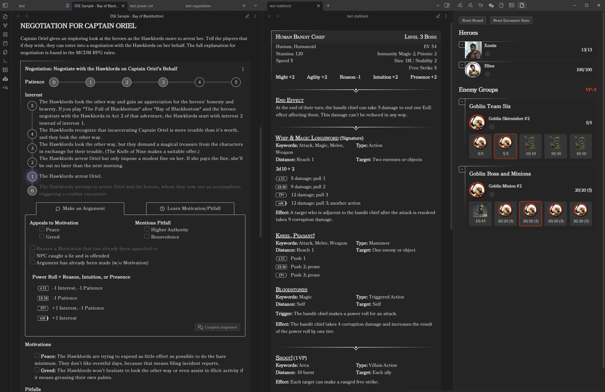
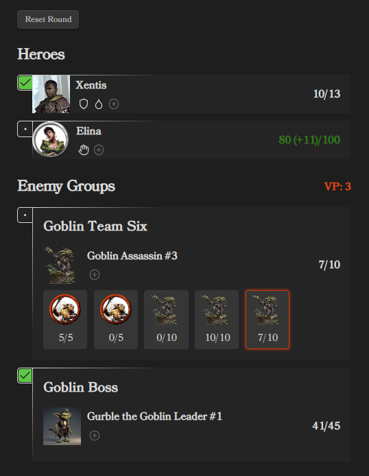
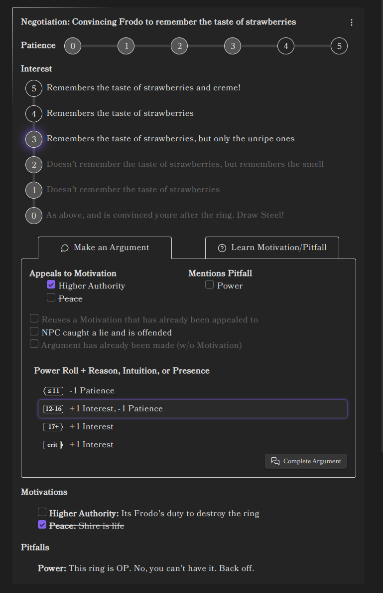
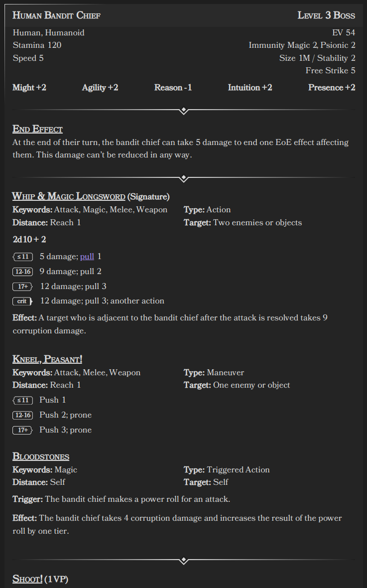
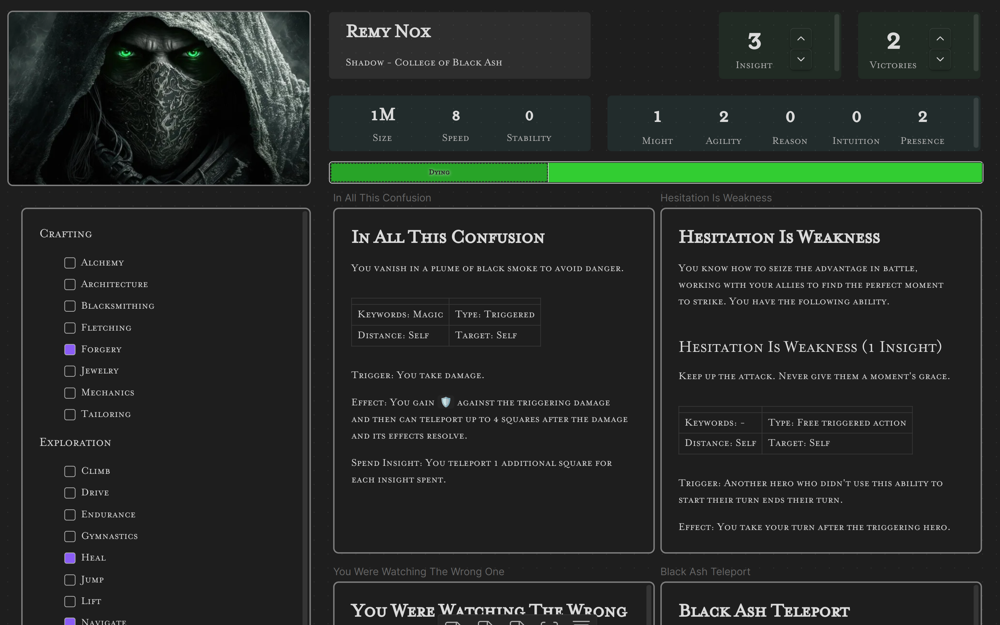

# Draw Steel Elements Plugin for Obsidian

Some helper elements for the MCDM Draw Steel TTRPG

_The Draw Steel Elements Obsidian Plugin is an independent product published under the DRAW STEEL Creator License and is not affiliated with MCDM Productions, LLC. DRAW STEEL © 2024 MCDM Productions, LLC._

**IMPORTANT: This plugin does NOT (yet) work in "Live Preview" mode.**

## Elements

### Feature Element

The [Features Element](Features.md) is used to quickly format Features and Traits

### Initiative Tracker Element

The [Initiative Tracker Element](initiative-tracker.md) is used to manage and run encounters.

### Negotiation Tracker Element

The [Negotiation Tracker Element](negotiation-tracker.md) is used to manage and run negotiations.

### Statblock Element

The [Statblock Element](statblock.md) is used to display statblocks.

### Horizontal Rule Element

The [Horizontal Rule Element](horizontal-rule.md) is used as an alternative `
` mimicking the Draw Steel design 

## Canvas Character Sheets

Various Elements are provided to support building [Character Sheets in Canvas](canvas-character-sheet.md)

## Compendium Downloader

The [Compendium Downloader](compendium-downloader.md) is able to manage a local copy of the 
[Draw Steel Compendium](https://steelcompendium.io/compendium) in your Obsidian Vault.   

