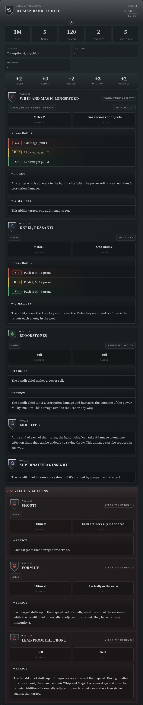
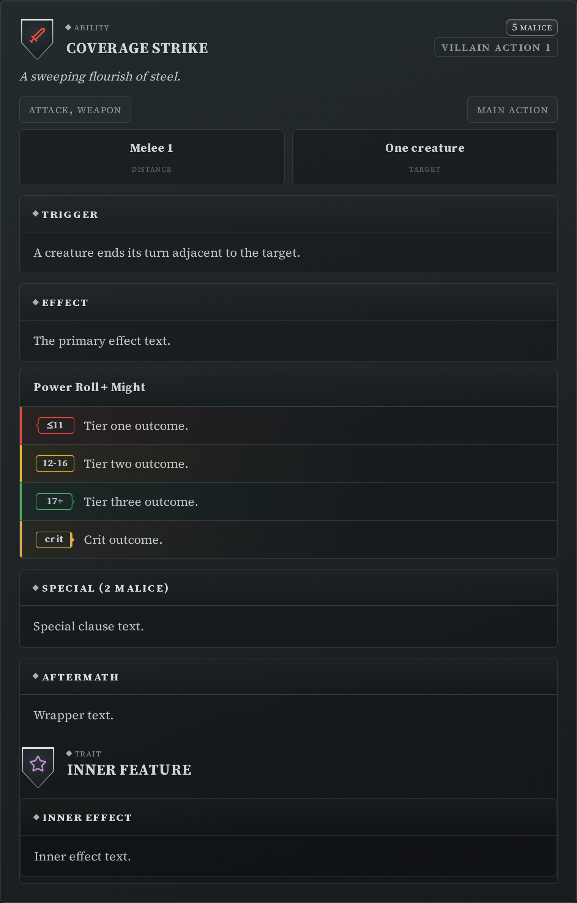
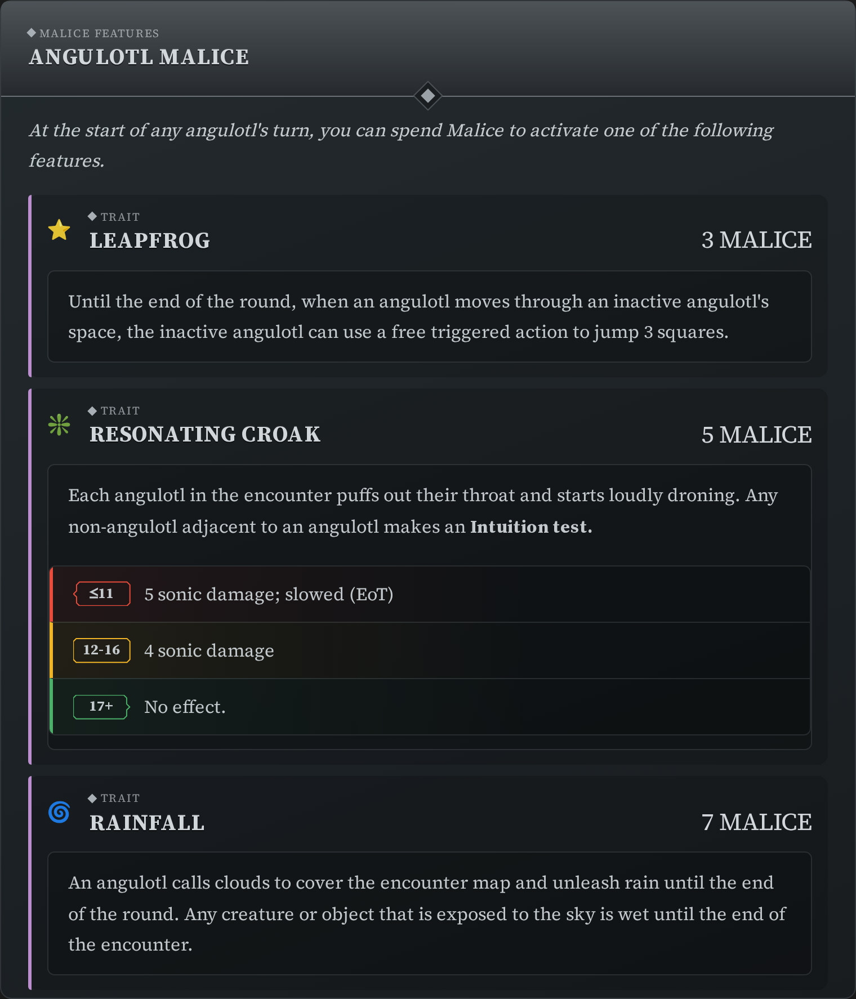
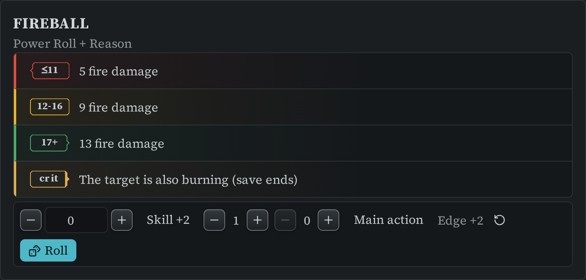
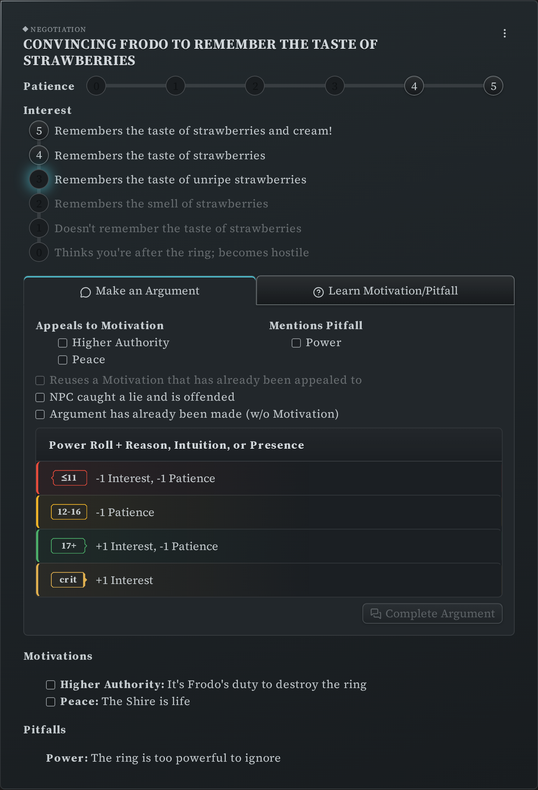
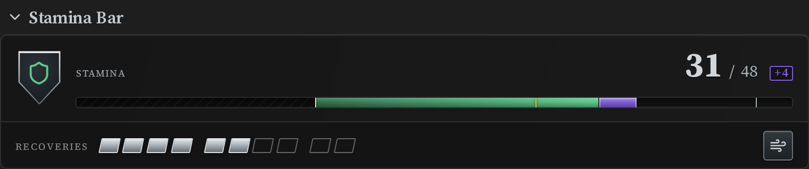
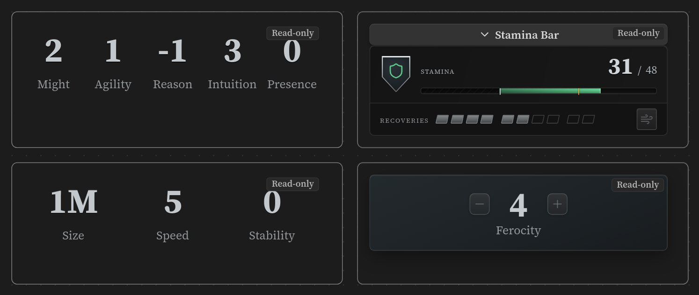

# Draw Steel Elements Plugin for Obsidian

Statblocks, ability cards, initiative and negotiation trackers, hero sheets and a synced
copy of the Draw Steel Compendium — all inside your Obsidian vault.

_The Draw Steel Elements Obsidian Plugin is an independent product published under the DRAW STEEL Creator License and is not affiliated with MCDM Productions, LLC. DRAW STEEL © 2024 MCDM Productions, LLC._

**Reading mode only.** The plugin renders in Obsidian's Reading view; blocks show as plain
code in Live Preview. Switch a note to Reading view (`Ctrl/Cmd + E`) to see your elements.

## Start here

**New to the plugin? [Getting started](getting-started.md)** takes you from installing it to
running a fight, assuming no YAML or markdown knowledge.

### Guides

- **[Getting started](getting-started.md)** — install, sync, your first element, your first fight
- **[Run an encounter](running-an-encounter.md)** — build it, then run it
- **[Track your hero](tracking-your-hero.md)** — the hero sheet and the standalone trackers
- **[Customize a monster](customizing-a-monster.md)** — the homebrew loop
- **[Style your statblocks](styling-statblocks.md)** — presets and the display settings
- **[Advanced usage](advanced-usage.md)** — per-block overrides, the sidebar, canvas, print, rolling

### Reference

- **[Writing and editing blocks](writing-blocks.md)** — type `/ds`, pick an element, and
  the plugin writes the block for you. Also: the insert commands, the edit button, and
  pinning a tracker to the sidebar.
- **[Compendium Sync](compendium-sync.md)** — download the official
  [Draw Steel Compendium](https://steelcompendium.io/compendium) into your vault and
  reference any entry by its code.
- **[Settings](settings.md)** — what every settings page does, and the statblock presets.
- **[Migrating from 5.x to 7.0.0](migrating-to-7.md)** — read this before your first sync
  if you have used the plugin before.

Requires **Obsidian 1.13.0 or newer**.

## Elements

Everything below is a fenced code block whose language is one of the listed names. Each
element accepts YAML inside the block; the extra names are shorter aliases for the same
element.

### Content you write or reference

**[Statblock](statblock.md)** — `ds-statblock`, `ds-sb`

A full creature statblock: characteristics, stats, traits, abilities and villain actions.
The body can be your own YAML, or a reference to a compendium creature.

**[Feature / ability card](Features.md)** — `ds-feature`, `ds-ft`, `ds-feat`

One ability, trait, test or custom power roll, rendered as a card with its power-roll
tiers.

**[Featureblock](featureblock.md)** — `ds-featureblock`, `ds-fb`

A group of features shown together — Malice features, Dynamic Terrain, and similar.

**[Compendium reference](compendium-sync.md#referencing-a-compendium-entry-in-your-notes)** — `ds-scc`

Renders any entry from your synced compendium. The body is the entry's SCC code and
nothing else, so the card always reflects the currently synced version.

**[Roll](Roll.md)** — `ds-roll`, `ds-r`, `ds-power-roll`

A standalone dice roller: power rolls with tiers, tests, opposed rolls and flat dice.

**[Horizontal rule](horizontal-rule.md)** — `ds-hr`, `ds-horizontal-rule`

A section divider styled like the ones in the book.

### Running the game

**[Initiative tracker](initiative-tracker.md)** — `ds-initiative`, `ds-it`, `ds-init`

Run an encounter: heroes and enemy groups, turn order, Stamina, conditions, minion pools,
the Malice pool with its log, and a per-actor action checklist.

**[Negotiation tracker](negotiation-tracker.md)** — `ds-negotiation`, `ds-nt`

Run a negotiation: interest and patience, motivations and pitfalls, and the argument
power roll.

**[Encounter builder](gm-trackers.md#encounter-builder-ds-encounter)** — `ds-encounter`

List monsters by compendium code and see the encounter's EV, your party's budget, the
resulting difficulty and the Victory payout — then hand the roster off to a new initiative
tracker block.

**[Montage Test tracker](gm-trackers.md#montage-test-tracker-ds-montage)** — `ds-montage`

Successes, failures, rounds and who used which skill during a montage test.

**[Project / downtime tracker](gm-trackers.md#project-tracker-ds-project)** — `ds-project`

A downtime project's goal, its prerequisites, and every respite roll that went into it.

**[Party tracker](gm-trackers.md#party-tracker-ds-party)** — `ds-party`

The whole party in one table: level, victories, XP, renown, wealth and the shared hero
token pool.

### Hero sheets

**[Hero sheet](hero-suite.md#hero-sheet-ds-hero)** — `ds-hero`

One hero in one block: Stamina and Recoveries, heroic resource, surges, conditions, and
their abilities as expandable, rollable cards. Class, ancestry, kit and abilities can all
be pulled from the synced compendium by code.

**[Stamina bar](stamina-bar.md)** — `ds-stamina-bar`, `ds-stamina`, `ds-stam`

Current, maximum and temporary Stamina, with an optional Recoveries row, a Catch Breath
button, and the Winded and Dying states.

**[Conditions](hero-suite.md#conditions-ds-conditions)** — `ds-conditions`, `ds-cond`

A conditions strip for a single hero or creature, with the same condition picker the
initiative tracker uses.

**[Heroic resource](hero-suite.md#heroic-resource-ds-resource)** — `ds-resource`

A counter for Ferocity, Focus, Piety, Essence and the rest — name the class and the block
labels itself.

**[Surges](hero-suite.md#surges-ds-surges)** — `ds-surges`

A surge counter, with the damage a surge adds shown alongside it.

**[Hero tokens](hero-suite.md#hero-tokens-ds-tokens)** — `ds-tokens`

The party's shared hero token pool, in one canonical block.

### Character sheet pieces

Various elements are provided to support building
[character sheets in Canvas](canvas-character-sheet.md). Canvas cards are **read-only** —
good for a sheet you look at, not one you click:

- **[Characteristics](characteristics-element.md)** — `ds-characteristics`, `ds-char`
- **[Skills](skills-element.md)** — `ds-skills`
- **[Values row](values-row-element.md)** — `ds-values-row`, `ds-vr`
- **[Counter](counter.md)** — `ds-counter`, `ds-ct`

## Compendium Sync

[Compendium Sync](compendium-sync.md) manages a local, up-to-date copy of the
[Draw Steel Compendium](https://steelcompendium.io/compendium) in your Obsidian Vault.

Once it's synced, a [`ds-scc` block](compendium-sync.md#referencing-a-compendium-entry-in-your-notes)
renders any entry in it — the body is just the entry's SCC code.

Upgrading from before 7.0.0? The compendium tree was reorganised, and the plugin can move
your existing copy to the new paths so Obsidian keeps your links working — see
[Migrating from 5.x to 7.0.0](migrating-to-7.md) and
[the migration map's review report](compendium-migration-map.md).

## Shared behaviour

- [Common element fields](common-element-fields.md) — collapsing a block.
- [Settings](settings.md) — appearance, fonts, statblock layout presets, rolling, and the
  per-block `prefs:` override for advanced users.
