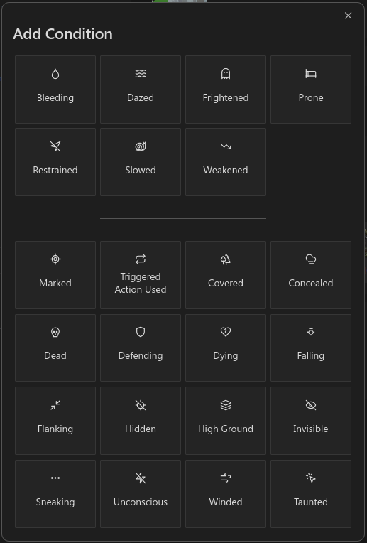

# Initiative Tracker

The Initiative Tracker helps manage combat encounters efficiently. It provides an interactive interface to track heroes, enemy groups, their health, conditions, and turn order.

The Initiative Tracker uses YAML-defined data to represent the state of an encounter, including heroes, enemy groups, and the villain's power level.
The YAML codeblock is where the initial encounter data is configured, but it will also be where state is persisted for 
easy transfer to other systems via whatever file-sync solution you use. 


## Quick Start Example


    ```ds-initiative
    heroes:
      - name: "Frodo Baggins"
        max_hp: 80
        image: "images/frodo.png"
      - name: "Samwise Gamgee"
        max_hp: 90
        image: "images/sam.png"
    enemy_groups:
      - name: "Mordor Forces"
        creatures:
          - name: "Orc"
            max_hp: 40
            amount: 4
            image: "images/orc.png"
          - name: "Troll"
            max_hp: 150
            amount: 1
            image: "images/troll.png"
    villain_power:
      value: 5
    ```

In the above example, there are two Heroes, two Enemy Groups (Initiative Groups), and the Villain Power starts at `5`.  
The first Enemy Group contains 4 Orcs and the second Enemy Group contains a single Troll 

## How to Use

To use the Initiative Tracker, you need to include a code block with the `initiative` language identifier in your Obsidian note. Inside this code block, you define your encounter data in YAML format.

### Code Block Structure

### Example

```yaml
heroes:
  - name: "Aragorn"
    max_hp: 120
enemy_groups:
  - name: "Orc Horde"
    creatures:
      - name: "Orc Warrior"
        max_hp: 50
        amount: 3
villain_power:
  value: 2
```

## Encounter Data Format

The encounter data consists of three main sections:

1. **Heroes**: Player characters participating in the encounter.
2. **Enemy Groups**: Groups of enemies, each containing one or more types of creatures.
3. **Villain Power**: The current villain power level.

### Heroes

#### Hero Fields

- `name` (string, required): The name of the hero.
- `max_hp` (number, required): The maximum health points (stamina) of the hero.
- `current_hp` (number, optional): The current health points of the hero. Defaults to `max_hp` if not provided.
- `temp_hp` (number, optional): Temporary health points (stamina). Defaults to `0`.
- `image` (string, optional): Path to the hero's image.
- `conditions` (list of strings, optional): List of condition keys affecting the hero.
- `has_taken_turn` (boolean, managed): Indicates if the hero has taken a turn. Managed by the tracker.

#### Example

```yaml
heroes:
  - name: "Gandalf"
    max_hp: 100
    current_hp: 85
    temp_hp: 5
    image: "images/gandalf.png"
    conditions:
      - "blinded"
```

### Enemy Groups

An enemy group represents a collection of creatures that act together in the initiative order.

#### Enemy Group Fields

- `name` (string, required): The name of the enemy group.
- `creatures` (list of creatures, required): List of creature definitions.
- `has_taken_turn` (boolean, managed): Indicates if the group has taken a turn. Managed by the tracker.
- `selectedInstanceKey` (string, managed): The key of the currently selected creature instance. Managed by the tracker.

#### Creatures

Each creature in the creatures list has the following fields:

- `name` (string, required): The name of the creature.
- `max_hp` (number, required): The maximum health points of the creature.
- `amount` (number, required): The number of instances of this creature.
- `instances` (list of CreatureInstance, managed): List of creature instances. Managed by the tracker.
- `image` (string, optional): Path to the creature's image.

#### Creature Instance Fields

- `id` (number, managed): Unique identifier for the instance.
- `current_hp` (number, managed): Current health points of the instance.
- `conditions` (list of strings, managed): Conditions affecting the instance.

#### Example

```yaml
enemy_groups:
  - name: "Goblin Gang"
    creatures:
      - name: "Goblin"
        max_hp: 30
        amount: 5
        image: "images/goblin.png"
```

### Villain Power

Fields

- `value` (number, required): The current villain power level.

#### Example

```yaml
villain_power:
  value: 3
```

## Interacting with the Tracker

Once your encounter is defined, the Initiative Tracker provides an interactive UI in your note.

### Heroes

- **Turn Indicator**: Click on the circle icon next to a hero's name to mark whether they have taken their turn.
- **Stamina Management**: Click on the hero's stamina display to open a modal where you can:
  - Apply damage or healing.
  - Adjust temporary stamina points.
- **Conditions**: Add or remove conditions affecting the hero.

### Enemy Groups

- **Turn Indicator**: Similar to heroes, click on the circle icon next to the enemy group's name.
- **Creature Grid**:
  - **Selection**: Click on a creature instance to view its details.
  - **Health Management**: Double-click on a creature instance to open the health management modal.
- **Detailed View**: The selected creature instance's details, including conditions and health, are displayed below the group header.

### Villain Power

**Adjusting**: Use the up and down arrows next to the villain power display to increase or decrease the value.

### Reset Round

Click the "Reset Round" button to clear all turn indicators and start a new round.

### Stamina Management


#### Adjusting Stamina Incrementally

- Use the **"+"** and **"-"** buttons next to the stamina value to increment or decrement by 1.
- Alternatively, edit the stamina value directly in the input field.

#### Applying Specific Damage or Healing

1. **Enter Amount**: Input the amount in the "Apply" field.
2. **Click "Damage" or "Healing"**:
  - **Damage** Reduces temporary stamina first, then reduces current stamina.

#### Managing Temporary Stamina

- Use the **"+"** and **"-"** buttons next to the temporary stamina value.
- Edit the temporary stamina value directly in the input field.

#### Quick Modifiers

- **Kill**: Sets current stamina to zero (creatures) or negative half maximum stamina (heroes), removes all temporary stamina.
- **Full Heal**: Restores current stamina to maximum.
- **Spend Recovery**: Increases current stamina by one-third of the maximum stamina.

### Conditions

Conditions represent status effects affecting heroes or creatures, such as "dazed" or "slowed".



Adding a Condition to a Hero or Creature:

- Click the "+" icon in the conditions section.
- Select a condition from the list.

Removing a Condition:

- Click on the condition icon to remove it.

### Data Persistence

All interactions with the tracker update the underlying YAML data in the code block. This ensures that your encounter state is preserved even after closing and reopening the note.
