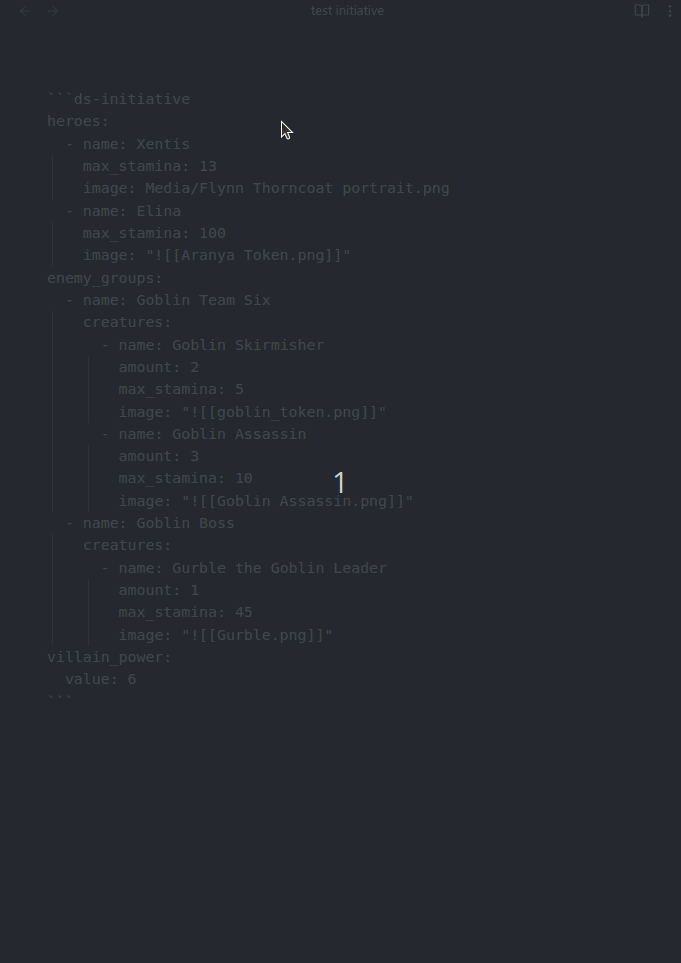
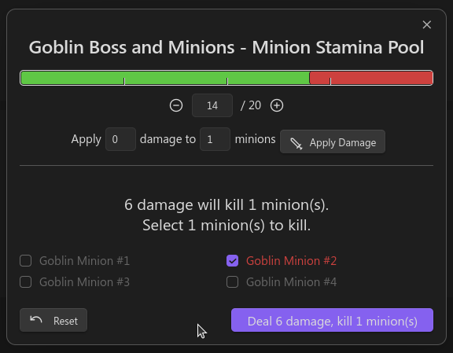
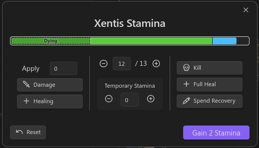
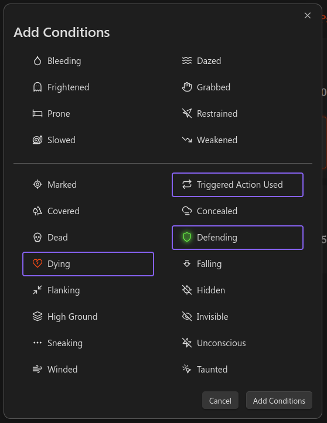

# Initiative Tracker

The Initiative Tracker helps manage combat encounters efficiently. It provides an interactive interface to track heroes, enemy groups, their health, conditions, and turn order.

The Initiative Tracker uses YAML-defined data to represent the state of an encounter, including heroes, enemy groups, and the villain's power level. The YAML codeblock is where the initial encounter data is configured, but it will also be where state is persisted for easy transfer to other systems via whatever file-sync solution you use.



## Quick Start Example

```
~~~ds-initiative
heroes:
  - name: "Frodo Baggins"
    max_stamina: 80
    image: "images/frodo.png"
  - name: "Samwise Gamgee"
    max_stamina: 90
    image: "images/sam.png"
enemy_groups:
  - name: "Mordor Forces"
    creatures:
      - name: "Orc"
        max_stamina: 40
        amount: 4
        image: "images/orc.png"
      - name: "Troll"
        max_stamina: 150
        amount: 1
        image: "images/troll.png"
villain_power:
  value: 5
~~~
```

In the above example, there are two Heroes and one Enemy Group (Initiative Groups) named "Mordor Forces," which contains 4 Orcs and 1 Troll. The Villain Power starts at `5`.

## How to Use

To use the Initiative Tracker, you need to include a code block with the `ds-initiative` language identifier in your Obsidian note. Inside this code block, you define your encounter data in YAML format.

### Code Block Structure

```
~~~ds-initiative # Your encounter data here
heroes:
  - name: "Aragorn"
    max_stamina: 120
enemy_groups:
  - name: "Orc Horde"
    creatures:
      - name: "Orc Warrior"
        max_stamina: 50
        amount: 3
villain_power:
  value: 2
~~~
```

## Encounter Data Format

The encounter data consists of three main sections:

1. **Heroes**: Player characters participating in the encounter.
2. **Enemy Groups**: Groups of enemies, each containing one or more types of creatures.
3. **Villain Power**: The current villain power level.

### Heroes

#### Hero Fields

- `name` (string, required): The name of the hero.
- `max_stamina` (number, required): The maximum health points (stamina) of the hero.
- `current_stamina` (number, optional): The current health points of the hero. Defaults to `max_stamina` if not provided.
- `temp_stamina` (number, optional): Temporary health points (stamina). Defaults to `0`.
- `image` (string, optional): Path to the hero's image.
- `conditions` (list of strings, optional): List of condition keys affecting the hero.
- `has_taken_turn` (boolean, managed): Indicates if the hero has taken their turn. Managed by the tracker.

#### Example

```yaml
heroes:
  - name: "Gandalf"
    max_stamina: 100
    current_stamina: 85
    temp_stamina: 5
    image: "images/gandalf.png"
    conditions:
      - "blinded"
```

### Enemy Groups

An enemy group represents a collection of creatures that act together in the initiative order.

#### Enemy Group Fields

- `name` (string, required): The name of the enemy group.
- `creatures` (list of creatures, required): List of creature definitions.
- `is_squad` (boolean, optional): Indicates if the creatures in this group are a squad of minions. Defaults to `false`.
- `minion_stamina_pool` (number, managed): The current combined stamina pool of the minion group. Managed by the tracker.
- `has_taken_turn` (boolean, managed): Indicates if the group has taken a turn. Managed by the tracker.
- `selectedInstanceKey` (string, managed): The key of the currently selected creature instance. Managed by the tracker.

#### Creatures

Each creature in the creatures list has the following fields:

- `name` (string, required): The name of the creature.
- `max_stamina` (number, required): The maximum health points of the creature.
- `amount` (number, required): The number of instances of this creature.
- `instances` (list of CreatureInstance, managed): List of creature instances. Managed by the tracker.
- `image` (string, optional): Path to the creature's image.
- `squad_role` (string, optional): If this Enemy Group is a squad, indicates if the creature role is `captain` or `minion`

#### Creature Instance Fields

- `id` (number, managed): Unique identifier for the instance.
- `current_stamina` (number, managed): Current stamina of the instance.
- `temp_stamina` (number, managed): Current temporary stamina of the instance.
- `isDead` (boolean, managed): Indicates if the creature instance is dead.
- `conditions` (list of strings, managed): Conditions affecting the instance.

#### Example

```yaml
enemy_groups:
  - name: "Goblin Gang"
    creatures:
      - name: "Goblin"
        max_stamina: 30
        amount: 5
        image: "images/goblin.png"
  - name: "Undead Horde"
    is_squad: true
    creatures:
      - name: "Skeleton"
        max_stamina: 10
        amount: 10
        image: "images/skeleton.png"
        squad_role: minion
```

In this example, "Goblin Gang" is a regular enemy group, while "Undead Horde" is a minion group consisting of 10 Skeletons.

### Minions and Captains

Minions are groups of weaker creatures that share a combined stamina pool and act together in combat. They are managed differently from regular creatures in the Initiative Tracker.

To define a minion group, set the `is_squad` field to `true` in the enemy group definition.  In a `creature` object, set the `squad_role` field to `minion`.  

Additionally, you can add another `creature` object to the Enemy group (squad) and set its `squad_role` to `captain`.  This has no effect right now, but may change in the future.

### Villain Power

#### Fields

- `value` (number, required): The current villain power level.

#### Example

```yaml
villain_power:   
  value: 3
```

## Interacting with the Tracker

Once your encounter is defined, the Initiative Tracker provides an interactive UI in your note.

### Heroes

- **Turn Indicator**: Click on the circle icon next to a hero's name to mark whether they have taken their turn.
- **Stamina Management**: Click on the hero's stamina display to open a modal where you can:
	- Apply damage or healing.
	- Adjust temporary stamina points.
- **Conditions**: Add or remove conditions affecting the hero.

### Enemy Groups

- **Turn Indicator**: Similar to heroes, click on the circle icon next to the enemy group's name.
- **Creature Grid**:
	- **Selection**: Click on a creature instance to view its details.
	- **Health Management**:
		- **Regular Creatures**: Double-click on a creature instance to open the health management modal.
		- **Minions**: Click on the stamina display of the minion group to open the Minion Stamina Pool modal.

### Stamina Pool Modal for Minions

The Stamina Pool modal for Minions allows you to manage the combined stamina of a minion group.  This modal works similarly to the Stamina Modals for normal creatures, but has some additional functionality.

When the Stamina Pool of minions gets reduced to thresholds that would kill a minion, the modal will allow the user to select which minion to kill.  The modal has some guardrails in place to help ensure the Director is following minion rules, but its not perfect and there is some flexibility. 



### Villain Power

**Adjusting**: Use the up and down arrows next to the villain power display to increase or decrease the value.

### Reset Round

Click the "Reset Round" button to clear all turn indicators and start a new round.

### Reset Encounter State

Click the "Reset Encounter State" button to clear all "state" data from the tracker. All state will be lost including current stamina, conditions, turn tracker, and villain power. **Warning: this is a destructive operation**

### Stamina Management



#### Adjusting Stamina Incrementally

- Use the **"+"** and **"-"** buttons next to the stamina value to increment or decrement by 1.
- Alternatively, edit the stamina value directly in the input field.

#### Applying Specific Damage or Healing

1. **Enter Amount**: Input the amount in the "Apply" field.
2. **Click "Damage" or "Healing"**:
	- **Damage**: Reduces temporary stamina first, then reduces current stamina.

#### Managing Temporary Stamina

- Use the **"+"** and **"-"** buttons next to the temporary stamina value.
- Edit the temporary stamina value directly in the input field.

#### Quick Modifiers

- **Kill**: Sets current stamina to zero (creatures) or negative half maximum stamina (heroes), removes all temporary stamina.
- **Full Heal**: Restores current stamina to maximum.
- **Spend Recovery**: Increases current stamina by one-third of the maximum stamina.

### Conditions

Conditions represent status effects affecting heroes or creatures, such as "dazed" or "slowed".



Adding a Condition to a Hero or Creature:

- Click the "+" icon in the conditions section.
- Select conditions from the list by clicking them.
- Click "Add Conditions".

Optionally, you can customize the appearance of the condition:

- Open the condition customization modal:
	- Click the "cog" icon when hovering over the condition in the "Add Conditions" modal **OR**
	- Double-click the condition in the "Add Conditions" modal.
- Change the color or effect with the provided selectors.

Removing a Condition:

- Click on the condition icon to remove it.

### Data Persistence

All interactions with the tracker update the underlying YAML data in the code block. This ensures that your encounter state is preserved even after closing and reopening the note.
