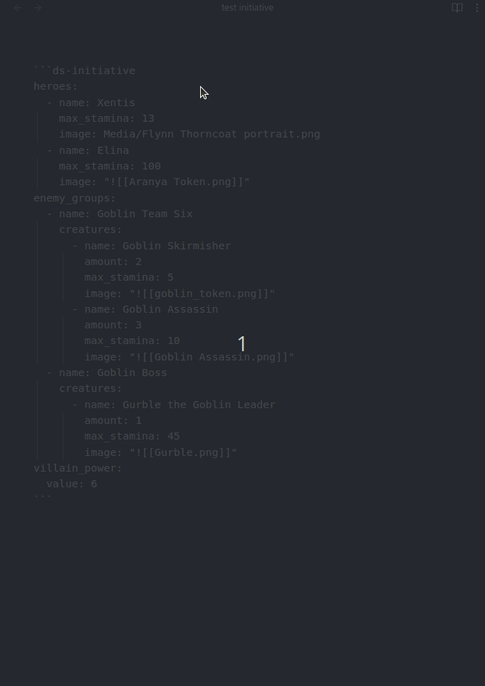

# Initiative Tracker

The Initiative Tracker helps manage combat encounters efficiently. It provides an interactive interface to track heroes, enemy groups, their health, conditions, and turn order.

The Initiative Tracker uses YAML-defined data to represent the state of an encounter, including heroes, enemy groups, and the villain's power level. The YAML codeblock is where the initial encounter data is configured, but it will also be where state is persisted for easy transfer to other systems via whatever file-sync solution you use.



Running a fight start to finish, with pictures:
[Run an encounter](running-an-encounter.md).

## Quick Start Example

```
~~~ds-initiative
heroes:
  - name: "Frodo Baggins"
    max_stamina: 80
    image: "images/frodo.png"
  - name: "Samwise Gamgee"
    max_stamina: 90
    image: "images/sam.png"
enemy_groups:
  - name: "Mordor Forces"
    creatures:
      - name: "Orc"
        max_stamina: 40
        amount: 4
        image: "images/orc.png"
      - name: "Troll"
        max_stamina: 150
        amount: 1
        image: "images/troll.png"
malice:
  value: 5
~~~
```

In the above example, there are two Heroes and one Enemy Group (Initiative Groups) named "Mordor Forces," which contains 4 Orcs and 1 Troll. The Villain Power starts at `5`.

## How to Use

To use the Initiative Tracker, you need to include a code block with the `ds-initiative` language identifier (or the shorter `ds-it` / `ds-init`) in your Obsidian note. Inside this code block, you define your encounter data in YAML format.

Two shortcuts save you the typing: type **`/ds`** in the editor and pick *Initiative tracker*
for a filled-in example, or build the fight in an
[encounter builder](gm-trackers.md#encounter-builder-ds-encounter) block and press
**Create tracker block**, which writes a ready-to-run tracker for you.

In the plugin settings, you can configure a [default image](settings.md#initiative-tracker) to use if none is provided.

### Code Block Structure

```
~~~ds-initiative # Your encounter data here
heroes:
  - name: "Aragorn"
    max_stamina: 120
enemy_groups:
  - name: "Orc Horde"
    creatures:
      - name: "Orc Warrior"
        max_stamina: 50
        amount: 3
malice:
  value: 2
~~~
```

## Encounter Data Format

The encounter data consists of three main sections:

1. **Heroes**: Player characters participating in the encounter.
2. **Enemy Groups**: Groups of enemies, each containing one or more types of creatures.
3. **Malice**: The current villain power level.

### Heroes

#### Hero Fields

- `name` (string, required): The name of the hero.
- `max_stamina` (number, required): The maximum health points (stamina) of the hero.
- `statblock` (string or object, optional): A reference to a statblock file or an inline statblock object. If provided, `name`, `max_stamina`, and `image` will be populated from the referenced statblock if they are not explicitly set.
- `current_stamina` (number, optional): The current health points of the hero. Defaults to `max_stamina` if not provided.
- `temp_stamina` (number, optional): Temporary health points (stamina). Defaults to `0`.
- `image` (string, optional): Path to the hero's image.
- `conditions` (list of strings, optional): List of condition keys affecting the hero.
- `has_taken_turn` (boolean, managed): Indicates if the hero has taken their turn. Managed by the tracker.

#### Example

```yaml
heroes:
  - name: "Gandalf"
    max_stamina: 100
    current_stamina: 85
    temp_stamina: 5
    image: "images/gandalf.png"
    conditions:
      - "blinded"
```

### Enemy Groups

An enemy group represents a collection of creatures that act together in the initiative order.

#### Enemy Group Fields

- `name` (string, required): The name of the enemy group.
- `creatures` (list of creatures, required): List of creature definitions.
- `is_squad` (boolean, optional): Indicates if the creatures in this group are a squad of minions. Defaults to `false`.
- `minion_stamina_pool` (number, managed): The current combined stamina pool of the group's minion squad. Managed by the tracker. A group holding **more than one** squad keeps each squad's pool on the minion creature itself (see the creature field of the same name) and leaves this one unset.
- `has_taken_turn` (boolean, managed): Indicates if the group has taken a turn. Managed by the tracker.
- `selectedInstanceKey` (string, managed): The key of the currently selected creature instance. Managed by the tracker.

#### Creatures

Each creature in the creatures list has the following fields:

- `name` (string, required): The name of the creature.
- `max_stamina` (number, required): The maximum health points of the creature.
- `statblock` (string or object, optional): A reference to a statblock file or an inline statblock object. If provided, `name`, `max_stamina`, and `image` will be populated from the referenced statblock if they are not explicitly set.
- `amount` (number, required): The number of instances of this creature.
- `instances` (list of CreatureInstance, managed): List of creature instances. Managed by the tracker.
- `image` (string, optional): Path to the creature's image.
- `squad_role` (string, optional): If this Enemy Group is a squad, the creature's role in it — `minion` (a squad sharing one stamina pool), `captain` (attached to one squad), or `attached` (travelling with the squad, not currently its captain). Every creature in a squad group must declare one.
- `captain_of` (string, optional): For a `captain` in a group holding **more than one** squad, the `name` of the minion creature they lead. Omit it in a one-squad group — a captain with no `captain_of` leads the group's first squad.
- `minion_stamina_pool` (number, managed): A `minion` creature's own shared stamina pool, used when the group holds more than one squad. Managed by the tracker; a one-squad group keeps its pool on the enemy group instead, so existing encounters are unchanged.

#### Creature Instance Fields

- `id` (number, managed): Unique identifier for the instance.
- `current_stamina` (number, managed): Current stamina of the instance.
- `temp_stamina` (number, managed): Current temporary stamina of the instance.
- `isDead` (boolean, managed): Indicates if the creature instance is dead.
- `conditions` (list of strings, managed): Conditions affecting the instance.

#### Example

```yaml
enemy_groups:
  - name: "Goblin Gang"
    creatures:
      - name: "Goblin"
        max_stamina: 30
        amount: 5
        image: "images/goblin.png"
  - name: "Undead Horde"
    is_squad: true
    creatures:
      - name: "Skeleton"
        max_stamina: 10
        amount: 10
        image: "images/skeleton.png"
        squad_role: minion
```

In this example, "Goblin Gang" is a regular enemy group, while "Undead Horde" is a minion group consisting of 10 Skeletons.

### Referencing Statblocks

You can reference existing statblocks to populate creature or hero data (Name, Max Stamina, and Image). This is done using the `statblock` field.

The reference supports multiple formats:

1. **Compendium code**: `scc.v1:mcdm.monsters.v1/monster.goblin.statblock/goblin-stinker` —
   resolved against your [synced compendium](compendium-sync.md), so it doesn't depend on
   where the file sits in your vault. This is what the
   [encounter builder](gm-trackers.md#encounter-builder-ds-encounter) writes.
2. **Full Path from vault root**: `Homebrew/monsters/MonsterName.md` (with or without `.md`)
3. **Path inside your compendium folder**: `DS Compendium/monster/goblin/statblock/goblin-stinker`
   (with or without `.md`)
4. **File Name**: `MonsterName` (with or without `.md`) looks for `MonsterName.md` anywhere in the vault 
5. **Link**: `[[MonsterName]]` will use the first found link matching the name.  
 
**Important:** if using File Name or Link and there are multiple files with the same name, the chosen one is not guaranteed. To ensure the correct file, specify the full path or the compendium code.

When a statblock is referenced by path, name or link, the plugin will look for the first Draw Steel Element code block (`ds-statblock` or similar) in that file and use its data.

**Example using references:**

```yaml
...
enemy_groups:
  - name: "Dragon Encounter"
    creatures:
      - statblock: "Thorn Dragon"
        amount: 1
      - statblock: "scc.v1:mcdm.monsters.v1/monster.goblin.statblock/goblin-stinker"
        amount: 5
```

In this case, the `Thorn Dragon`'s name, max stamina (or stamina), and image will be automatically loaded. You can still override these values by explicitly providing them in the YAML.

### Minions and Captains

Minions are groups of weaker creatures that share a combined stamina pool and act together in combat. They are managed differently from regular creatures in the Initiative Tracker.

To define a minion group, set the `is_squad` field to `true` in the enemy group definition.  In a `creature` object, set the `squad_role` field to `minion`.

**More than one squad per group.** A squad group may hold several `minion` creatures, and each one is its own squad with its own stamina pool — the shape published encounters use when a single group fields, say, two squads of the same minion (Delian Tomb, Encounter W1). Nothing changes for a group with one squad: its pool stays where it always was, on the enemy group.

**Captains.** Add another `creature` to the group with `squad_role: captain`. The tracker marks the captain's roster cell with a crown badge and a forged frame, pulls it to the front of the squad, and calls out "Captain down" when the captain drops to 0 — the moment the rules allow a replacement.

**Changing the captain.** Click a creature's cell to open it, then click the badge beside its name: the captain's badge reads **Captain** and relieves them; any other non-minion creature's reads **Make captain** and promotes it (naming the squad, when the group holds more than one). A relieved captain becomes `squad_role: attached` and stays in the group. Minions are never captain candidates — the rules require a non-minion creature.

### Malice

#### Fields

- `value` (number, required): The current villain power level.
- `round_gain` (number, optional): Malice automatically added to the pool (and logged)
	each time you press "Advance round". Leave unset for no auto-gain — there's no
	built-in default, since the amount depends on your table/adventure. Trigger-based
	gains (e.g. a monster feature that grants +3 Malice) stay manual via the quick-add
	below instead.
- `log` (list, managed): The spend/gain log (`{round, amount, label}`, oldest first).
	Managed by the tracker — populated by "Advance round" (when `round_gain` is set) and
	the quick-add control. Capped at the 50 most recent entries; older entries drop off
	automatically.

#### Example

```yaml
malice:
  value: 3
  round_gain: 2
```

## Interacting with the Tracker

Once your encounter is defined, the Initiative Tracker provides an interactive UI in your note.

### Heroes

- **Turn Indicator**: Click a hero's **portrait** to mark whether they have taken their
	turn — a struck steel seal presses into the portrait's lower-right corner once they
	have. (With portraits turned off there is no picture to click, so the circle
	checkbox next to the name takes over as the control instead.)
- **Stamina Management**: Click on the hero's stamina display to open a modal where you can:
	- Apply damage or healing.
	- Adjust temporary stamina points.
- **Conditions**: Add or remove conditions affecting the hero.

### Enemy Groups

- **Turn Indicator**: An enemy group has no portrait to click, so it keeps the circle
	checkbox next to its name as its turn control.
- **Creature Grid**:
	- **Selection**: Click on a creature instance to view its details.
	- **Health Management**:
		- **Regular Creatures**: Double-click on a creature instance to open the health management modal.
		- **Minions**: Click on the stamina display of the minion group to open the Minion Stamina Pool modal.

### Stamina Pool Modal for Minions

The Stamina Pool modal for Minions allows you to manage the combined stamina of a minion group.  This modal works similarly to the Stamina Modals for normal creatures, but has some additional functionality.

When the Stamina Pool of minions gets reduced to thresholds that would kill a minion, the modal will allow the user to select which minion to kill.  The modal has some guardrails in place to help ensure the Director is following minion rules, but its not perfect and there is some flexibility. 


### Action Checklist

Each hero and each creature instance shows a small [Main] [Maneuver] [Move] [Triggered]
checklist below its name — click a chip to toggle it on/off as that actor spends the
action during their turn. "Triggered" is per-round rather than per-turn (a creature gets
at most one triggered action each round), so it clears on "Advance round" but not on
"Reset turns (this round)". The checklist is purely a bookkeeping aid; nothing else in
the tracker reads it.

### The Command Bar (Round + Malice)

All round and Malice controls sit in a single full-width bar between the Heroes and the
Enemy Groups: the round counter and its two controls at the left edge, the Malice pool
and quick-add at the right, and the Malice log folded into a disclosure that opens a
full-width drawer beneath the bar. In a narrow pane (a split view or the sidebar) the
bar stacks into a single column.

**Adjusting the pool**: Use the up and down arrows next to the villain power display to
increase or decrease the value.

**Malice log**: Click "Malice log · N entries" to open a small read-only list of every
gain/spend (`R<round>: +/-<amount> — <label>`), most recent additions preserved, oldest
entries dropped once the log exceeds 50 entries. Printed handouts always show the log
open.

**Quick-add**: Enter an amount and a label (e.g. "3" / "Feytouched") and click "Add" to
log a manual, trigger-based Malice gain (or spend, using a negative amount) without
waiting for a round to advance.

### Round / Turn Controls

Next to the round counter, the tracker offers two distinct controls — they are **not**
interchangeable:

- **"Reset turns (this round)"**: Clears every turn indicator and per-actor action
	checklist (Main/Maneuver/Move/Triggered) back to unmarked, **without** advancing the
	round counter or granting any configured Malice round gain. Use this for a mid-round
	correction — e.g. undoing a misclick, or re-running the current round from the top.
- **"Advance round"**: The full round-boundary transition — increments the round counter,
	clears every turn indicator and action checklist (same as "Reset turns"), and (if a
	Malice round gain is configured) adds it to the villain power pool and logs it. Use
	this when the round has actually ended.

### Reset Encounter State

Click the "Reset Encounter State" button to clear all "state" data from the tracker. All state will be lost including current stamina, conditions, turn tracker, and villain power. **Warning: this is a destructive operation**

### Stamina Management


#### Adjusting Stamina Incrementally

- Use the **"+"** and **"-"** buttons next to the stamina value to increment or decrement by 1.
- Alternatively, edit the stamina value directly in the input field.

#### Applying Specific Damage or Healing

1. **Enter Amount**: Input the amount in the "Apply" field.
2. **Click "Damage" or "Healing"**:
	- **Damage**: Reduces temporary stamina first, then reduces current stamina.

#### Managing Temporary Stamina

- Use the **"+"** and **"-"** buttons next to the temporary stamina value.
- Edit the temporary stamina value directly in the input field.

#### Quick Modifiers

- **Kill**: Sets current stamina to zero (creatures) or negative half maximum stamina (heroes), removes all temporary stamina.
- **Full Heal**: Restores current stamina to maximum.
- **Spend Recovery**: Increases current stamina by one-third of the maximum stamina.

### Conditions

Conditions represent status effects affecting heroes or creatures, such as "dazed" or "slowed".


Click the "+" icon in the conditions section to open the **Conditions** manager for
that hero or creature. It shows exactly what's currently active — not a catalog to pick
from:

Adding a Condition:

- Click "+ Add condition" (or just start typing) to open the type-ahead search.
- Type to filter the known conditions, then press ↑/↓ and Enter (or click a match) to
	add it.
- If nothing matches — a bespoke condition from a homebrew statblock, for example — the
	list always ends with an **"Add custom: ..."** row that adds whatever you typed.
- The search box stays open afterward, so you can add several conditions in a row.

Customizing a Condition:

- Click the "cog" icon on a condition's row to open its Duration / Color / Effect editor
	inline, under the row.
- Duration is End of Turn, Save Ends, End of Encounter, or Until Removed (the default).
- Changes apply immediately — there's no separate Save button.

Removing a Condition:

- Inside the manager: click the trash icon on the condition's row.
- Or skip the manager entirely: click the condition's own icon directly in the tracker
	row (each condition icon is itself a remove button) — the fastest way to clear a
	single condition without opening anything.

When you're done, click "Done" (or just close the modal) — every change was already
applied as you made it.

### Data Persistence

All interactions with the tracker update the underlying YAML data in the code block. This ensures that your encounter state is preserved even after closing and reopening the note.

### Pinning to the Sidebar

Running a session across several notes? Use the "Send initiative tracker to sidebar"
command (or, with your cursor inside the block, the generic "Send block to sidebar"
command) to pin the tracker to a persistent panel in Obsidian's right sidebar — it stays
visible and interactive as you navigate to other notes, and edits made in the sidebar or
in the note stay in sync. Open the sidebar directly at any time via the sword icon in the
ribbon ("Open Draw Steel sidebar").
