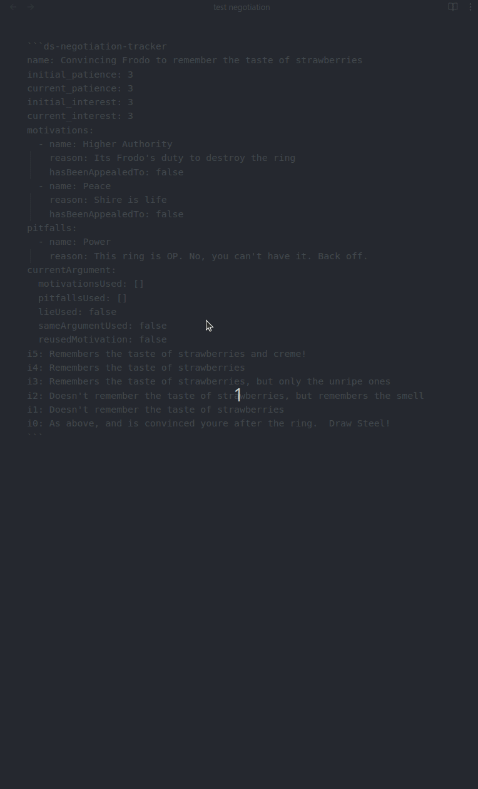

# Negotiation Tracker

The Negotiation Tracker is a tool designed to facilitate and manage negotiations within your Obsidian notes. It provides
an interactive interface to manage arguments, monitor patience and interest levels, and understand the motivations and
pitfalls of the parties involved.

The Negotiation Tracker uses YAML-defined data to represent the state of a negotiation, including motivations, pitfalls,
and current levels of patience and interest. The YAML code block is where the initial negotiation data is configured and
where the state is persisted.



## Quick Start Example

```markdown
~~~ds-negotiation
name: "Convincing Frodo to remember the taste of strawberries"
initial_interest: 3
initial_patience: 3
motivations:
  - name: "Higher Authority"
    reason: "It's Frodo's duty to destroy the ring"
  - name: "Peace"
    reason: "The Shire is life"
pitfalls:
  - name: "Power"
    reason: "The ring is too powerful to ignore"
i5: "Remembers the taste of strawberries and cream!"
i4: "Remembers the taste of strawberries"
i3: "Remembers the taste of unripe strawberries"
i2: "Remembers the smell of strawberries"
i1: "Doesn't remember the taste of strawberries"
i0: "Thinks you're after the ring; becomes hostile"
~~~
```


In the above example, we are setting up a negotiation where the heroes are trying to convince Frodo to remember the
taste of strawberries. The initial interest and patience levels are set to `3`. Motivations and pitfalls are defined,
along with descriptions for each interest level from `i0` to `i5`.

## How to Use

To use the Negotiation Tracker, include a code block with the `ds-negotiation` language identifier in your Obsidian
note. Inside this code block, you define your negotiation data in YAML format.

### Code Block Structure

```markdown
~~~ds-negotiation
name: "Negotiation Title"
initial_interest: <number>
initial_patience: <number>
motivations:
  - name: "Motivation Name"
    reason: "Explanation of the motivation"
pitfalls:
  - name: "Pitfall Name"
    reason: "Explanation of the pitfall"
i5: "Interest Level 5 Description"
i4: "Interest Level 4 Description"
i3: "Interest Level 3 Description"
i2: "Interest Level 2 Description"
i1: "Interest Level 1 Description"
i0: "Interest Level 0 Description"
~~~
```

## Negotiation Data Format

The negotiation data consists of several key sections:

1. **Name**: The title of the negotiation.
2. **Initial Interest and Patience**: Starting levels for the NPC.
3. **Motivations**: Positive aspects to appeal to during negotiation.
4. **Pitfalls**: Negative aspects that can hinder the negotiation if mentioned.
5. **Interest Levels (i0 to i5)**: Descriptions of NPC's responses at different interest levels.

### Fields

- `name` (string, optional): The name of the negotiation.
- `initial_interest` (number, required): The NPC's starting interest level (0-5).
- `initial_patience` (number, required): The NPC's starting patience level (0-5).
- `motivations` (list, optional): A list of motivations.
    - Each motivation has:
        - `name` (string, required): Name of the motivation.
        - `reason` (string, optional): Explanation or details.
- `pitfalls` (list, optional): A list of pitfalls.
    - Each pitfall has:
        - `name` (string, required): Name of the pitfall.
        - `reason` (string, optional): Explanation or details.
- `i5` to `i0` (string, optional): Descriptions of the NPC's response at each interest level.

#### Example

```markdown
name: "Negotiation with the Dragon"
initial_interest: 2
initial_patience: 4
motivations:

- name: "Greed"
  reason: "The dragon loves treasure"
- name: "Pride"
  reason: "The dragon wants to be recognized as the strongest"
  pitfalls:
- name: "Insult"
  reason: "Mentioning the dragon's age angers it"
  i5: "The dragon agrees to help and offers a gift"
  i4: "The dragon is willing to negotiate further"
  i3: "The dragon is intrigued but hesitant"
  i2: "The dragon listens but remains indifferent"
  i1: "The dragon grows impatient"
  i0: "The dragon becomes hostile"
```

## Interacting with the Tracker

Once your negotiation is defined, the Negotiation Tracker provides an interactive UI in your note.

### Negotiation Name and Menu

At the top of the tracker, the negotiation's name is displayed. Next to it, there's a menu icon (**⋮**) which provides
additional options:

- **Reset Negotiation**: Resets all negotiation data to its initial state. This clears any changes made during the
  negotiation, such as used motivations or adjusted interest and patience levels.

### Patience and Interest Tracker

The tracker displays the current **patience** and **interest** levels of the NPC:

- **Patience**: Indicates how willing the NPC is to continue the negotiation (0-5).
- **Interest**: Reflects the NPC's inclination towards the desired outcome (0-5).

#### Adjusting Levels

- **Patience**: Click on the patience bubbles to set the current patience level. Selected bubbles are highlighted.
- **Interest**: Click on the interest levels to set the current interest level. The selected level and all higher levels
  are highlighted.

### Actions Tab

The tracker includes two main actions accessible via tabs:

#### Make an Argument

Allows you to make an argument to influence the NPC's interest and patience levels.

#### Learn Motivation/Pitfall

Enables you to attempt to discover one of the NPC's motivations or pitfalls through a Power Roll.

### Motivations and Pitfalls View

Displays a list of the NPC's motivations and pitfalls:

- **Motivations**: Positive aspects you can appeal to during negotiation.
    - Check off motivations that have been appealed to.
- **Pitfalls**: Negative aspects that can hinder the negotiation if mentioned.

#### Managing Motivations

- **Appealed To**: Use the checkbox next to a motivation to indicate it has been appealed to.
- **Tooltips**: Hover over motivations for additional information.

#### Pitfalls

- Pitfalls are displayed for your reference to avoid mentioning them during negotiation.

## Argument Process

When making an argument, you can apply various modifiers to influence the outcome.

### Argument Modifiers

In the **Make an Argument** tab, you can select modifiers that affect the negotiation:

- **Appeals to Motivation**: Check if your argument appeals to one or more of the NPC's motivations.
- **Mentions Pitfall**: Check if your argument inadvertently mentions a pitfall.
- **Reuses Motivation**: Indicates if you're reusing a motivation already appealed to.
    - Automatically enabled if you select a motivation that has been appealed to before.
- **NPC Caught a Lie**: Check if the NPC catches a lie during the negotiation.
- **Same Argument Used**: Indicates if you're repeating an argument without appealing to a motivation.
    - Disabled if you're appealing to a motivation.

#### Example

Suppose you select the "Greed" motivation, which hasn't been appealed to yet. The "Reuses Motivation" checkbox remains
unchecked. If you select a motivation that has already been appealed to, the "Reuses Motivation" checkbox is
automatically enabled.

### Power Roll

After setting your modifiers, the tracker calculates the Power Roll difficulty. After the Hero rolls for the Argument,
you can click the power roll result tier corresponding to the roll to select it. Then you can complete the Argument
(see below)

### Completing an Argument

Once you've selected the outcome tier, click the **Complete Argument** button to apply the results:

- **Interest**: Adjusted based on the outcome.
- **Patience**: Adjusted based on the outcome.
- **Argument**: Modifiers are reset for the next argument.
- **Motivations**: Any motivations used are marked as appealed to.

**Note:**

- The **Complete Argument** button is enabled only after selecting an outcome tier.
- The selected outcome tier determines the impact on interest and patience.

## Learning Motivations or Pitfalls

The **Learn Motivation/Pitfall** tab has a brief summary of the rules for Heroes attempting to discover one of the NPC's
motivations or pitfalls.

## Additional Notes

- **Data Persistence**: All interactions with the tracker update the underlying YAML data in the code block. This
  ensures that your negotiation state is preserved.
