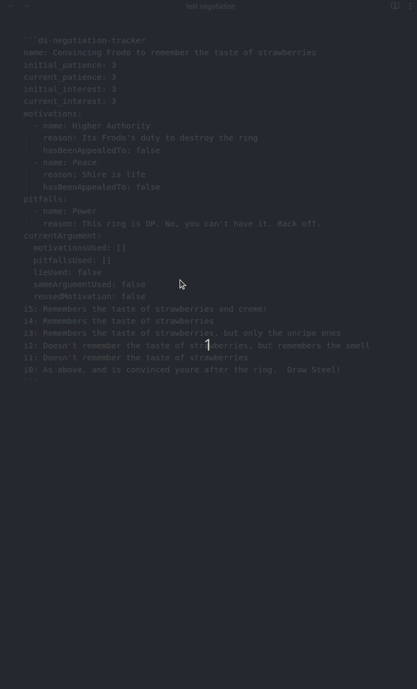
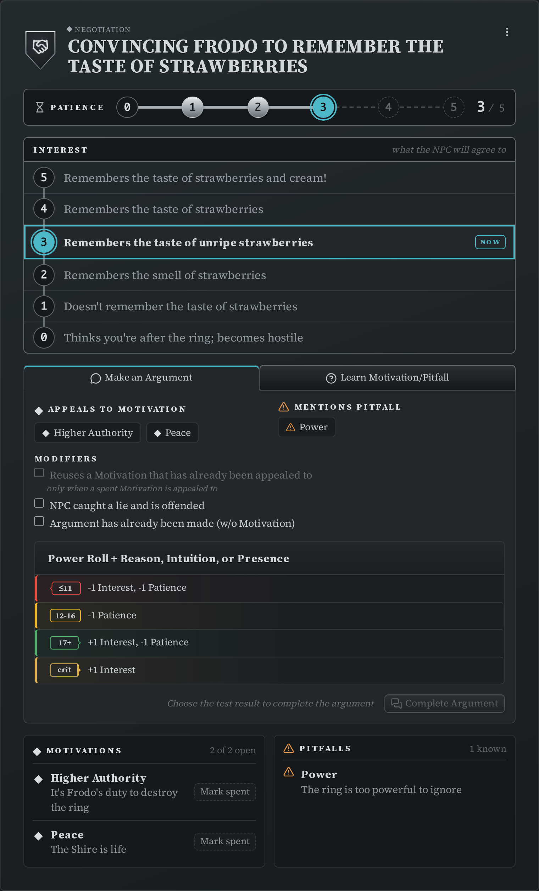

# Negotiation Tracker

The Negotiation Tracker is a tool designed to facilitate and manage negotiations within your Obsidian notes. It provides
an interactive interface to manage arguments, monitor patience and interest levels, and understand the motivations and
pitfalls of the parties involved.

The Negotiation Tracker uses YAML-defined data to represent the state of a negotiation, including motivations, pitfalls,
and current levels of patience and interest. The YAML code block is where the initial negotiation data is configured and
where the state is persisted.



## Quick Start Example

```markdown
~~~ds-negotiation
name: "Convincing Frodo to remember the taste of strawberries"
initial_interest: 3
initial_patience: 3
motivations:
  - name: "Higher Authority"
    reason: "It's Frodo's duty to destroy the ring"
  - name: "Peace"
    reason: "The Shire is life"
pitfalls:
  - name: "Power"
    reason: "The ring is too powerful to ignore"
i5: "Remembers the taste of strawberries and cream!"
i4: "Remembers the taste of strawberries"
i3: "Remembers the taste of unripe strawberries"
i2: "Remembers the smell of strawberries"
i1: "Doesn't remember the taste of strawberries"
i0: "Thinks you're after the ring; becomes hostile"
~~~
```



In the above example, we are setting up a negotiation where the heroes are trying to convince Frodo to remember the
taste of strawberries. The initial interest and patience levels are set to `3`. Motivations and pitfalls are defined,
along with descriptions for each interest level from `i0` to `i5`.

## How to Use

To use the Negotiation Tracker, include a code block with the `ds-negotiation` language
identifier (or the shorter `ds-nt`) in your Obsidian note. Inside this code block, you
define your negotiation data in YAML format. Typing **`/ds`** in the editor and picking
*Negotiation tracker* writes a filled-in example for you.

### Code Block Structure

```markdown
~~~ds-negotiation
name: "Negotiation Title"
initial_interest: <number>
initial_patience: <number>
motivations:
  - name: "Motivation Name"
    reason: "Explanation of the motivation"
pitfalls:
  - name: "Pitfall Name"
    reason: "Explanation of the pitfall"
i5: "Interest Level 5 Description"
i4: "Interest Level 4 Description"
i3: "Interest Level 3 Description"
i2: "Interest Level 2 Description"
i1: "Interest Level 1 Description"
i0: "Interest Level 0 Description"
~~~
```

## Negotiation Data Format

The negotiation data consists of several key sections:

1. **Name**: The title of the negotiation.
2. **Initial Interest and Patience**: Starting levels for the NPC.
3. **Motivations**: Positive aspects to appeal to during negotiation.
4. **Pitfalls**: Negative aspects that can hinder the negotiation if mentioned.
5. **Interest Levels (i0 to i5)**: Descriptions of NPC's responses at different interest levels.

### Fields

- `name` (string, optional): The name of the negotiation.
- `initial_interest` (number, required): The NPC's starting interest level (0-5).
- `initial_patience` (number, required): The NPC's starting patience level (0-5).
- `motivations` (list, optional): A list of motivations.
    - Each motivation has:
        - `name` (string, required): Name of the motivation.
        - `reason` (string, optional): Explanation or details.
- `pitfalls` (list, optional): A list of pitfalls.
    - Each pitfall has:
        - `name` (string, required): Name of the pitfall.
        - `reason` (string, optional): Explanation or details.
- `i5` to `i0` (string, optional): Descriptions of the NPC's response at each interest level.

#### Example

```markdown
name: "Negotiation with the Dragon"
initial_interest: 2
initial_patience: 4
motivations:

- name: "Greed"
  reason: "The dragon loves treasure"
- name: "Pride"
  reason: "The dragon wants to be recognized as the strongest"
  pitfalls:
- name: "Insult"
  reason: "Mentioning the dragon's age angers it"
  i5: "The dragon agrees to help and offers a gift"
  i4: "The dragon is willing to negotiate further"
  i3: "The dragon is intrigued but hesitant"
  i2: "The dragon listens but remains indifferent"
  i1: "The dragon grows impatient"
  i0: "The dragon becomes hostile"
```

## Interacting with the Tracker

Once your negotiation is defined, the Negotiation Tracker provides an interactive UI in your note.

### Negotiation Name and Menu

At the top of the tracker, the negotiation's name is displayed beside a small shield crest. Next to it, there's a menu
icon (**⋮**) which provides additional options:

- **Reset Negotiation**: Resets all negotiation data to its initial state. This clears any changes made during the
  negotiation, such as used motivations or adjusted interest and patience levels. It also clears the "negotiation
  over" banner (see [When the negotiation ends](#when-the-negotiation-ends)).

### Patience and Interest Tracker

The tracker displays the current **patience** and **interest** levels of the NPC:

- **Patience**: Indicates how willing the NPC is to continue the negotiation (0-5).
- **Interest**: Reflects the NPC's inclination towards the desired outcome (0-5).

Both levels are drawn with the same round numbered seal.

- **Patience** runs **across**, left to right, from 0 to 5. A filled steel seal is patience the NPC still has; a dashed,
  hollow seal is patience that has been spent. A "3 / 5" readout sits beside the label.
- **Interest** runs **down** the list of outcomes, from 5 at the top to 0 at the bottom. Each row shows the outcome the
  NPC will agree to at that level. The row for the current level carries a **now** tag.
- On both, the **current value is the solid teal seal**, ringed in teal. The state is never colour alone: the seal fill,
  the dashed outline, the ring and the "now" tag all say it too.

#### Adjusting Levels

- **Click** a seal to set that level. Clicking the level that is already set does nothing.
- **Keyboard**: Tab to a track once (each track is a single Tab stop), then use the **arrow keys** to move along it
  (left/up goes to the previous seal in the list, right/down to the next, wrapping at the ends). **Home** and **End** jump
  to the first and last seal. Each move sets the level.
- Interest 5 is the first row. **Down** therefore means a *lower* interest.

### When the negotiation ends

The negotiation is over when any of these is true, checked in this order:

1. **Interest reaches 5**: a **deal**. The NPC agrees to the Interest 5 outcome.
2. **Interest falls to 0**: **hostile**. The NPC ends the negotiation with the Interest 0 outcome.
3. **Patience reaches 0**: a **final offer** at the current Interest.

When this happens a banner appears under the Interest list (a flag, then "Negotiation over" or "Final offer", then the
outcome in words), the current Interest row's tag changes to read **final offer** or **outcome**, the power roll turns
into plain, unselectable rows, and **Complete Argument** is switched off with a note telling you why. The banner shows
in read-only views too.

Nothing is locked: if you set a level wrong, move the seal back and the banner disappears and Complete Argument comes
back. **⋮ → Reset Negotiation** starts the negotiation again.

### Actions Tab

The tracker includes two main actions accessible via tabs:

#### Make an Argument

Allows you to make an argument to influence the NPC's interest and patience levels.

#### Learn Motivation/Pitfall

Enables you to attempt to discover one of the NPC's motivations or pitfalls through a Power Roll.

### Motivations and Pitfalls View

Two cards at the bottom show the NPC's motivations (◆) and pitfalls (a warning triangle), each with its reason:

- **Motivations**: Positive aspects you can appeal to during negotiation. The header counts how many are still open
  ("1 of 2 open").
- **Pitfalls**: Negative aspects that can hinder the negotiation if mentioned. They are for reference only.

#### Managing Motivations

- **Mark spent / ✓ Spent**: Each motivation has one button. Press **Mark spent** to record that it has already been
  appealed to; the diamond becomes hollow (◇) and the name is struck through. Press it again to clear it.
- This is where you correct what a past argument used. (Completing an argument marks its motivations spent for you.)
- The cards have no appeal or mention controls. Those live in the **Make an Argument** tab.

#### Pitfalls

- Pitfalls are displayed for your reference to avoid mentioning them during negotiation.

## Argument Process

When making an argument, you can apply various modifiers to influence the outcome.

### Argument Modifiers

In the **Make an Argument** tab, you can select modifiers that affect the negotiation:

- **Appeals to Motivation**: One button per motivation. Press the ones your argument appeals to. A pressed button shows a
  check. A motivation that was used in an earlier argument is marked **spent** (hollow diamond, struck through).
- **Mentions Pitfall**: Press a pitfall's button if your argument inadvertently mentions it.
- **Reuses Motivation**: Indicates if you're reusing a motivation already appealed to.
    - Automatically enabled if you select a motivation that has been appealed to before.
- **NPC Caught a Lie**: Check if the NPC catches a lie during the negotiation.
- **Same Argument Used**: Indicates if you're repeating an argument without appealing to a motivation.
    - Disabled if you're appealing to a motivation.

A greyed-out modifier says why, in small italics under it ("only when a spent Motivation is appealed to", "not while a
Motivation is appealed to"). With a Motivation appealed to (and no Pitfall), the Argument Test is a **medium** test, as
in the Heroes book.

#### Example

Suppose you select the "Greed" motivation, which hasn't been appealed to yet. The "Reuses Motivation" checkbox remains
unchecked. If you select a motivation that has already been appealed to, the "Reuses Motivation" checkbox is
automatically enabled.

### Power Roll

After setting your modifiers, the tracker calculates the Power Roll. **The tier results update the moment you press a
button or tick a box**, so what you see is always what Complete Argument will apply. After the Hero rolls for the
Argument, click the power roll result tier corresponding to the roll to select it. The chosen row is ringed and marked
**✓ chosen** (at sidebar width the word drops out and the ring and check remain), and a tier you have chosen stays chosen
when you change a modifier. Then you can complete the Argument (see below).

### Completing an Argument

Once you've selected the outcome tier, click the **Complete Argument** button to apply the results:

- **Interest**: Adjusted based on the outcome, and always kept between 0 and 5.
- **Patience**: Adjusted based on the outcome, and always kept between 0 and 5.
- **Argument**: Modifiers are reset for the next argument.
- **Motivations**: Any motivations used are marked as appealed to.

**Note:**

- The **Complete Argument** button is enabled (and turns accent-coloured) only after selecting an outcome tier.
- The selected outcome tier determines the impact on interest and patience.
- Complete Argument is unavailable once the negotiation is over (see
  [When the negotiation ends](#when-the-negotiation-ends)).
- After completing, the tab starts fresh: buttons and boxes cleared, no tier chosen, the motivations you used shown as spent
  on the cards.

## Learning Motivations or Pitfalls

The **Learn Motivation/Pitfall** tab has a brief summary of the rules for Heroes attempting to discover one of the NPC's
motivations or pitfalls.

## Additional Notes

- **Data Persistence**: All interactions with the tracker update the underlying YAML data in the code block. This
  ensures that your negotiation state is preserved.
