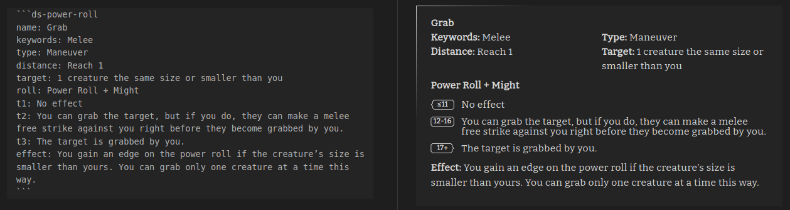
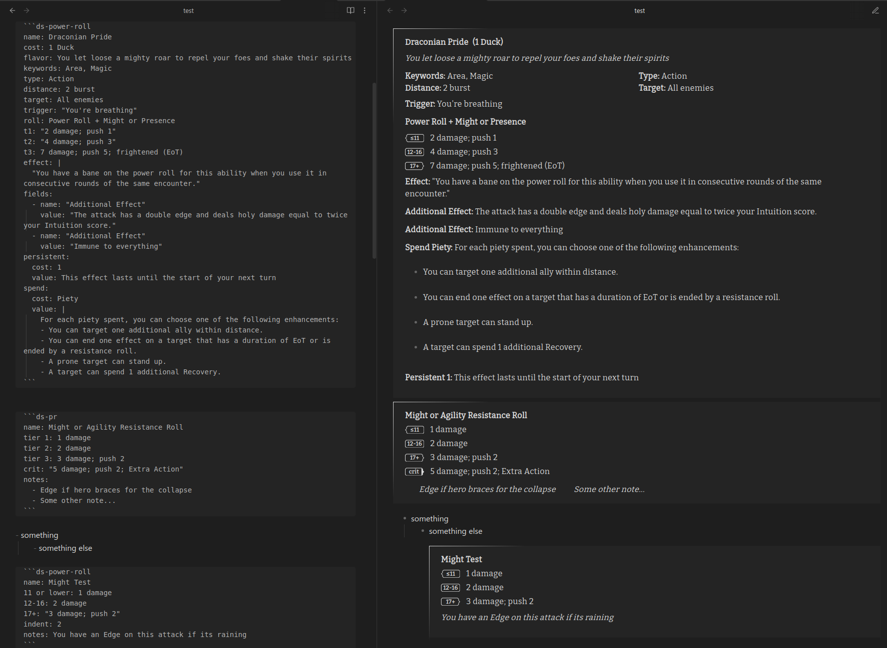

# Power Roll Element



## Codeblock

Power Roll element for Tests, Resistance Rolls, Abilities, and other Power Rolls. Triggered with a codeblock leading
with `ds-power-roll` or `ds-pr`



	```ds-power-roll
	name: Draconian Pride
	flavor: You let loose a mighty roar to repel your foes and shake their spirits
	keywords: Area, Magic
	type: Action
	distance: 2 burst
	target: All enemies
	roll: Power Roll + Might or Presence
	t1: "2 damage; push 1"
	t2: "4 damage; push 3"
	t3: 7 damage; push 5; frightened (EoT)
	effect: You have a bane on the power roll for this ability when you use it in consecutive rounds of the same encounter.
	```

- The values should support standard markdown rendering for bold, italics, links, etc.
- The generated html should be highly customizable with css

### Fields

| Property                      | Description                                              | Example                                   |
| ----------------------------- | -------------------------------------------------------- | ----------------------------------------- |
| `name`                        | The "Title" or "Description" of the Power Roll.          | `name: Might Resistance Roll`             |
| `cost`                        | The cost to use the ability                              | `cost: 3 Piety`                           |
| `keywords`                    | Keywords of the ability                                  | `keywords: Area, Magic`                   |
| `type`                        | Type of the ability                                      | `type: Action`                            |
| `distance`                    | Distance of the ability                                  | `distance: 2 burst`                       |
| `target`                      | Target of the ability                                    | `target: All enemies`                     |
| `trigger`                     | The Trigger for a Triggered Action                       | `trigger: You are damaged`                |
| `roll`                        | Power Roll                                               | `roll: Power Roll + Might or Presence`    |
| `tier 1`, `t1`, `11 or lower` | The tier-1 (11 or lower) result of the Power Roll        | `t1: 2 damage`                            |
| `tier 2`, `t2`, `12-16`       | The tier-2 (12-16) result of the Power Roll              | `t2: 3 damage`                            |
| `tier 3`, `t3`, `17+`         | The tier-3 (17+) result of the Power Roll                | `t3: 4 damage`                            |
| `crit`, `nat 19-20`           | The critical result of the Power Roll                    | `crit: 4 damage, Extra Action`            |
| `effect`                      | Effect of the ability                                    | `effect: Gain an Edge if you didn't move` |
| `custom_fields`, `fields`     | Custom fields and values. Displays after Effects         | See below                                 |
| `spend`                       | Additional effects from spending (Heroic) Resources      | See below                                 |
| `persistent`                  | Persistent effects from spending Elementalist Essence    | See below                                 |
| `note`, `notes`               | Notes and reminders about the Power Roll                 | `note: Grant Edge if creature is bracing` |
| `indent`                      | Left-margin indentation for the block (for nested lists) | `indent: 2`                               |

### `custom_fields` and `fields`

These are for arbitrary fields under the power roll and effects:

```
fields:
  - name: "Spend 1 Piety"
    value: "The attack has a double edge and deals holy damage equal to twice your Intuition score."
  - name: "Eat a Sandwich"
    value: "Immune to everything"
```

Yaml is incredibly sensitive, be sure to format exactly.

### `spend`

For specifying additional effects that activate when (Heroic) Resources are spent.

```
spend:
  cost: 1 Rage
  value: If you are not dying, you can spend a Recovery.
```

Can additionally handle multi-line strings:

```
spend:
  cost: Piety
  value: |
    For each piety spent, you can choose one of the following enhancements
    • You can target one additional ally within distance. 
    • You can end one effect on a target that has a duration of EoT or is ended by a resistance roll.
    • A prone target can stand up.
    • A target can spend 1 additional Recovery.
```

Yaml is incredibly sensitive, be sure to format exactly.

### `persistent`

For specifying additional effects that activate when (Heroic) Resources are spent.

```
spend:
  cost: 1
  value: This effect lasts until the start of your next turn.
```

Yaml is incredibly sensitive, be sure to format exactly.

