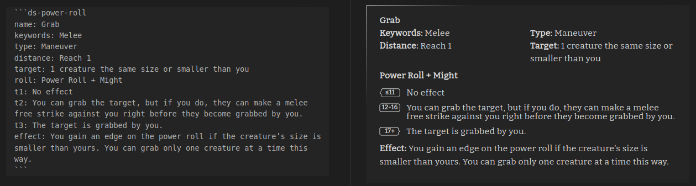
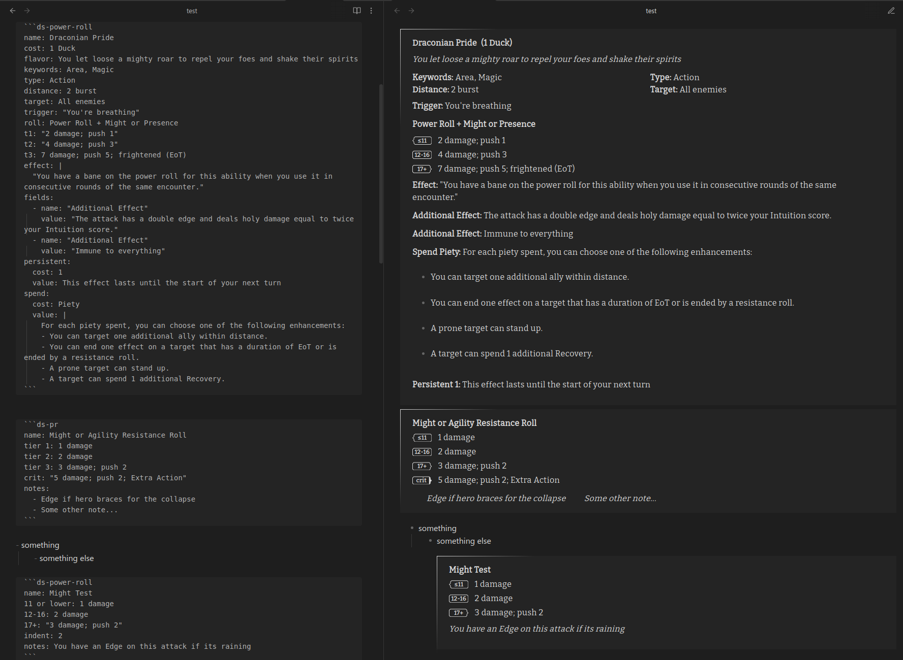

# Power Roll Element



## Codeblock

Power Roll element for Tests, Resistance Rolls, Abilities, and other Power Rolls. Triggered with a codeblock leading
with `ds-power-roll` or `ds-pr`



	```ds-power-roll
	name: Draconian Pride
	flavor: You let loose a mighty roar to repel your foes and shake their spirits
	keywords: Area, Magic
	type: Action
	distance: 2 burst
	target: All enemies
	roll: Power Roll + Might or Presence
	t1: "2 damage; push 1"
	t2: "4 damage; push 3"
	t3: 7 damage; push 5; frightened (EoT)
	effect: You have a bane on the power roll for this ability when you use it in consecutive rounds of the same encounter.
	```

- The values should support standard markdown rendering for bold, italics, links, etc.
- The generated html should be highly customizable with css

## Fields

See the [abilities](./Abilities.md) documentation for field definitions
