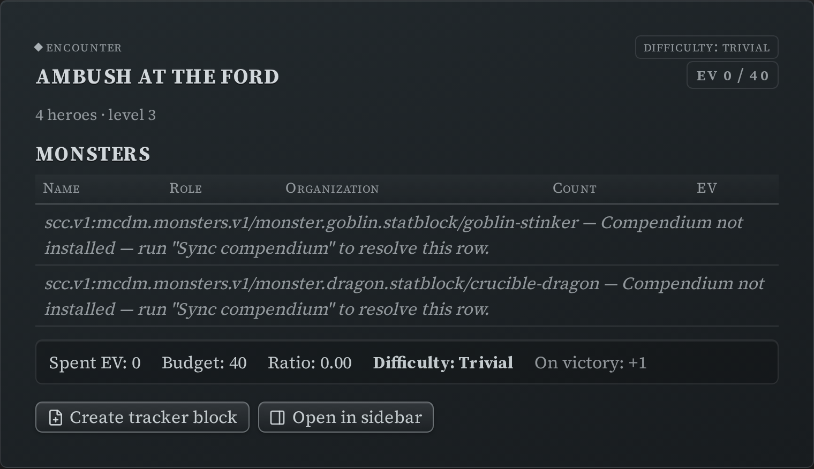
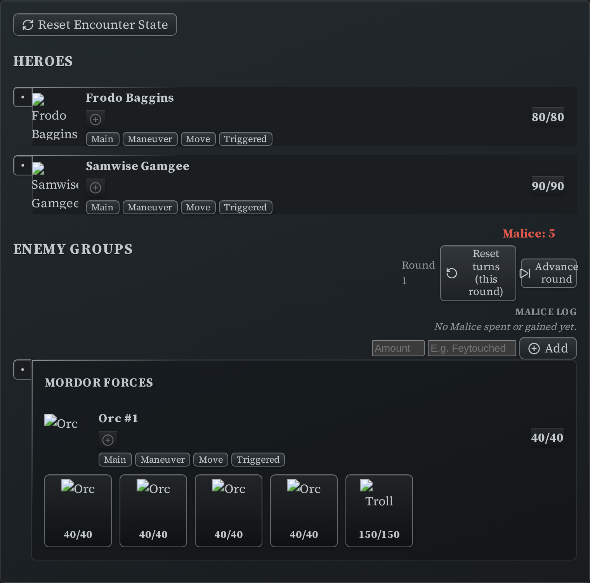
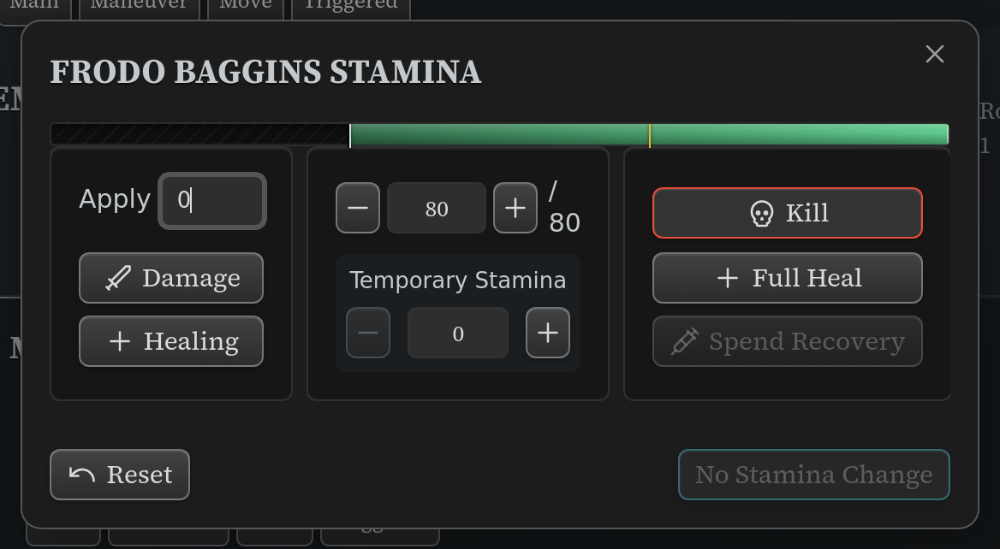
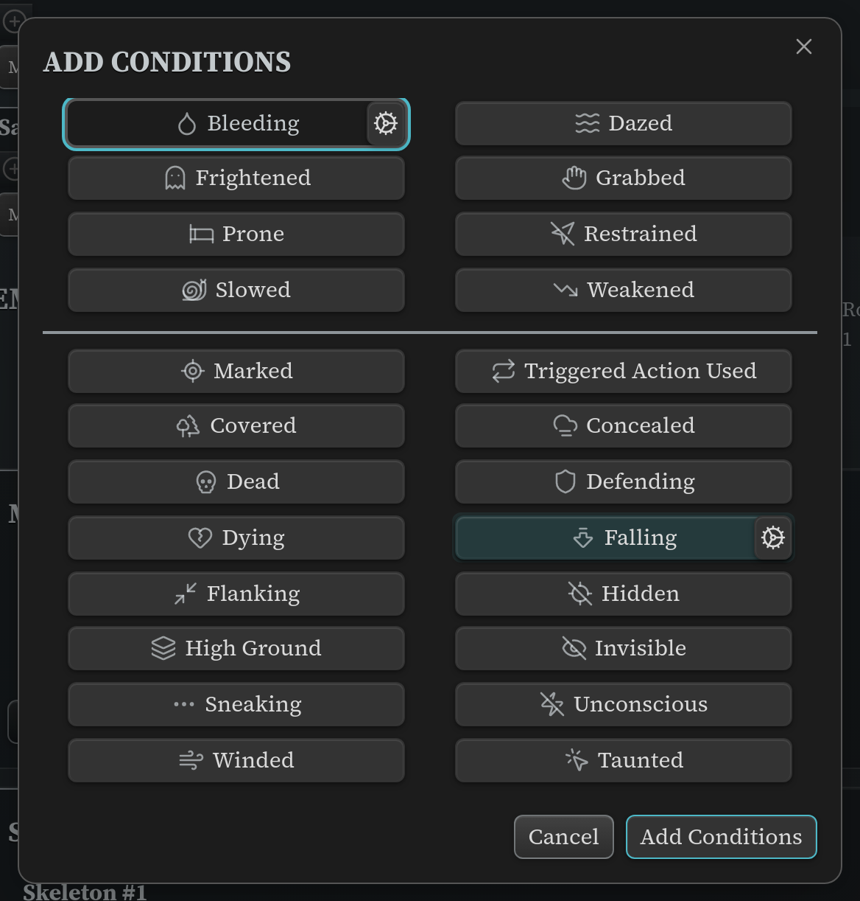
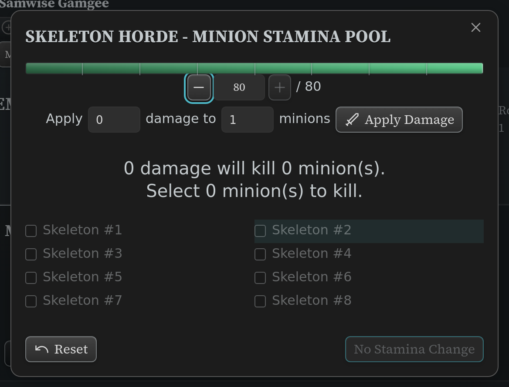
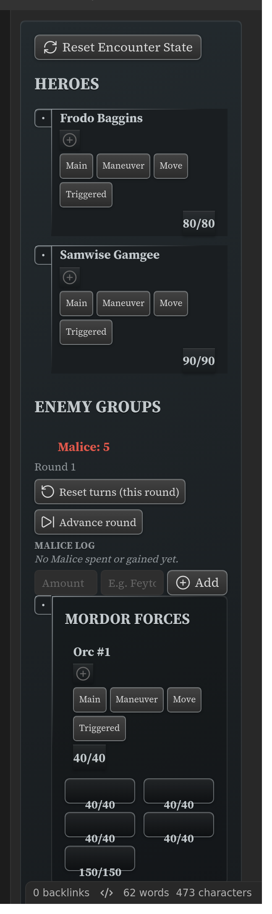

# Run an Encounter

From "I want a fight here" to running it at the table. Two blocks do the work: the
**encounter builder** picks the monsters and tells you how hard it will be, then hands the
roster to the **initiative tracker**, which runs it.

New to the plugin? Start with [Getting started](getting-started.md).

You need the compendium synced for this one — the builder reads the monsters' real stats
from it (**Settings → Draw Steel Elements → Compendium → Sync**).

## 1. Build the fight

In **Editing view**, type `/ds` and pick **Encounter builder**. You get a worked example to
edit. Tell it about your party and list the monsters you're considering:

```
~~~ds-encounter
label: Ambush at the ford
party:
  hero_count: 4
  hero_level: 3
monsters:
  - code: scc.v1:mcdm.monsters.v1/monster.goblin.statblock/goblin-stinker
    count: 6
    squad: minion
  - code: scc.v1:mcdm.monsters.v1/monster.dragon.statblock/crucible-dragon
    count: 1
~~~
```

You don't have to type those codes by hand. Use **Insert Draw Steel: compendium reference**
in the command palette to search for a creature, drop the block it writes anywhere, and copy
the code out of it — or hold **Ctrl/Cmd** when you pick a search result to copy the code
straight to your clipboard.

Switch to **Reading view**:



The summary line does the arithmetic for you: what the monsters cost in EV, what your party's
budget is, and the difficulty that lands on — trivial, easy, standard, hard or extreme —
plus how many Victories the party earns for winning. Change a `count`, look again. That is
the whole tuning loop.

A couple of honest limits: budgets are worked out for parties of **1–6 heroes at levels
1–10**, and outside that range the builder shows the spent EV but no budget. A code it
can't find is listed with the reason rather than quietly dropped.

## 2. Hand it to the tracker

When the roster is right, click **Create tracker block**. The builder writes a matching
[initiative tracker](initiative-tracker.md) at the end of the note — monsters grouped,
minions marked as squads, Stamina filled in from their real statblocks.

Click **Open in sidebar** instead and it does the same thing, then pins the new tracker to
Obsidian's right sidebar so it stays on screen while you flip between notes.

### The tracker is a snapshot, and that is on purpose

**What works.** Press either button as many times as you like. The first press builds the
tracker. After that **Open in sidebar** finds the tracker you already have and puts it back
on screen, so you can pull the sidebar up again mid-fight without worrying about it; **Create
tracker block** finds it too and simply leaves it alone. You will never end up with a pile of
duplicate trackers, and nothing you have done in the fight is touched.

**What deliberately doesn't.** The tracker is a copy of the encounter taken at the moment it
was built. If you go back and change the encounter afterwards — add a monster, change the
party size — **those changes do not appear in a tracker that already exists.**

That is deliberate rather than a gap. Once a fight is running, the tracker is the fight:
current Stamina, conditions, whose turn has come round. Rebuilding it from the encounter
would be the only way to pick up your edits, and it would throw all of that away — usually
in the middle of the session, from a button you pressed just to bring the sidebar back.
Keeping your place is worth more than staying in sync.

**When you do want a fresh one:** delete the tracker block from the note, then press
**Open in sidebar** again. With no tracker to find, the builder makes a new one from the
encounter as it stands now. Do this between fights, not during one — the new tracker starts
clean, with everyone at full Stamina and no conditions.

## 3. Run it



At the table:

- **Turn markers** — click the circle by a name when they've gone.
- **The action checklist** — each actor has [Main] [Maneuver] [Move] [Triggered] chips.
  Click them off as they're spent. "Triggered" clears per round, the rest per turn.
- **Stamina** — click any Stamina number for the damage/healing editor.



- **Conditions** — the `+` in a row opens the Conditions manager: type to add (including
  a custom one for anything the catalog doesn't cover), click the trash icon to remove.
  For a quick single removal you can skip the manager and click the condition's own icon
  in the row instead.



- **Minion squads** — a squad shares one Stamina pool. Click a minion to select it, then
  click the pool to open its editor, which walks you through which minions die.



- **Malice** — the panel tracks the pool, logs every gain and spend, and can add a set
  amount each round. Use "Quick-add" for a one-off ("3 — Feytouched").

### Two buttons that are not the same

- **Reset turns (this round)** clears the turn markers and action chips without moving the
  round on. Use it when you mis-clicked.
- **Advance round** is the real round boundary: it clears those *and* bumps the round
  counter *and* grants the Malice you configured.

## Keep it visible while you play

Running the session across several notes? Hover the tracker in Reading view, open its **⋯**
menu, and choose **Pin to sidebar** — it moves to a persistent panel on the right and stays
there, in sync with the note, while you navigate. The cursor-driven **Send block to
sidebar** command (or the dedicated **Send initiative tracker to sidebar**) still works
too. Full walkthrough: [Pinning a block to the
sidebar](writing-blocks.md#pinning-a-block-to-the-sidebar).



Everything you click is written back into the note as you go, in the sidebar as much as in
the note, so the state survives closing Obsidian.

## Afterwards

Award the Victories in your [party tracker](gm-trackers.md#party-tracker-ds-party) — it
holds the whole party's victories, XP, renown, wealth and hero tokens in one table.

## See also

- [Initiative Tracker](initiative-tracker.md) — every field and control
- [Director's trackers](gm-trackers.md) — the encounter builder's fields, montages,
  downtime projects, the party tracker
- [Negotiation tracker](negotiation-tracker.md) — for the fights that aren't fights
