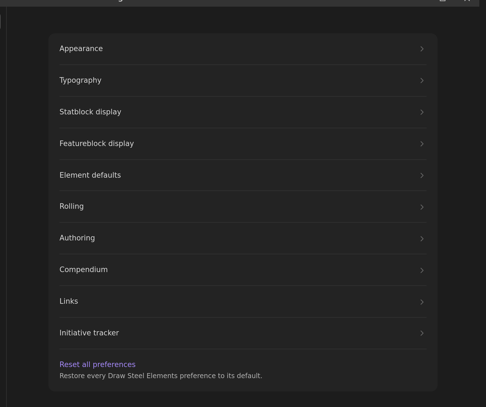
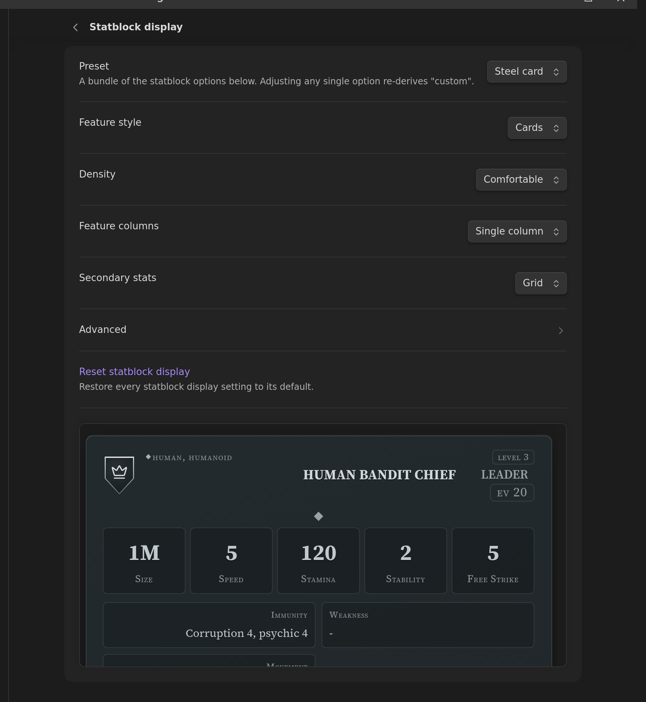

# Settings

Open **Settings → Draw Steel Elements**. The plugin's settings are a short index of pages;
click a page to see only its own settings.

You can also just search: Obsidian's own settings search (the box at the top of the
settings window) indexes every Draw Steel Elements setting, so typing "font", "density" or
"malice" finds the right row from anywhere and jumps straight to it.

Three pages — Appearance, Typography and Statblock display — show a **live preview** docked
at the bottom while you scroll, so you can see what a setting does before you leave the
page. Each page also has a **Reset** action that puts that page's settings back to their
defaults.

Every setting ships on the value that reproduces what the plugin renders out of the box.
Nothing changes unless you change it.

Choosing a statblock look, with pictures:
[Style your statblocks](styling-statblocks.md).

## Appearance

- **Reduce motion** — turn off transitions and animations inside Draw Steel elements. Your
  system's own reduced-motion preference is always honoured regardless of this setting.
- **Print preview** — show every element in its print/export layout on screen, so you can
  check a handout without printing it.
- **Initiative portraits** — show creature portraits in the initiative tracker.

## Typography

- **Title font**, **Body font**, **Controls font** — pick from a curated list, or type any
  font installed on your machine. "Default (Obsidian vault fonts)" keeps your vault's own
  text font.
- **Text size** (60%–140%) and **Card size** (80%–120%) — scale the text inside elements,
  or whole statblock and ability cards. Print and export always use 100%.
- Under **Advanced**: **Card body font**, **Label font** and **Monospace font** for the
  smaller text slots.

Font and size settings apply everywhere, including print and export, and are global —
they can't be overridden per block.

## Statblock display

How statblocks are laid out. Start with the **Preset**:

- **Steel card** — the plugin's own look, and the default.
- **Sourcebook** — the book-style flat layout.
- **Index card** — compact, for reference at the table.

A preset writes all nine settings below it. Change any one of them afterwards and the
preset box reads **Custom** — nothing is lost, it's just no longer one of the three named
bundles.

The individual settings:

- **Feature style** — abilities and traits as **Cards** or as a **Flat list**.
- **Density** — **Comfortable** or **Compact** spacing.
- **Feature columns** — **Single column** or **Side-by-side (wide)**.
- **Secondary stats** — the Immunity / Weakness / Movement / With Captain block as a
  **Grid**, a **Grid (centered)**, or a hairline **Ledger**.
- **Sticky mini-header** — once a statblock's own header has scrolled out of view, pin a
  compact bar with its name, role and key stats to the top of the pane. On by default.
  Screen only: print, PDF export and canvas cards never show it.
- **↳ Include secondary stats** — add a second line to that pinned bar with Movement, With
  Captain, Immunity and Weakness. On by default; greyed out while the mini-header is off.
  In a narrow pane (a sidebar leaf) the second line is dropped whatever this says — there
  is no room for it.

The two sticky settings are **not** part of a preset — picking a look never turns a scroll
behaviour on or off, and changing them never re-derives the preset to **Custom**.

Under **Advanced**:

- **Keyword display** — the keyword and action-type band as **Chips**, **Inline text**, a
  **Grid**, or a **Ledger**. Applies to every ability card.
- **Distance + target** — the same three treatments for the distance/target rail.
- **Characteristics** — the familiar **One line** ("Might +2"), or the value stacked over
  the word.
- **Boxed first letter** — a small framed M / A / R / I / P beside each characteristic,
  with or without the spelled-out word.
- **Villain actions** — listed among the other features, or collected into one collapsible
  **Villain Actions** band below them (always open in print and export).

## Featureblock display

The same idea for [featureblocks](featureblock.md); the preview on this page shows a
featureblock rather than a statblock.

- **Feature style** — cards or a flat list.
- **Stat line** — the Stamina / Size / EV header as paired cells or as full-width rows with
  the value right-aligned.

## Element defaults

- **Collapsible by default** — blocks can be collapsed unless the block itself sets
  `collapsible:`. See [common element fields](common-element-fields.md).
- **Start collapsed** — collapsible blocks start closed unless the block sets
  `collapse_default:`.
- Under **Advanced**: **Edit Recoveries with a popover** — clicking a Recovery marker opens
  a small − / + popover instead of setting the count immediately. See
  [Stamina Bar](stamina-bar.md#recoveries-and-winded).

## Rolling

- **Enable rolling** (off by default) — adds a dice roller to rendered ability cards. The
  standalone [Roll element](Roll.md) always rolls, whatever this says.
- **Roller** — roll natively, or hand the raw dice to the community
  [Dice Roller](https://github.com/javalent/dice-roller) plugin when it's installed. Draw
  Steel's tier/edge/bane maths always stays native, and the plugin falls back to its own
  roller automatically if Dice Roller is missing or fails.
- **Click ability to roll** — with rolling enabled, clicking a power-roll tier row on an
  ability card rolls it.

## Authoring

- **Show edit button on rendered blocks** (off by default) — adds a pencil to each rendered
  block that opens a form editor. See
  [Writing and editing blocks](writing-blocks.md#edit-a-rendered-block-with-a-form).

## Compendium

Destination folder, release and locale for [Compendium Sync](compendium-sync.md), plus the
**Sync** and **Check for updates** buttons and a line showing which release you have, how
many files it installed, and when.

## Links

- **Fall back to steelcompendium.io links** — when an `scc.v1:` link doesn't resolve to a
  file in your vault, link to its page on steelcompendium.io instead. Nothing is fetched;
  you just get a working link when you click it.

## Initiative tracker

- **Default creature image path** — the image used for creatures in the
  [initiative tracker](initiative-tracker.md) that don't specify their own.

## Overriding a setting for one block

Appearance settings are global, but a single block can pin its own layout with a reserved
`prefs:` key — see
[per-block appearance overrides](writing-blocks.md#per-block-appearance-overrides-advanced).
