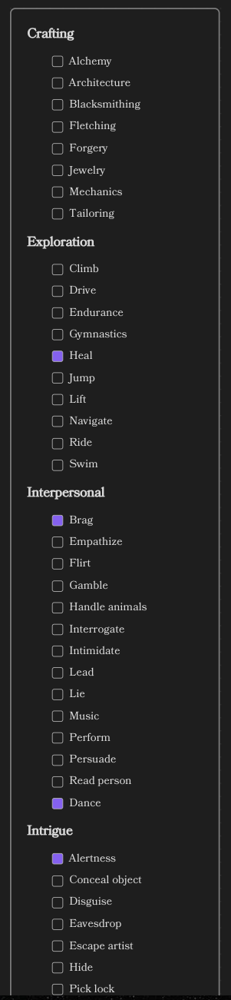

# Skills Element

The Skills Element is a tool designed to parse and display a character's skills within Obsidian. It allows you to 
define a set of skills and custom skills using YAML syntax, and then renders this information in an organized layout 
for easy reference during gameplay or writing.

## Usage

To use the Skills Element, insert a code block with the language identifier `ds-skills` in your Obsidian note, and then 
define your skills using YAML syntax inside the code block.

### Example skills:

```
~~~ds-skills
skills:
  - Heal
  - Sneak
custom_skills:
  - name: Dance
    has_skill: true
    skill_group: Interpersonal
    description: Moving and groovin' to the beat.
~~~
```

This code block will render the character's skills and custom skills in a formatted display.



## Field Definitions

Below is a detailed description of each field used in the skills element, including their types, default values, and whether they are required.

| Field           | Type                     | Description                                                             | Required | Default Value |
|-----------------|--------------------------|-------------------------------------------------------------------------|----------|---------------|
| `skills`        | `array` of `string`      | A list of standard skills the character possesses.                      | No       | `[]`          |
| `custom_skills` | `array` of `CustomSkill` | A list of custom skills defined by the user. See **CustomSkill** below. | No       | `[]`          |

### Notes:

- The `skills` field is an array of skill names (strings) that the character has.
- The `custom_skills` field allows you to define custom skills with additional properties.

## CustomSkill Definitions

Each custom skill in the `custom_skills` array can be defined using the following fields:

| Field         | Type      | Description                                                                          | Required | Default Value |
|---------------|-----------|--------------------------------------------------------------------------------------|----------|---------------|
| `name`        | `string`  | The name of the custom skill.                                                        | **Yes**  | N/A           |
| `has_skill`   | `boolean` | Indicates whether the character possesses this custom skill.                         | No       | `true`        |
| `skill_group` | `string`  | The skill group this custom skill belongs to (e.g., "Interpersonal", "Exploration"). | No       | `undefined`   |
| `description` | `string`  | A brief description of the custom skill.                                             | No       | `undefined`   |

### Notes:

- If `has_skill` is set to `false`, the skill will be displayed as not possessed by the character.
- `skill_group` helps categorize custom skills under existing or new skill groups.
- If `skill_group` matches an existing skill group, the custom skill will be displayed under that group; otherwise, it will be placed under "Custom Skills".
