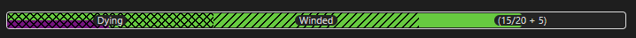
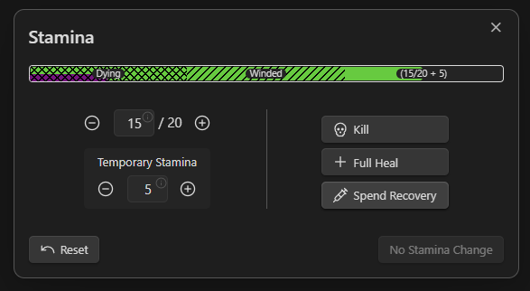

# Stamina Bar Element

The Stamina Bar Element is a tool designed to parse and display a character's stamina within Obsidian.
It allows you to define a character's maximum stamina, current stamina, and temporary stamina using 
YAML syntax, and then renders this information as an interactive stamina bar for easy tracking during 
gameplay or writing.

## Usage

To use the Stamina Bar Element, insert a code block with the language identifier `ds-stamina-bar` in your 
Obsidian note, and then define your stamina values using YAML syntax inside the code block.

### Example stamina bar:

```
~~~ds-stamina-bar
max_stamina: 20
current_stamina: 15
temp_stamina: 5
~~~
```

This code block will render the stamina bar with the specified stamina values.



This interactive bar visually represents the character's stamina, including any temporary stamina. 
Clicking on the bar allows you to adjust the stamina values directly.



## Field Definitions

Below is a detailed description of each field used in the stamina bar element, including their types, 
default values, and whether they are required.

| Field             | Type      | Description                                                   | Required | Default Value          |
|-------------------|-----------|---------------------------------------------------------------|----------|------------------------|
| `max_stamina`     | `integer` | The maximum stamina value of the character.                   | **Yes**  | N/A                    |
| `current_stamina` | `integer` | The current stamina value of the character.                   | No       | Value of `max_stamina` |
| `temp_stamina`    | `integer` | Temporary stamina added to the character (e.g., from buffs).  | No       | `0`                    |
| `height`          | `number`  | Adjusts the height of the stamina bar in the rendered output. | No       | `1`                    |

### Notes:

- **`current_stamina`** defaults to the value of **`max_stamina`** if not specified.
- **`temp_stamina`** represents any temporary stamina the character has gained and is added on top of the current stamina.
- **`height`** allows you to customize the visual height of the stamina bar to suit your preferences.

## Interaction

- **Clicking** on the stamina bar opens an editor where you can adjust the `current_stamina`, `max_stamina`, and `temp_stamina` values directly.
- The stamina bar **automatically updates** to reflect any changes in the stamina values.
- The bar displays different colors or overlays to indicate various states (e.g., low stamina, temporary stamina).
