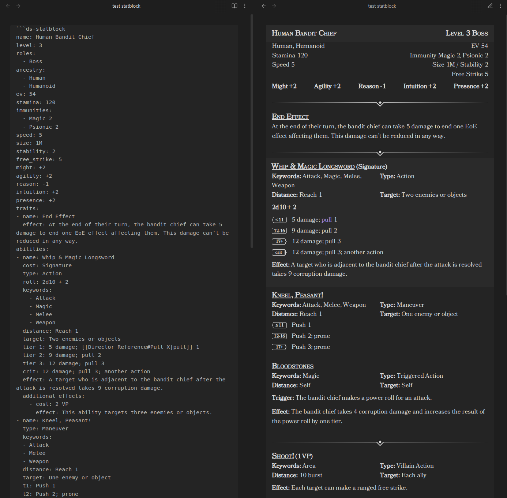

# Statblock Element

The Statblock codeblock is a tool designed to parse and display statblocks within Obsidian. 
It allows you to define creatures or characters with various attributes, abilities, traits, and more using YAML syntax, 
and then renders this information in an organized layout for easy reference during gameplay or writing.



## Usage

To use the Statblock Processor, insert a code block with the language identifier `ds-statblock` in your Obsidian note, 
and then define your statblock using YAML syntax inside the code block.

Example statblock

```
~~~ds-statblock
name: Human Bandit Chief
level: 3 
roles: 
  - Boss
ancestry: 
  - Human
  - Humanoid 
ev: 54
stamina: 120 
immunities: 
  - Magic 2
  - Psionic 2
speed: 5 
size: 1M
stability: 2
free_strike: 5
might: +2 
agility: +2 
reason: -1 
intuition: +2 
presence: +2
traits:
- name: End Effect 
  effects: 
    - At the end of their turn, the bandit chief can take 5 damage to end one EoE effect affecting them. This damage can’t be reduced in any way.
abilities:
- name: Whip & Magic Longsword
  cost: Signature
  type: Action
  roll: 2d10 + 2
  keywords:
    - Attack
    - Magic
    - Melee
    - Weapon
  distance: Reach 1
  target: Two enemies or objects
  tier 1: 5 damage; [[Director Reference#Pull X|pull]] 1
  tier 2: 9 damage; pull 2
  tier 3: 12 damage; pull 3
  crit: 12 damage; pull 3; another action
  effect: A target who is adjacent to the bandit chief after the attack is resolved takes 9 corruption damage.
  additional_effects:
    - cost: 2 Malice
      effect: This ability targets three enemies or objects.
- name: Kneel, Peasant!
  type: Maneuver
  keywords:
  - Attack
  - Melee
  - Weapon
  distance: Reach 1 
  target: One enemy or object
  t1: Push 1
  t2: Push 2; prone
  t3: Push 3; prone
  additional_effects:
    - cost: 2 Malice
      effect: This ability targets each enemy adjacent to the bandit chief.
- name: Bloodstones 
  type: Triggered Action
  keywords:
    - Magic
  distance: Self 
  target: Self
  trigger: The bandit chief makes a power roll for an attack.
  effect: The bandit chief takes 4 corruption damage and increases the result of the power roll by one tier.
- name: Shoot!
  type: Villain Action
  cost: 1 Malice
  keywords: Area
  distance: 10 burst 
  target: Each ally
  effect: Each target can make a ranged free strike.
- name: Form Up! 
  type: Villain Action
  cost: 2 Malice
  effect: Each target shifts up to their speed. Until the end of the encounter, any enemy takes a bane on attacks against the bandit chief or any of the bandit chief’s allies if they are adjacent to that target.
  keywords: Area
  distance: 10 burst 
  target: Each ally
- name: Lead From the Front 
  type: Villain Action
  cost: 3 Malice
  keywords: 
    - Attack 
    - Weapon
  distance: Self 
  target: Self
  effect: The bandit chief shifts twice their speed. During or after this movement, they can attack up to four targets with Whip & Magic Longsword. Any ally of the bandit chief adjacent to a target can make a free strike against that target.
~~~
```


## Field Definitions

Below is a detailed description of each field used in the statblock, including their types, default values, and whether they are required.

### Header Fields

| Field         | Type                 | Description                                                                        | Required | Default Value |
| ------------- | -------------------- | ---------------------------------------------------------------------------------- | -------- | ------------- |
| `name`        | `string`             | The name of the creature.                                                          | **Yes**  | N/A           |
| `level`       | `integer`            | The creature's level.                                                              | No       | `0`           |
| `roles`       | `array` of `string`  | A list of roles assigned to the creature (e.g., "Boss", "Minion").                 | No       | `[]`          |
| `ancestry`    | `array` of `string`  | A list of ancestries or types the creature belongs to (e.g., "Human", "Humanoid"). | No       | `[]`          |
| `ev`          | `integer`            | Encounter Value (EV) of the creature.                                              | No       | `0`           |
| `stamina`     | `integer`            | The creature's max stamina.                                                        | No       | `0`           |
| `immunities`  | `array` of `string`  | A list of immunities the creature has (e.g., "Magic 2", "Psionic 2").              | No       | `[]`          |
| `speed`       | `integer`            | Movement speed of the creature.                                                    | No       | `0`           |
| `size`        | `string`             | The size category of the creature (e.g., "1M" for medium size).                    | No       | ""            |
| `stability`   | `integer`            | Stability value of the creature.                                                   | No       | `0`           |
| `free_strike` | `integer`            | The free strike value of the creature.                                             | No       | `0`           |
| `might`       | `integer`            | The creature's might value.                                                        | No       | `0`           |
| `agility`     | `integer`            | The creature's agility value.                                                      | No       | `0`           |
| `reason`      | `integer`            | The creature's reason value.                                                       | No       | `0`           |
| `intuition`   | `integer`            | The creature's intuition value.                                                    | No       | `0`           |
| `presence`    | `integer`            | The creature's presence value.                                                     | No       | `0`           |
| `with_captain`| `string`             | Effect when a captain is present.                                                  | No       | N/A           |
| `traits`      | `array` of `Trait`   | Traits of the creature.  See Traits below                                          | No       | `[]`          |
| `abilities`   | `array` of `Ability` | Abilities of the creature.  See [abilities](./Abilities.md)                        | No       | `[]`          |

**Notes:**

- Attribute values can be positive or negative integers. You can include a `+` sign for positive values (e.g., `+2`), but it's optional.

### Traits

Each trait in the `traits` array consists of the following fields:

| Field    | Type     | Description                                                               | Required | Default Value |
| -------- | -------- | ------------------------------------------------------------------------- | -------- | ------------- |
| `name`   | `string` | The name of the trait.                                                    | **Yes**  | N/A           |
| `type`   | `string` | The action-type of the trait (e.g., "Maneuver", "Free Triggered Action"). | No       | ``            |
| `effects` | `array of string` | A description of the trait's effect.                                      | **Yes**  | `[]`           |

### Abilities

See the [abilities](./Abilities.md) documentation for field definitions
