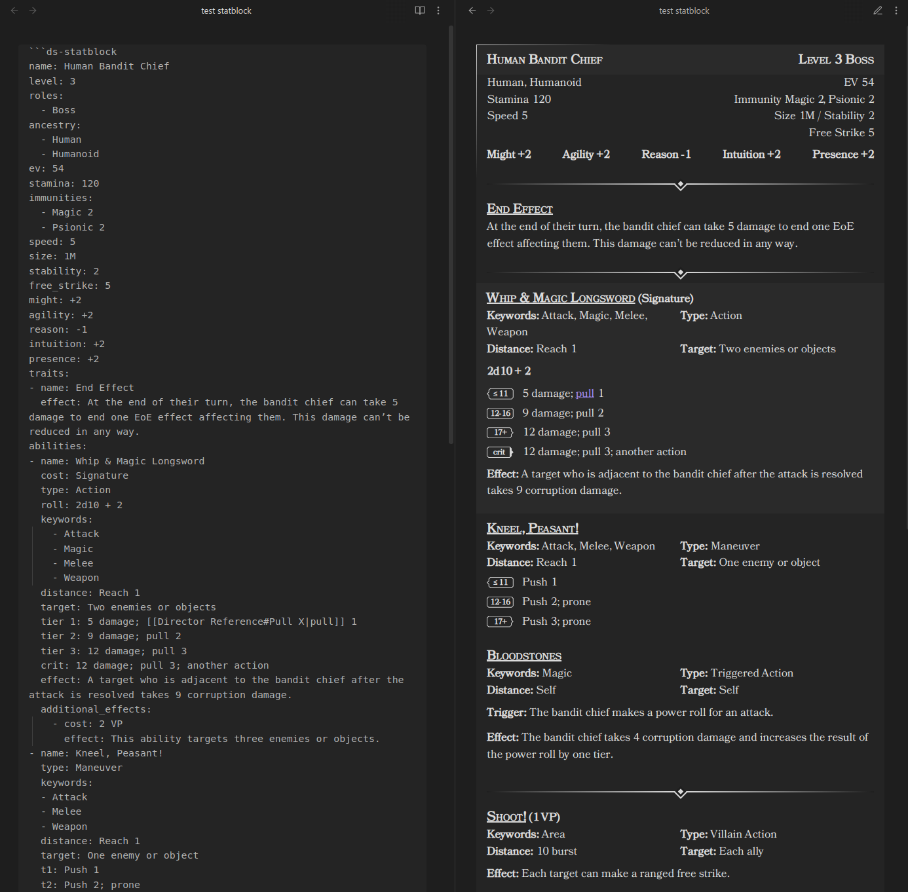
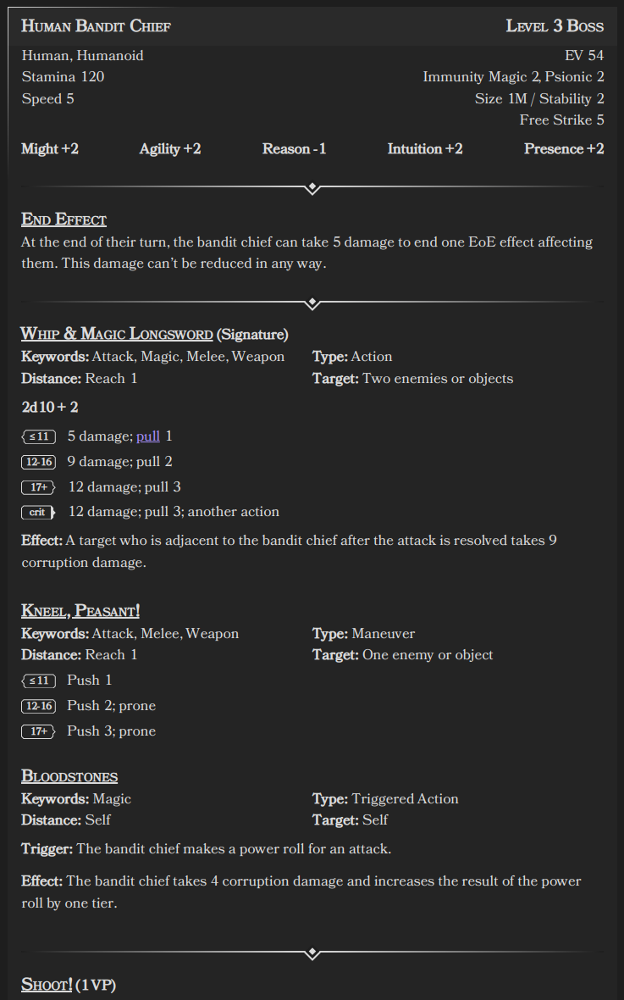

# Statblock Element

The Statblock codeblock is a tool designed to parse and display statblocks within Obsidian. 
It allows you to define creatures or characters with various characteristics, stats, features, and more using YAML syntax, 
and then renders this information in an organized layout for easy reference during gameplay or writing.



## Usage

To use the Statblock Processor, insert a code block with the language identifier `ds-statblock` in your Obsidian note, 
and then define your statblock using YAML syntax inside the code block.

Example statblock

```
~~~ds-statblock
type: statblock
name: Human Bandit Chief
level: 3
organization: Leader
role: ""
keywords:
  - Human
  - Humanoid
ev: "20"
stamina: "120"
immunities:
  - Corruption 4
  - psychic 4
speed: 5
size: 1M
stability: 2
free_strike: 5
might: 2
agility: 3
reason: 2
intuition: 3
presence: 2
features:
  - type: feature
    feature_type: ability
    name: Whip and Magic Longsword
    icon: 🗡
    ability_type: Signature Ability
    keywords:
      - Magic
      - Melee
      - Strike
      - Weapon
    usage: Main action
    distance: Melee 2
    target: Two enemies or objects
    effects:
      - roll: Power Roll + 2
        tier1: 8 damage; pull 1
        tier2: 12 damage; pull 2
        tier3: 15 damage; pull 3
      - name: Effect
        effect: Any target who is adjacent to the bandit chief after the power roll is
          resolved takes 3 corruption damage.
      - cost: 2 Malice
        effect: This ability targets one additional target.
  - type: feature
    feature_type: ability
    name: Kneel, Peasant!
    icon: 🗡
    keywords:
      - Melee
    usage: Maneuver
    distance: Melee 1
    target: One enemy
    effects:
      - roll: Power Roll + 2
        tier1: Push 1; M < 1 prone
        tier2: Push 2; M < 2 prone
        tier3: Push 4; M < 3 prone
      - cost: 2 Malice
        effect: The ability takes the Area keyword, loses the Melee keyword, and is a 1
          burst that targets each enemy in the area.
  - type: feature
    feature_type: ability
    name: Bloodstones
    icon: ❗️
    keywords:
      - Magic
    usage: Triggered action
    distance: Self
    target: Self
    trigger: The bandit chief makes a power roll.
    effects:
      - name: Effect
        effect: The bandit chief takes 5 corruption damage and increases the outcome of
          the power roll by one tier. This damage can't be reduced in any way.
  - type: feature
    feature_type: trait
    name: End Effect
    icon: ⭐️
    effects:
      - effect: At the end of each of their turns, the bandit chief can take 5 damage to
          end one effect on them that can be ended by a saving throw. This
          damage can't be reduced in any way.
  - type: feature
    feature_type: trait
    name: Supernatural Insight
    icon: ⭐️
    effects:
      - effect: The bandit chief ignores concealment if it's granted by a supernatural
          effect.
  - type: feature
    feature_type: ability
    name: Shoot!
    icon: ☠️
    ability_type: Villain Action 1
    keywords:
      - Area
    usage: "-"
    distance: 10 burst
    target: Each artillery ally in the area
    effects:
      - name: Effect
        effect: Each target makes a ranged free strike.
  - type: feature
    feature_type: ability
    name: Form Up!
    icon: ☠️
    ability_type: Villain Action 2
    keywords:
      - Area
    usage: "-"
    distance: 10 burst
    target: Each ally in the area
    effects:
      - name: Effect
        effect: Each target shifts up to their speed. Additionally, until the end of the
          encounter, while the bandit chief or any ally is adjacent to a target,
          they have damage immunity 2.
  - type: feature
    feature_type: ability
    name: Lead From the Front
    icon: ☠️
    ability_type: Villain Action 3
    keywords:
      - "-"
    usage: "-"
    distance: Self
    target: Self
    effects:
      - name: Effect
        effect: The bandit chief shifts up to 10 squares regardless of their speed.
          During or after this movement, they can use their Whip and Magic
          Longsword against up to four targets. Additionally, one ally adjacent
          to each target can make a free strike against that target.
~~~
```



## Field Definitions

Below is a detailed description of each field used in the statblock, including their types
and whether they are required by the Draw Steel Compendium's data schema. The plugin itself
does not enforce this client-side — a missing field just renders as its display fallback
(`N/A`, `-`, "No Role", etc.) instead of an error.

| Property       | Type      | Required | Description                                                                                              |
|----------------|-----------|----------|-----------------------------------------------------------------------------------------------------------|
| `name`         | string    | Yes      | The name of the creature.                                                                                 |
| `type`         | string    | Yes      | Static string `"statblock"`.                                                                              |
| `level`        | integer   | Yes      | The creature's level.                                                                                     |
| `role`         | string    | Yes      | The creature's combat role (e.g., Ambusher, Artillery, Brute, Controller, Defender, Harrier, Skirmisher). May be `""` — Leader/Solo creatures usually carry their classification in `organization` instead. |
| `organization` | string    | Yes      | The creature's organizational type (e.g., Minion, Horde, Platoon, Elite, Solo, Leader).                   |
| `keywords`     | string[]  | Yes      | Keywords for the creature (e.g., Goblin, Humanoid, Undead, Elemental).                                    |
| `ev`           | string    | Yes      | Encounter Value (EV) of the creature.                                                                     |
| `stamina`      | string    | Yes      | The creature's max stamina.                                                                                |
| `immunities`   | string[]  | No       | List of immunities (e.g., Magic 2, Psionic 2).                                                             |
| `weaknesses`   | string[]  | No       | List of weaknesses (e.g., acid 3, holy 1).                                                                 |
| `speed`        | integer   | Yes      | Movement speed of the creature (e.g., 5).                                                                  |
| `movement`     | string    | No       | Movement types of the creature (e.g., 'climb, fly, swim').                                                 |
| `size`         | string    | Yes      | Size category (e.g., 1M for medium).                                                                       |
| `stability`    | integer   | Yes      | Stability value of the creature.                                                                           |
| `free_strike`  | integer   | Yes      | The free strike value.                                                                                     |
| `might`        | integer   | Yes      | Might modifier.                                                                                             |
| `agility`      | integer   | Yes      | Agility modifier.                                                                                           |
| `reason`       | integer   | Yes      | Reason modifier.                                                                                            |
| `intuition`    | integer   | Yes      | Intuition modifier.                                                                                         |
| `presence`     | integer   | Yes      | Presence modifier.                                                                                          |
| `with_captain` | string    | No       | Effect when a captain is present.                                                                          |
| `features`     | Feature[] | No       | List of features (see Feature schema).                                                                     |

**Notes:**

- Attribute values can be positive or negative integers. You can include a `+` sign for positive values (e.g., `+2`), but it's optional.
- **Legacy keys:** statblocks written before 6.0.0 used `roles: string[]` and
  `ancestry: string[]` instead of `role`/`organization`/`keywords`. Those old keys still
  parse (classified the same way the SDK's own markdown reader does) but log a deprecation
  warning to the developer console, and are ignored on any axis where the modern key is also
  present. Support for `roles`/`ancestry` is removed in 7.0.0 — see the
  [migration guide](migrating-to-6.md) for the conversion rule and a worked example.

### Features

See the [features](./Features.md) documentation for field definitions
