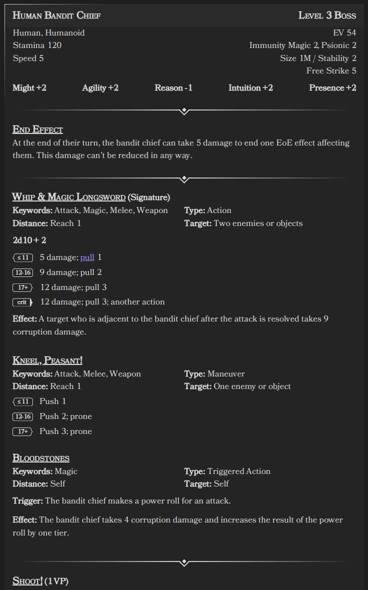

# Statblock Element

The Statblock codeblock is a tool designed to parse and display statblocks within Obsidian. 
It allows you to define creatures or characters with various attributes, abilities, traits, and more using YAML syntax, 
and then renders this information in an organized layout for easy reference during gameplay or writing.


## Usage

To use the Statblock Processor, insert a code block with the language identifier `ds-statblock` in your Obsidian note, 
and then define your statblock using YAML syntax inside the code block.

Example statblock

```
~~~ds-statblock
name: Human Bandit Chief
level: 3
roles:
  - Leader
ancestry:
  - Human
  - Humanoid
ev: "20"
stamina: "120"
immunities:
  - Corruption 4
  - psychic 4
speed: 5
size: 1M
stability: 2
free_strike: 5
might: 2
agility: 3
reason: 2
intuition: 3
presence: 2
traits:
  - name: End Effect
    effects:
      - effect: At the end of each of their turns, the bandit chief can take 5 damage to
          end one effect on them that can be ended by a saving throw. This
          damage can't be reduced in any way.
  - name: Supernatural Insight
    effects:
      - effect: The bandit chief ignores concealment if it's granted by a supernatural
          effect
abilities:
  - name: Whip and Magic Longsword
    icon: 🗡
    cost: Signature Ability
    keywords:
      - Magic
      - Melee
      - Strike
      - Weapon
    type: Main action
    distance: Melee 2
    target: Two enemies or objects
    effects:
      - roll: Power Roll + 2
        t1: 8 damage; pull 1
        t2: 12 damage; pull 2
        t3: 15 damage; pull 3
      - effect: Any target who is adjacent to the bandit chief after the power roll is
          resolved takes 3 corruption damage.
        name: Effect
      - effect: This ability targets one additional target.
        cost: 2 Malice
  - name: Kneel, Peasant!
    icon: 🗡
    keywords:
      - Melee
    type: Maneuver
    distance: Melee 1
    target: One enemy
    effects:
      - cost: ≤11
        effect: Push 1; M < 1 prone
        t2: Push 2; M < 2 prone
        t3: Push 4; M < 3 prone
      - effect: The ability takes the Area keyword, loses the Melee keyword, and is a 1
          burst that targets each enemy in the area.
        cost: 2 Malice
  - name: Bloodstones
    icon: ❗️
    keywords:
      - Magic
    type: Triggered action
    distance: Self
    target: Self
    trigger: The bandit chief makes a power roll.
    effects:
      - effect: The bandit chief takes 5 corruption damage and increases the outcome of
          the power roll by one tier. This damage can't be reduced in any way.
        name: Effect
  - name: Shoot!
    icon: ☠️
    cost: Villain Action 1
    keywords:
      - Area
    type: "-"
    distance: 10 burst
    target: Each artillery ally in the area
    effects:
      - effect: Each target makes a ranged free strike.
        name: Effect
  - name: Form Up!
    icon: ☠️
    cost: Villain Action 2
    keywords:
      - Area
    type: "-"
    distance: 10 burst
    target: Each ally in the area
    effects:
      - effect: Each target shifts up to their speed. Additionally, until the end of the
          encounter, while the bandit chief or any ally is adjacent to a target,
          they have damage immunity 2.
        name: Effect
  - name: Lead From the Front
    icon: ☠️
    cost: Villain Action 3
    keywords:
      - "-"
    type: "-"
    distance: Self
    target: Self
    effects:
      - effect: The bandit chief shifts up to 10 squares regardless of their speed.
          During or after this movement, they can use their Whip and Magic
          Longsword against up to four targets. Additionally, one ally adjacent
          to each target can make a free strike against that target.
        name: Effect
~~~
```



## Field Definitions

Below is a detailed description of each field used in the statblock, including their types, default values, and whether they are required.

### Header Fields

| Field         | Type                 | Description                                                                        | Required | Default Value |
|---------------|----------------------|------------------------------------------------------------------------------------|----------|---------------|
| `name`        | `string`             | The name of the creature.                                                          | **Yes**  | N/A           |
| `level`       | `integer`            | The creature's level.                                                              | No       | `0`           |
| `roles`       | `array` of `string`  | A list of roles assigned to the creature (e.g., "Boss", "Minion").                 | No       | `[]`          |
| `ancestry`    | `array` of `string`  | A list of ancestries or types the creature belongs to (e.g., "Human", "Humanoid"). | No       | `[]`          |
| `ev`          | `integer`            | Encounter Value (EV) of the creature.                                              | No       | `0`           |
| `stamina`     | `integer`            | The creature's max stamina.                                                        | No       | `0`           |
| `immunities`  | `array` of `string`  | A list of immunities the creature has (e.g., "Magic 2", "Psionic 2").              | No       | `[]`          |
| `speed`       | `integer`            | Movement speed of the creature.                                                    | No       | `0`           |
| `size`        | `string`             | The size category of the creature (e.g., "1M" for medium size).                    | No       | ""            |
| `stability`   | `integer`            | Stability value of the creature.                                                   | No       | `0`           |
| `free_strike` | `integer`            | The free strike value of the creature.                                             | No       | `0`           |
| `might`       | `integer`            | The creature's might value.                                                        | No       | `0`           |
| `agility`     | `integer`            | The creature's agility value.                                                      | No       | `0`           |
| `reason`      | `integer`            | The creature's reason value.                                                       | No       | `0`           |
| `intuition`   | `integer`            | The creature's intuition value.                                                    | No       | `0`           |
| `presence`    | `integer`            | The creature's presence value.                                                     | No       | `0`           |
| `traits`      | `array` of `Trait`   | Traits of the creature.  See Traits below                                          | No       | `[]`          |
| `abilities`   | `array` of `Ability` | Abilities of the creature.  See [abilities](./Abilities.md)                        | No       | `[]`          |

**Notes:**

- Attribute values can be positive or negative integers. You can include a `+` sign for positive values (e.g., `+2`), but it's optional.

### Traits

Each trait in the `traits` array consists of the following fields:

| Field     | Type                | Description                                       | Required | Default Value |
|-----------|---------------------|---------------------------------------------------|----------|---------------|
| `name`    | `string`            | The name of the trait.                            | **Yes**  | N/A           |
| `icon`    | `string`            | Icon for the trait.                               | No       | ``            |
| `effects` | `array` of `Effect` | See the [Effects section](./Abilities.md#Effects) | **No**   | `[]`          |

### Abilities

See the [abilities](./Abilities.md) documentation for field definitions
