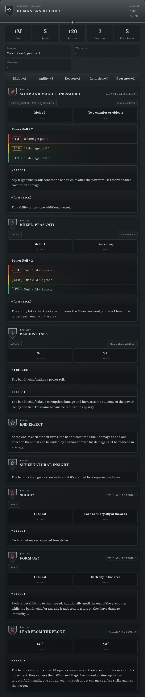
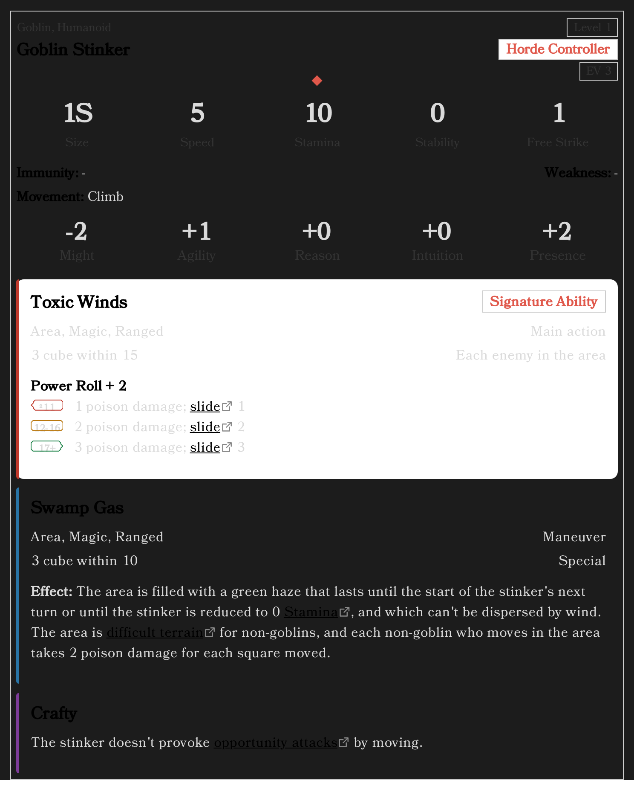

# Style Your Statblocks

Statblocks can be laid out several ways — cards or a flat list, roomy or compact, one column
or two. It's a setting, not something you write into the block, so changing it restyles
every statblock in your vault at once.

New to the plugin? Start with [Getting started](getting-started.md).

## Start with a preset

Open **Settings → Draw Steel Elements → Statblock display**. The first row is **Preset**:

- **Steel card** — the plugin's own look, and the default.
- **Sourcebook** — the flat, book-style layout.
- **Index card** — compact, for quick reference at the table.


Pick one and watch the preview at the bottom of the page change. That preview is a real
statblock rendered by the real plugin, so what you see is what your notes will look like.

A preset just sets the nine options below it in one go. Change any single one afterwards and
the box reads **Custom** — nothing is lost, it simply isn't one of the three named bundles
any more.

## The individual controls

The four on the main page are the ones that change the shape of a card most:

- **Feature style** — abilities as **Cards** or as a **Flat list**.
- **Density** — **Comfortable** or **Compact**.
- **Feature columns** — **Single column**, or **Side-by-side** on a wide screen.
- **Secondary stats** — the Immunity / Weakness / Movement block as a grid, a centred grid,
  or a hairline ledger.

Side-by-side is worth a look if you read on a wide window:



Under **Advanced** on the same page are three more, all matching the website's own options:
**Characteristics**, **Boxed first letter** and **Villain actions** (listed inline, or
gathered into one collapsible band).

Two more that a preset also writes — **Keyword display** and **Distance + target** — live
on the **Feature display** page, because they restyle the ability card itself wherever it
appears rather than the statblock around it.

Feature blocks — Malice, Dynamic Terrain — have their own page,
**Featureblock display**, with the same idea and a featureblock in the preview.

Every option is described one by one in the [settings guide](settings.md#statblock-display).

## Make the text bigger

**Settings → Draw Steel Elements → Typography**:

- **Text size** (60%–140%) scales the text inside every Draw Steel element.
- **Card size** (80%–120%) scales whole cards.
- **Title / Body / Controls font** — pick from the list, or type any font you have
  installed. "Default (Obsidian vault fonts)" keeps your vault's own.

These apply everywhere, including print and export.

## Just this one block

Occasionally you want one statblock to differ — a compact one in a busy session note, say.
A block can pin its own layout:

```
~~~ds-statblock
prefs:
  sbDensity: compact
  sbFeatureStyle: flat
name: Goblin Stinker
…
~~~
```

The names are the setting keys, listed in
[Advanced usage](advanced-usage.md#per-block-appearance-overrides). Three settings that
change a card's *structure* rather than its styling — Characteristics, Boxed first letter,
Villain actions — and all the typography settings are deliberately global only.

## Printing and PDFs

Everything you pick carries into print and export. To check a handout without printing it,
turn on **Settings → Appearance → Print preview**, which shows every element in its print
layout on screen:



Villain actions are always shown open in print, whatever the band setting says — paper has
no disclosure triangles.

## See also

- [Settings](settings.md) — every page, every option
- [Statblock Element](statblock.md) — the fields themselves
- [Advanced usage](advanced-usage.md) — per-block overrides in full
