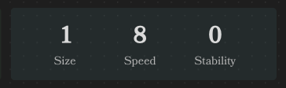

# Values Row Element

The Values Row Element is a tool designed to parse and display a list of key-value pairs within Obsidian. It allows 
you to define a set of named values using YAML syntax, and then renders this information in an organized layout for 
easy reference during gameplay or writing.

## Usage

To use the Values Row Element, insert a code block with the language identifier `ds-values-row` in your Obsidian 
note, and then define your key-value pairs using YAML syntax inside the code block.

### Example key-value pairs:

```
~~~ds-values-row
values:
  - Size: 1
  - Speed: 8
  - Stability: 2
value_height: 3
name_height: 1
~~~
```

This code block will render the key-value pairs in a formatted display.



## Field Definitions

Below is a detailed description of each field used in the key-value pairs, including their types, default values, and 
whether they are required.

| Field          | Type                | Description                                                 | Required | Default Value |
|----------------|---------------------|-------------------------------------------------------------|----------|---------------|
| `values`       | `array` of `KVPair` | A list of key-value pairs to display. See **KVPair** below. | **Yes**  | N/A           |
| `value_height` | `integer`           | Adjusts the size of the value text in the rendered output.  | No       | `3`           |
| `name_height`  | `integer`           | Adjusts the size of the name text in the rendered output.   | No       | `1`           |

### Notes:

The `values` field is an array where each entry represents a key-value pair. Entries can be defined in several ways:

- **Key-Value Mapping**: A simple key-value pair.

```yaml
values:
  - Size: 1
```

- **Object with `name` and `value` Fields**:

```yaml
values:
  - name: Size
    value: 1
```

- **Nameless Value**: A single string or number, which will be displayed without a name.

```yaml
values:
  - 1S
```

`value_height` and `name_height` are optional parameters to adjust the visual presentation of the key-value pairs in 
the rendered output. They are useful for customizing the display according to your preferences.
